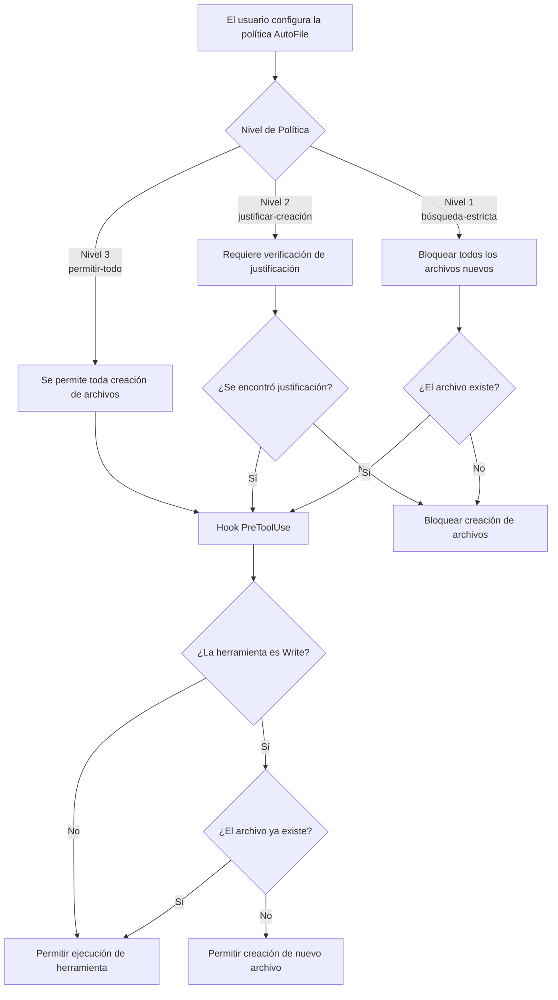
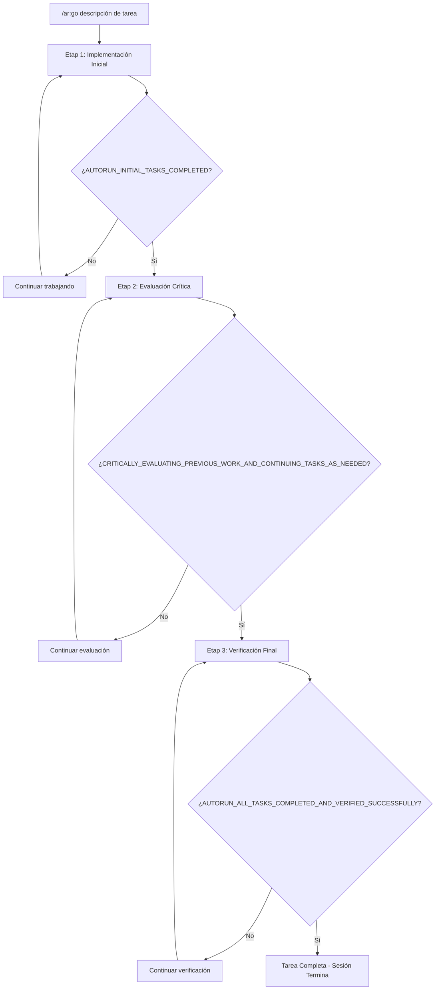

# autorun

[](https://python.org)
[](LICENSE)


## Características Principales

1. **Menos Interrupciones**: Claude, CLIs de la familia Gemini, Qwen o Codex siguen trabajando sin prompts de "continuar" para que puedas alejarte
2. **Verificar Planes Antes de Comenzar**: Los planes se critican y refinan antes de escribir código
3. **Implementar, Evaluar, Verificar**: La IA debe pasar las tres etapas. Evita que se declare completado un trabajo a medias
4. **Control de Creación de Archivos por IA**: Elige si la IA puede crear archivos libremente, debe justificarlos o solo editar
5. **Los Comandos Peligrosos se Redirigen**: `rm` se convierte en `trash`, `git reset --hard` se convierte en `git stash`
6. **Funciona en varios entornos de desarrollo con IA**: Mismas políticas de seguridad en Claude Code, Gemini CLI, Antigravity, Qwen Code, Codex CLI y ForgeCode
7. **Más de 80 Comandos de Autorun**: Exportación automática de planes, seguimiento de tareas, pautas de commit git, filosofía de diseño y más
8. **Aprender de los Errores**: Analiza sesiones pasadas para encontrar fallos recurrentes de la IA y conviértelos en reglas permanentes, habilidades y bloques de ganchos (hooks) en CLAUDE.md



## Inicio Rápido

```bash
# Instalar (requiere UV - ver Instalación de UV abajo)
uv pip install git+https://github.com/ahundt/autorun.git
autorun --install

# Verificar instalación
/ar:st
# Esperado: "AutoFile policy: allow-all"
```

**Planificar y Ejecutar** (flujo de trabajo más común):

```bash
/ar:plannew Diseña una API REST con autenticación y pruebas
/ar:planrefine                          # Criticar y mejorar el plan
/ar:planprocess                         # Ejecutar el plan

/ar:go Construye un formulario de inicio de sesión con pruebas    # O ejecutar una tarea directamente
```

**Política de Archivos** (prevenir acumulación de archivos):

```bash
/ar:f                    # Estricto: solo modificar archivos existentes
/ar:j                    # Justificar: requiere justificación para nuevos archivos
/ar:a                    # Permitir: crear archivos libremente (predeterminado)
```

**Seguridad**:

```bash
/ar:sos                  # Parada de emergencia
```

> Compatible con **Claude Code**, **Gemini CLI**, **Google Antigravity**, **Qwen Code**, **Codex CLI** y **ForgeCode** — ver [Soporte Multi-CLI](#multi-cli-support).

> Los ejemplos usan comandos con slash de Claude/Gemini. En Codex, usa el mismo comando sin el slash inicial, como `ar:st` o `ar:ok git push`.

**Automejora** (aprender de sesiones anteriores):

```bash
aise messages corrections --since 30d   # Encontrar errores recurrentes de la IA
aise analyze                            # Análisis cualitativo completo
# → Agregar hallazgos a CLAUDE.md, habilidades o bloques de hooks (ver la habilidad $ai-session-tools, Flujo 6)
```

## Tabla de Contenidos

- [Características Principales](#key-features)
- [Inicio Rápido](#quick-start)
- [Instalación con UV](#uv-installation-recommended)
  - [Soporte Multi-CLI](#multi-cli-support)
- [Qué hace autorun por ti](#what-autorun-does-for-you)
- [Por qué la integración con Byobu + tmux](#why-byobu--tmux-integration)
- [Flujo del Ciclo de Vida de AutoFile](#autofile-lifecycle-flow)
- [Cómo Funciona](#how-it-works)
  - [Sistema Autorun de Tres Etapas](#three-stage-autorun-system)
- [Integración con Tmux](#tmux-integration)
- [Desarrollo](#development)
- [Comandos Disponibles](#available-commands)
  - [AutoFile (Control de Creación de Archivos)](#autofile-file-creation-control)
  - [Redirección de Comandos](#command-redirecting)
  - [Comandos de Autorun (Ejecución Autónoma)](#autorun-commands-autonomous-execution)
  - [Comandos de Gestión de Planes](#plan-management-commands)
  - [Seguimiento del Ciclo de Vida de Tareas](#task-lifecycle-tracking)
  - [Comandos de Documentación](#documentation-commands)
  - [Comandos de Automatización Tmux](#tmux-automation-commands)
  - [Ejemplos de Uso](#usage-examples)
- [Referencia de la CLI](#cli-reference)
- [Guía de Arquitectura e Integración de Plugins](#plugin-architecture-and-integration-guide)
- [Agentes de Automatización Tmux](#tmux-automation-agents)
- [Estructura del Proyecto](#project-structure)
- [Documentación para Desarrolladores](#developer-documentation)
- [Dependencias](#dependencies)
- [Herramientas Complementarias](#companion-tools)
- [Solución de Problemas](#troubleshooting)
- [Contribuir y Compartir](#contributing-and-sharing)
- [Referencias](#references)
- [Licencia](#license)

## Instalación con UV (Recomendada)

El marketplace de autorun incluye 2 plugins: **autorun** y **pdf-extractor**.

> **Nota:** la funcionalidad de exportación de planes ahora está integrada en el plugin autorun. Usa los comandos `/ar:planexport` para gestionar planes.

### Instalación desde GitHub

Instala todo el marketplace directamente desde GitHub:

```bash
# Instalar plugins desde GitHub
uv pip install git+https://github.com/ahundt/autorun.git

# Registrar plugins con Claude Code
autorun --install
```

### Instalación Local

Instala desde un clon local:

```bash
# Clonar repositorio
git clone https://github.com/ahundt/autorun.git
cd autorun

# Instalar marketplace
uv pip install .

# Registrar plugins con Claude Code
autorun --install
```

> **Nota:** Usa `autorun --install` para asegurar que el comando se ejecute en el entorno UV correcto. Si `autorun-marketplace` está en tu PATH, puedes ejecutarlo directamente sin `uv run`.

### Instalación para Desarrollo

Para colaboradores y desarrolladores:

```bash
# Clonar repositorio
git clone https://github.com/ahundt/autorun.git
cd autorun

# Opción 1: UV (recomendada - más rápida, mejor gestión de dependencias)
uv run python -m plugins.autorun.src.autorun.install --install --force

# Opción 2: respaldo pip (si UV no está disponible)
pip install -e . && python -m plugins.autorun.src.autorun.install --install --force

# REQUERIDO: Instalar como herramienta UV para disponibilidad global de CLI
# Esto hace que los comandos 'autorun' y 'aise' estén disponibles globalmente
# los cuales son necesarios para la operación adecuada del daemon y gestión de sesiones
cd plugins/autorun && uv tool install --force --editable .

# Verificar instalación
autorun --status  # Verifica que la instalación de la herramienta UV funcione
```

**Instalar UV (si es necesario):**
```bash
# macOS/Linux:
curl -LsSf https://astral.sh/uv/install.sh | sh

# Homebrew:
brew install uv

# Windows:
powershell -c "irm https://astral.sh/uv/install.ps1 | iex"
```

### Verificación

Después de la instalación, verifica que los plugins estén registrados:

```bash
# Verificar plugins instalados
claude plugin marketplace list

# Ver todos los comandos disponibles
/help

# Probar autorun
/ar:st
# Esperado: "AutoFile policy: allow-all"
```

### Soporte Multi-CLI

**autorun soporta Claude Code, Gemini CLI, Google Antigravity, Qwen Code, Codex CLI y ForgeCode**, proporcionando características de seguridad compartidas, manejadores de comandos y capacidades de ejecución autónoma en los entornos compatibles.

#### Soporte para Codex CLI

Autorun instala ganchos (hooks) de Codex en `~/.codex/hooks.json` por defecto y expone su paquete de habilidades como un plugin local de Codex a través de `~/.agents/plugins/marketplace.json` con origen `~/plugins/autorun`. Después de instalar, ejecuta `/hooks` dentro de Codex si se solicita para que Codex confíe en los hashes de los hooks. El progreso de tareas de Codex se mapea a la herramienta nativa `update_plan`, la guía de búsqueda/descubrimiento de archivos usa `rg -n` y `rg --files` en la shell, y las ediciones de archivos usan `apply_patch`.

Codex carga hooks coincidentes de cada fuente activa, incluyendo configuración de usuario y paquetes de plugins. Por lo tanto, autorun hace explícita la fuente de los hooks durante la instalación:

```bash
autorun --install --codex --codex-hook-source user    # predeterminado: solo ~/.codex/hooks.json
autorun --install --codex --codex-hook-source plugin  # solo hooks empaquetados autorun@personal
autorun --install --codex --codex-hook-source both    # instalar ambas fuentes intencionalmente
autorun --install --codex --codex-hook-source none    # eliminar hooks de Codex de autorun, mantener habilidades/guías
autorun --install --codex --codex-plugin-marketplace github
                                                        # instalar plugin desde ahundt/autorun como autorun@autorun
```

`AUTORUN_CODEX_HOOK_SOURCE` puede configurar el mismo modo para reinstalaciones sin supervisión. Las reinstalaciones refrescan el plugin de Codex seleccionado (`autorun@personal` o `autorun@autorun`) para que cambiar de modo elimine archivos de hooks obsoletos de versiones anteriores de caché en lugar de dejar duplicados de hooks PreToolUse/PostToolUse.

`autorun@personal` es la identidad del plugin de desarrollo local: `autorun` es el nombre del plugin y `personal` es el nombre generado localmente del marketplace en `~/.agents/plugins/marketplace.json`. Para instalaciones de Codex respaldadas por repositorio, el repositorio envía `.agents/plugins/marketplace.json` con nombre de marketplace `autorun` y nombre para mostrar `Autorun`; usa `--codex-plugin-marketplace github` para agregar `ahundt/autorun` a través de `codex plugin marketplace add` e instalar `autorun@autorun`.

Codex puede interceptar comandos con slash desconocidos antes de que los hooks los vean, así que usa las formas `ar:*` o `ar <comando>` en Codex, como `ar:st` o `ar:ok git push`. Las habilidades de autorun usan las superficies nativas de habilidades de Codex: ejecuta `/skills`, menciona la habilidad como `$mermaid-diagrams`, o selecciona el plugin instalado `@autorun`. Codex no convierte habilidades arbitrarias en comandos con slash como `/mermaid`.

#### Habilidades Incluidas

Las habilidades se instalan desde cada árbol `plugins/*/skills/` seleccionado y usan el selector nativo de habilidades o sintaxis de mención de cada entorno. En Codex, usa `/skills` o `$skill-name`; no asumas que una habilidad es un comando `/ar:*`. La salida de solo lectura
`autorun --capability-snapshot` es el inventario legible por máquina.

| Habilidad | Propósito |
|-------|---------|
| `ai-session-tools` | Buscar, recuperar y analizar historial de sesiones de IA |
| `autorun-maintainer` | Diagnosticar, instalar y validar autorun en varios entornos |
| `cache` | Configurar protección contra fallos de caché y compactación |
| `claude-session-tools` | Alias de compatibilidad para `ai-session-tools` |
| `claude-skill-builder` | Crear y revisar habilidades de Claude |
| `cli-demo-recorder` | Grabar demos reproducibles de CLI y TUI |
| `mermaid-diagrams` | Renderizar diagramas Mermaid |
| `parallel-subagent` | Investigar fallos ambiguos con enfoques paralelos |
| `pdf-extractor` | Extraer texto y datos estructurados de PDFs con respaldo de backend |
| `tmux-automation` | Automatizar pruebas aisladas de terminal y entornos |

Claude, Gemini, Qwen y Antigravity descubren la habilidad a través de su instalación nativa por plugin. Codex recibe la unión de habilidades de plugins seleccionados en
`~/.agents/skills/`, por lo que `$pdf-extractor` funciona independientemente de la caché del plugin autorun. ForgeCode no expone una API de habilidades; autorun informa esa limitación en lugar de afirmar paridad de habilidades.

Para detalles del esquema de hooks, ver [docs/codex-cli-hooks-api.md](docs/codex-cli-hooks-api.md).

#### Requisitos para Gemini CLI

**Versión**: Gemini CLI v0.28.0 o posterior (los hooks requieren habilitación explícita)

**Configuraciones Requeridas**: Edita `~/.gemini/settings.json` y agrega:

```json
{
  "tools": {
    "enableHooks": true,
    "enableMessageBusIntegration": true
  }
}
```

**Actualizar Gemini CLI**:

```bash
# Usando Bun (recomendado - 2x más rápido)
bun install -g @google/gemini-cli@latest

# O usando npm
npm install -g @google/gemini-cli@latest

# Verificar versión
gemini --version  # Debe mostrar 0.28.0 o posterior
```

Para solución de problemas, ver [TROUBLESHOOTING.md](plugins/autorun/TROUBLESHOOTING.md).

#### Instalación para Gemini CLI

```bash
# Clonar e instalar
git clone https://github.com/ahundt/autorun.git && cd autorun

# Opción 1: UV (recomendada)
uv run python -m plugins.autorun.src.autorun.install --install --force
uv run python plugins/autorun/scripts/restart_daemon.py

# Opción 2: respaldo pip
pip install -e . && \
python -m plugins.autorun.src.autorun.install --install --force && \
python plugins/autorun/scripts/restart_daemon.py

# Verificar instalación
gemini extensions list
# Debe mostrar: autorun-workspace@0.12.0

# Probar en Gemini CLI
gemini
/ar:st
# Esperado: "AutoFile policy: allow-all"
```

#### Soporte para Qwen Code

Qwen Code usa una superficie de extensiones derivada de Gemini (`qwen extensions install`, `qwen extensions list`, y hooks de extensión). Autorun reutiliza la plantilla de extensión de Gemini pero reescribe los comandos de hooks instalados de Qwen a `--cli qwen`, por lo que las sesiones de Qwen obtienen detección y manejo de respuestas específicas de Qwen mientras los comandos y habilidades permanecen de propiedad única.

```bash
brew install qwen-code
autorun --install --qwen --force
qwen extensions list
```

Para Z.AI GLM-5.2 a través de Qwen Code, usa la ruta de autenticación compatible con OpenAI de Qwen
y el endpoint de plan de codificación de Z.AI:

```bash
OPENAI_BASE_URL="https://api.z.ai/api/coding/paas/v4" \
OPENAI_API_KEY="$Z_AI_AUTH_TOKEN" \
OPENAI_MODEL="${Z_AI_MODEL:-glm-5.2}" \
qwen --auth-type openai --model "${Z_AI_MODEL:-glm-5.2}"
```

Los alias locales de Claude pueden seguir usando `ANTHROPIC_AUTH_TOKEN` y
`Z_AI_BASE_URL=https://api.z.ai/api/anthropic`; la ruta verificada de GLM-5.2 de Qwen
mapea el mismo secreto `Z_AI_AUTH_TOKEN` a `OPENAI_API_KEY` en su lugar.

#### Flujos de Trabajo Multimodelo

Usa las características de seguridad de autorun en CLIs compatibles:

```bash
# Claude Code crea la implementación
claude
/ar:go "Implementar sistema de autenticación de usuarios"

# Gemini CLI revisa con capacidades de visión
gemini
"Revisar el código de autenticación y analizar este diagrama de arquitectura"
# Adjuntar: architecture.png

# Todas las sesiones usan seguridad de autorun:
# - Las políticas de archivo se aplican consistentemente
# - El bloqueo de comandos previene operaciones peligrosas
# - Las sesiones están aisladas (sin filtración de estado)
```

#### Características Específicas de Gemini

**Visión + Seguridad**: Analiza imágenes/diagramas con guardias de seguridad de autorun activos:

```bash
gemini -i screenshot.png -c "Convertir este mockup de UI a componentes de React"
```

Autorun asegura que el código generado respete las políticas de archivo (`/ar:f` para modo estricto) y bloquee operaciones peligrosas.

**Revisión de Código Cross-Modelo**: Usa Gemini para revisar el trabajo de Claude con características de seguridad activas:

```bash
# Después de que Claude crea código
gemini -c "Revisar src/auth.py en busca de problemas de seguridad y sugerir mejoras"
# Las políticas de archivo y la redirección de comandos permanecen activas durante la revisión
```

#### Notas de Instalación

1. **Comando de instalación único**: `autorun --install` detecta CLIs compatibles e instala para los presentes
2. **Mismos manejadores**: Los comandos de autorun y pdf-extractor usan el mismo comportamiento subyacente en CLIs compatibles
3. **Sesiones aisladas**: Las sesiones de CLIs compatibles no interfieren entre sí
4. **Seguridad compartida**: Políticas de archivos, redirección de comandos y hooks funcionan consistentemente en CLIs compatibles

Para más detalles, ver [GEMINI.md](GEMINI.md) para patrones de uso específicos de Gemini.

## Qué hace autorun por ti

| Problema | Solución autorun |
|---------|-----------------|
| Claude se detiene a mitad de tarea, requiriendo "continuar" manual | **Continuación automática** — los hooks detectan trabajo incompleto y reinyectan la tarea |
| La IA declara "listo" con implementación parcial | **Implementar, evaluar, verificar** antes de que termine la sesión. Reduce salidas prematuras |
| La IA crea docenas de archivos experimentales | **Control de política de archivos** — búsqueda estricta (`/ar:f`), creación justificada (`/ar:j`), o permitir todo (`/ar:a`) |
| Comandos peligrosos se ejecutan sin advertencia | **Redirección de comandos** — bloquea `rm`, `git reset --hard`, etc. y sugiere alternativas más seguras |
| Crash de terminal pierde todo el progreso | **Persistencia de sesión** — [tmux](https://github.com/tmux/tmux)/[byobu](https://www.byobu.org/) mantiene sesiones vivas a través de crashes, reinicios y caídas de red |
| Debe estar en la estación de trabajo para monitorear IA | **Trabajar desde cualquier lugar** — accede a sesiones remotamente vía SSH/[Mosh](https://mosh.org/) desde cualquier dispositivo |

### Pruebas

```bash
# Pruebas rápidas de núcleo
uv run pytest plugins/autorun/tests/test_unit_simple.py -v

# Suite completa con cobertura
uv run pytest plugins/autorun/tests/ --cov=plugins/autorun/src/autorun --cov-report=term-missing
```

**Prueba de integración**: Crea una sesión byobu (`byobu-new-session autorun-work`), ejecuta `/ar:go <tarea>`, cierra terminal, vuelve a adjuntar (`byobu-attach autorun-work`) — el trabajo de la IA debería continuar desde donde se dejó.

## Por qué la integración con Byobu + tmux

**autorun está diseñado para usarse con [byobu](https://www.byobu.org/)** (wrapper de tmux) para persistencia de sesión, acceso remoto y monitoreo multipane:

1. **Sobrevivir fallos**: Las sesiones persisten a través de crashes, reinicios y caídas de red — vuelve a conectar por SSH y reanuda exactamente donde lo dejaste
2. **Trabajar desde cualquier lugar**: Accede a sesiones desde cualquier dispositivo vía SSH/Mosh (ver [Referencias](#references) para recomendaciones de clientes)
3. **Monitoreo multipane**: Divide la terminal en paneles para salida de IA, registros de errores, monitoreo del sistema de archivos e historial de comandos simultáneamente

## FLUJO DEL CICLO DE VIDA DE AUTOFILE



**Nivel de Política 1: Búsqueda Estricta** (`/afs`)
- Bloquea toda creación de nuevos archivos mediante hooks PreToolWrite
- Obliga a la IA a modificar archivos existentes después de una búsqueda nativa de la plataforma (`Glob`/`Grep` en Claude, `glob`/`grep_search` en Gemini, `rg --files`/`rg -n` en Codex)
- Ideal para refactorizar bases de código establecidas
- Previene contaminación con archivos experimentales

**Nivel de Política 2: Justificar Creación** (`/afj`)
- Requiere etiqueta `<AUTOFILE_JUSTIFICATION>` en el razonamiento de la IA
- El hook escanea la transcripción en busca de justificación adecuada antes de permitir nuevos archivos
- Equilibra innovación con organización
- Registra por qué se creó cada archivo en el razonamiento

**Nivel de Política 3: Permitir Todo** (`/afa`)
- Sin restricciones en la creación de archivos (predeterminado para nuevos proyectos)
- Libertad creativa total para desarrollo inicial
- Mejor para prototipado y configuración de nuevos proyectos
- Todas las herramientas pasan sin intervención

## Cómo Funciona

### Sistema Autorun de Tres Etapas



**Etapa 1 - Implementación Inicial**: Claude trabaja en la tarea, emite `AUTORUN_INITIAL_TASKS_COMPLETED` cuando termina.

**Etapa 2 - Evaluación Crítica**: Claude evalúa críticamente el trabajo, identifica brechas, emite `CRITICALLY_EVALUATING_PREVIOUS_WORK_AND_CONTINUING_TASKS_AS_NEEDED` cuando está satisfecho.

**Etapa 3 - Verificación Final**: Claude verifica que se cumplieron todos los requisitos, emite `AUTORUN_ALL_TASKS_COMPLETED_AND_VERIFIED_SUCCESSFULLY` para finalizar.

**Parada de Emergencia**: En cualquier momento, `/ar:sos` emite `AUTORUN_STATE_PRESERVATION_EMERGENCY_STOP` y detiene inmediatamente.

**Mecanismo de hooks**: El usuario envía `/ar:go <tarea>` → Hook UserPromptSubmit activa seguimiento de etapa → IA trabaja autónomamente → sistema valida marcadores de completitud en cada límite de etapa (implementar, evaluar, verificar) → la sesión termina solo después de completar todas las etapas.

### Mecanismos de Seguridad
- **Límite máximo de verificación**: Previene bucles infinitos (predeterminado: 3 intentos por etapa)
- **Parada de emergencia**: `/ar:sos` termina inmediatamente cualquier proceso descontrolado
- **Aceptación de planes**: Los planes pueden activar autorun automáticamente mediante el marcador "PLAN ACCEPTED"
- **Validación de estado**: Asegura la integridad de la sesión durante todo el proceso

### Ejemplo de Verificación

**Antes de autorun**: Claude se detiene después de implementar un formulario básico de inicio de sesión
**Con autorun (implementar, evaluar, verificar)**:
1. Etapa 1: "¡Formulario de inicio de sesión implementado!" → `AUTORUN_INITIAL_TASKS_COMPLETED`
2. Etapa 2: "Evaluado críticamente - añadido manejo de errores, faltan pruebas" → continúa trabajando → `CRITICALLY_EVALUATING_PREVIOUS_WORK_AND_CONTINUING_TASKS_AS_NEEDED`
3. Etapa 3: "Verificado: El formulario funciona, las pruebas pasan, manejo de errores completo" → `AUTORUN_ALL_TASKS_COMPLETED_AND_VERIFIED_SUCCESSFULLY` → Sesión termina

## Integración con Tmux

Para sesiones a prueba de crashes que sobrevivan desconexiones, usa [byobu](https://www.byobu.org/) (wrapper de tmux recomendado). Instala: `brew install byobu` (macOS), `sudo apt install byobu` (Linux).

```bash
# Crear sesión, iniciar trabajo autónomo, desacoplar
byobu-new-session autorun-work
/ar:go Construir una aplicación web completa con autenticación
# Desacoplar: Ctrl+A, D (o cerrar terminal)

# Volver a adjuntar desde cualquier lugar (SSH/Mosh)
byobu-attach autorun-work
```

**¿Por qué byobu en lugar de tmux puro?** Atajos más simples, barra de estado, persistencia de sesión integrada:
- **F3/F4** — cambiar entre pestañas (ventanas)
- **Ctrl+A, D** — desacoplar (la sesión sigue corriendo)
- **`byobu-attach autorun-work`** — volver a adjuntar desde cualquier terminal/dispositivo
- **F1** — ayuda con todos los atajos

Más: [docs de byobu](https://www.byobu.org/documentation), [Mosh](https://mosh.org/) para conexiones móviles, [Clientes SSH/Mosh](#references) por plataforma.

## Desarrollo

1. **Editar fuente**: `plugins/autorun/src/autorun/` en el repositorio git (NO la caché del plugin en `~/.claude/plugins/cache/`)
2. **Ejecutar pruebas**: `uv run pytest plugins/autorun/tests/ -v`
3. **Reinstalar después de cambios**: Ver [Instalación para Desarrollo (Colaboradores)](#development-installation-contributors)
4. **Actualizar plugin**: `/plugin update autorun`

## Configuración Avanzada (Opcional)

### Instalación para Desarrollo (Colaboradores)

Para contribuir al desarrollo de autorun:

```bash
# Clonar repositorio
git clone https://github.com/ahundt/autorun.git
cd autorun

# Instalar plugin + herramienta UV + reiniciar daemon (one-liner)
(uv run --project plugins/autorun python -m autorun --install --force && \
  cd plugins/autorun && \
  uv tool install --force --editable . && \
  cd ../.. && \
  autorun --restart-daemon) 2>&1 | tee "install-$(date +%Y%m%d-%H%M%S).log"
```

**Flujo de Trabajo del Colaborador:**
1. **Realizar cambios**: Edita código en tu clon local
2. **Probar localmente**: Usa la versión de desarrollo instalada para probar tus cambios
3. **Ejecutar pruebas**: `uv run pytest tests/` para asegurar que nada se rompa
4. **Enviar PR**: Crea un pull request con tus mejoras

**Seguridad de IA con Git:**
- **Deshacer último commit**: `git reset --soft HEAD~1` deshace el commit, mantiene cambios en staged
- **Guardar cambios**: `git stash` archiva temporalmente cambios, `git stash pop` restaura
- **Restaurar un archivo**: `git restore filename` revierte archivo específico al último commit
- **Visibilidad de cambios**: `git diff` muestra exactamente qué se modificó antes de commitear

### Instalación Manual (si el sistema de plugins falla)

```bash
# Opción 1: UV (recomendada)
uv run python -m plugins.autorun.src.autorun.install --install --force

# Opción 2: respaldo pip (si UV no está disponible)
python3 -m venv .venv
source .venv/bin/activate
pip install -e ".[dev]"
python -m plugins.autorun.src.autorun.install --install --force
```

## Comandos Disponibles

- **Nombre del proyecto/repo**: `autorun`
- **Nombre del marketplace**: `autorun` (usado para `/plugin install autorun@autorun`)
- **Prefijo de comando**: `ar` (formas cortas como `/ar:st` para velocidad, formas largas como `/ar:status` para descubrimiento)

| Corto | Largo | Legado | Descripción |
|-------|------|--------|-------------|
| `/ar:a` | `/ar:allow` | `/afa` | Permitir toda creación de archivos (Nivel 3) |
| `/ar:j` | `/ar:justify` | `/afj` | Requerir justificación para nuevos archivos (Nivel 2) |
| `/ar:f` | `/ar:find` | `/afs` | Buscar solo archivos existentes - sin creación (Nivel 1) |
| `/ar:st` | `/ar:status` | `/afst` | Mostrar estado actual de la política |
| `/ar:go` | `/ar:run` | `/autorun` | Iniciar ejecución autónoma de tareas |
| `/ar:gp` | `/ar:proc` | `/autoproc` | Flujo de trabajo autónomo procedimental |
| `/ar:gc` | `/ar:commit` | - | Mostrar Requisitos de Commit Git (proceso de 17 pasos) |
| `/ar:ph` | `/ar:philosophy` | - | Mostrar Filosofía Universal de Diseño de Sistemas (17 principios) |
| `/ar:pn` | `/ar:plannew` | - | Crear nuevo plan estructurado |
| `/ar:x` | `/ar:stop` | `/autostop` | Parada elegante |
| `/ar:sos` | `/ar:estop` | `/estop` | Parada de emergencia |
| `/ar:pr` | `/ar:planrefine` | - | Refinar y mejorar plan existente |
| `/ar:pu` | `/ar:planupdate` | - | Actualizar plan con nueva información |
| `/ar:pp` | `/ar:planprocess` | - | Ejecutar plan con proceso de desarrollo |
| `/ar:tm` | `/ar:tmux` | - | Gestión de sesiones Tmux |
| `/ar:tt` | `/ar:ttest` | - | Flujo de prueba Tmux |
| `/ar:tabs` | - | - | Descubrir y gestionar sesiones de Claude a través de tmux |
| `/ar:no <p>` | - | - | Bloquear patrón de comando en sesión |
| `/ar:ok <p> [N\|5m\|perm]` | - | - | Permitir patrón — `3` usos, `5m` duración, o `perm` (resto de sesión); predeterminado 1 uso luego se revoca automáticamente |
| `/ar:clear` | - | - | Limpiar todos los bloques y permisos de sesión |
| `/ar:globalno <p>` | - | - | Bloquear patrón de comando globalmente (persiste entre sesiones) |
| `/ar:globalok <p> [N\|5m\|perm]` | - | - | Permitir patrón globalmente — `3` usos, `5m` duración, o `perm` (hasta limpiar); predeterminado 1 uso luego se revoca automáticamente |
| `/ar:blocks` | - | - | Mostrar bloques y permisos activos de sesión |
| `/ar:globalstatus` | - | - | Mostrar bloques y permisos globales |
| `/ar:globalclear` | - | - | Limpiar todos los bloques y permisos globales |
| `/ar:reload` | - | - | Recargar reglas de integración desde archivos de configuración |
| `/ar:restart-daemon` | - | - | Reiniciar el daemon para la instalación/árbol de fuentes de autorun actual |
| `/ar:tasks` | - | - | Alternar recordatorios de tareas estancadas on/off o establecer umbral |
| `/ar:tasks stale [on\|off\|min <N>]` | - | - | Escaparate para tareas estancadas: después de N bloques de parada consecutivos idénticos, inyectar instrucciones de marcador claro (v0.10.2) |
| `/ar:task-status` | - | - | Mostrar estado del ciclo de vida de tareas y tareas incompletas |
| `/ar:task-ignore <id>` | - | - | Marcar tarea como ignorada (desbloquear parada) |
| `/ar:cache` | - | - | Puerta de protección contra fallos de caché/compactación (desactivado por defecto) — mostrar estado |
| `/ar:cache on [5m\|1h\|perm]` | - | - | Habilitar la puerta (opcionalmente por una ventana) |
| `/ar:cache off [5m\|1h\|perm]` | - | - | Deshabilitar la puerta (opcionalmente temporalmente, se restaura estado previo) |
| `/ar:cache set ratio\|read\|age\|full <v>` | - | - | Configurar ejes de umbral (tokens `50k\|.5M`, `85%`, duraciones `5m\|2h30m`) |
| `/ar:cache ok [5m\|N\|perm]` | - | - | Anular la puerta — misma gramática que `/ar:ok` |
| `/ar:cache no` | - | - | Cancelar anulaciones pendientes |
| `/ar:cache global <subcmd>` | - | - | Mismas operaciones en ámbito global (cross-sesión) |
| `/ar:pe` | `/ar:planexport` | - | Mostrar estado de exportación de planes |
| `/ar:pe-on` | `/ar:planexport-enable` | - | Habilitar auto-exportación |
| `/ar:pe-off` | `/ar:planexport-disable` | - | Deshabilitar auto-exportación |
| `/ar:pe-cfg` | `/ar:planexport-configure` | - | Configuración interactiva |
| `/ar:pe-dir` | `/ar:planexport-dir` | - | Establecer directorio de salida |
| `/ar:pe-fmt` | `/ar:planexport-pattern` | - | Establecer patrón de nombre de archivo |
| `/ar:pe-reset` | `/ar:planexport-reset` | - | Restablecer a valores predeterminados |
| `/ar:pe-rej` | `/ar:planexport-rejected` | - | Alternar exportación de planes rechazados |
| `/ar:pe-rdir` | `/ar:planexport-rejected-dir` | - | Establecer directorio de salida de planes rechazados |
| `/ar:tabw` | - | - | Acciones de sesión cross-ventana |
| `/ar:gemini` | - | - | Guía de referencia de Gemini CLI |
| `/ar:test` | - | - | Pautas de comandos de prueba |
| `/ar:marketplace-test` | - | - | Ejecutar pruebas de marketplace |

### AutoFile (Control de Creación de Archivos)

Sistema de políticas de tres niveles aplicado mediante hooks PreToolUse:
- **Nivel 3** `/ar:a` — Permitir todo (predeterminado). Mejor para nuevos proyectos
- **Nivel 2** `/ar:j` — Requerir etiqueta `<AUTOFILE_JUSTIFICATION>`. Para bases de código establecidas
- **Nivel 1** `/ar:f` — Bloquear todos los archivos nuevos, forzar búsqueda y modificación. Para refactorización

### Redirección de Comandos

**Redirección general de comandos con sugerencias accionables** — Cuando se bloquea un comando peligroso, autorun no solo dice "no" — sugiere una alternativa más segura (ej. `rm` → `trash`, `git reset --hard` → `git stash`). Esta es una de las características de seguridad más importantes de autorun. Bloquea comandos por sesión o globalmente.

**Comandos de Sesión:**
- **/ar:no \<patrón> [descripción]** - Bloquear patrón en esta sesión
- **/ar:ok \<patrón> [N|5m|permanent]** - Permitir patrón — `3` usos, `5m` duración, o `permanent` (resto de sesión); predeterminado 1 uso luego se revoca automáticamente
- **/ar:clear** - Limpiar todos los bloques y permisos de sesión
- **/ar:blocks** - Mostrar bloques y permisos de patrón activos en nivel de sesión
- **/ar:status** - Mostrar política AutoFile, bloques/permisos de sesión y globales

**Comandos Globales:**
- **/ar:globalno \<patrón> [descripción]** - Bloquear patrón globalmente (todas las sesiones)
- **/ar:globalok \<patrón> [N|5m|permanent]** - Permitir patrón globalmente — `3` usos, `5m` duración, o `permanent` (hasta limpiar); predeterminado 1 uso luego se revoca automáticamente
- **/ar:globalstatus** - Mostrar bloques globales
- **/ar:globalclear** - Limpiar todos los bloques y permisos de patrón globales

**Comandos de Desarrollador/Admin:**
- **/ar:reload** - Forzar recarga de todas las reglas de integración desde archivos de configuración
- **/ar:restart-daemon** - Reiniciar el daemon para la instalación/árbol de fuentes de autorun actual
- **autorun --restart-all-daemons** - Comando de recuperación arriesgado para daemons estancados o de versiones mixtas; puede interrumpir sesiones respaldadas por autorun activas en otras instalaciones

**Prefijos de Tipo de Patrón:**
- **regex:\<patrón>** - Usar coincidencia de expresión regular
- **glob:\<patrón>** - Usar coincidencia de patrón glob
- **/\<patrón>/** - Detecta automáticamente regex cuando el patrón contiene metacaracteres
- *(predeterminado)* - Coincidencia de subcadena literal

**Ejemplos:**
```bash
# Bloqueo básico (usa DEFAULT_INTEGRATIONS para sugerencias)
/ar:no rm

# Descripción personalizada para guía específica
/ar:no "exec(" función exec insegura - usa alternativas

# Coincidencia de patrón regex para patrones flexibles
/ar:no regex:eval\( uso peligroso de eval - bloqueado por seguridad

# Coincidencia de patrón glob para comodines
/ar:no glob:*.tmp archivos temporales no permitidos en esta sesión

# Bloqueo global con descripción personalizada
/ar:globalno "git reset --hard" DESTRUCTIVO PERMANENTE - usa git restore en su lugar

# Detección automática de regex cuando el patrón contiene metacaracteres
/ar:no /eval\(.*assert/ coincide eval( o assert(
```

**Ejemplos de Tipo de Patrón:**

| Tipo | Prefijo | Descripción | Patrón de Ejemplo | Coincide |
|------|--------|-------------|---------------|--------|
| Literal | *(ninguno)* | Coincidencia de subcadena/parte (predeterminado) | `rm` | `rm file.txt` |
| Regex | `regex:` | Expresión regular | `regex:eval\(` | `code(eval(x))` |
| Glob | `glob:` | Coincidencia de patrón glob | `glob:*.tmp` | `file.tmp` |
| Auto | `/.../` | Detecta automáticamente regex | `/eval\(./` | `eval(...` |

**Integraciones Predeterminadas (43 entradas):**
- `rm` → Sugiere CLI 'trash' (eliminación segura de archivos con recuperación)
- `rm -rf` → Peligroso, sugiere alternativas de CLI trash
- `git reset --hard` → CRÍTICO: Descarta permanentemente cambios no commiteados, sugiere alternativas más seguras de git
- `git checkout .` → PELIGROSO: Descarta TODOS los cambios no commiteados, sugiere git stash
- `git checkout --` → PRECAUCIÓN: Descarta cambios no indexados a archivo específico, sugiere git stash push
- `git checkout` → PRECAUCIÓN: Descarta cambios no indexados (sintaxis moderna sin --), sugiere git restore
- `git stash drop` → PRECAUCIÓN: Elimina permanentemente cambios en stash, sugiere git stash pop
- `git clean -f` → PELIGROSO: Elimina permanentemente archivos no rastreados, sugiere git clean -n dry-run primero
- `git reset HEAD~` → PRECAUCIÓN: Deshace commits, sugiere rama de respaldo o git revert
- `dd if=` → Advertencia de escritura en disco, sugiere herramientas de respaldo
- `mkfs` → Advertencia de sistema de archivos, sugiere respaldar primero
- `fdisk` → Advertencia de partición, sugiere alternativas GUI
- `sed` → Sugiere herramienta AI {edit} en lugar de bash sed para modificaciones de archivos
- `awk` → Sugiere Python o herramienta AI {read} en lugar de awk para procesamiento de texto
- `grep` → Sugiere búsqueda nativa de plataforma en su lugar (Claude `Grep`, Gemini `grep_search`, Codex `rg -n`; bloqueado cuando no está en una tubería)
- `find` → Sugiere descubrimiento de archivos nativo de plataforma en su lugar (Claude `Glob`, Gemini `glob`, Codex `rg --files`; bloqueado cuando no está en una tubería)
- `cat` → Sugiere herramienta AI {read} en su lugar (bloqueado cuando no está en una tubería)
- `head` → Sugiere herramienta AI {read} con parámetro de límite (bloqueado cuando no está en una tubería)
- `tail` → Sugiere herramienta AI {read} con parámetro de offset (bloqueado cuando no está en una tubería)
- `echo >` → Sugiere herramienta AI {write} en lugar de redirección echo
- `git` → Solo advertencia (acción: warn): recuerda verificar requisitos de commit git de CLAUDE.md

**Instalar CLI trash:**
- macOS: `brew install trash`
- Linux: `go install github.com/andraschume/trash-cli@latest`
- Restaura archivos desde: `trash-restore` o papelera del sistema

**Prioridad (evaluado de arriba a abajo, primera coincidencia gana):**
1. **Permisos de sesión/global** — `/ar:ok` y `/ar:globalok` (TIER 1, anula todos los bloques)
2. **Bloques de sesión** — `/ar:no` (TIER 2, denegación gana sobre advertencia)
3. **Bloques globales** — `/ar:globalno` (TIER 2)
4. **Archivos de integración de usuario** — `~/.claude/hookify.*.local.md` (TIER 2)
5. **Integraciones predeterminadas** — guardias de seguridad integrados en `config.py` (TIER 2)

**Compatibilidad con Versiones Anteriores:**
Todos los patrones existentes sin prefijos de tipo usan coincidencia literal por defecto. Los bloques existentes continúan funcionando como antes.

### Comandos de Autorun (Ejecución Autónoma)

Inicia una tarea y aléjate. Autorun mantiene al agente compatible trabajando a través de implementar, evaluar y verificar para que no tengas que escribir "continuar" repetidamente:

- **/ar:go** o **/ar:run** \<prompt> - Iniciar flujo de trabajo autónomo con sesiones de trabajo extendidas
  - Reduce significativamente los prompts manuales de "continuar"
  - Requiere etapas de implementar, evaluar y verificar para reducir salidas prematuras
  - Toma descripción de tarea como argumento (requerido)

- **/ar:gp** o **/ar:proc** \<prompt> - Flujo de trabajo autónomo procedimental
  - Usa Metodología de Mejora Secuencial
  - Incluye proceso de espera y generación de mejores prácticas

- **/ar:x** o **/ar:stop** - Detener elegantemente después de la completitud de la tarea actual
  - Permite a la IA terminar el trabajo actual antes de detenerse
  - Limpia procesos y archivos de estado adecuadamente

- **/ar:sos** o **/ar:estop** - Parada de emergencia — detener inmediatamente cualquier proceso descontrolado
  - Detiene todos los procesos inmediatamente sin esperar
  - Usar para situaciones críticas o cuando algo sale mal

### Comandos de Gestión de Planes

Planificación estructurada para tareas de desarrollo complejas — reduce errores y asegura que nada se pase por alto.

| Corto | Largo | Descripción |
|-------|------|-------------|
| `/ar:pn` | `/ar:plannew` | Crear un nuevo plan estructurado |
| `/ar:pr` | `/ar:planrefine` | Refinar y mejorar un plan existente |
| `/ar:pu` | `/ar:planupdate` | Actualizar plan con nueva información |
| `/ar:pp` | `/ar:planprocess` | Ejecutar plan con proceso de desarrollo |

- **/ar:pn** o **/ar:plannew** - Crear un nuevo plan de desarrollo
  - Genera plan estructurado con casillas de verificación y dependencias
  - Incluye desglose de tareas y criterios de verificación

- **/ar:pr** o **/ar:planrefine** - Refinar un plan existente
  - Evalúa críticamente y mejora la calidad del plan
  - Identifica brechas y agrega pasos faltantes

- **/ar:pu** o **/ar:planupdate** - Actualizar plan con nuevo contexto
  - Incorpora nuevos requisitos o cambios
  - Mantiene consistencia del plan

- **/ar:pp** o **/ar:planprocess** - Ejecutar proceso de desarrollo
  - Sigue el plan con Metodología de Mejora Secuencial
  - Activa autorun automáticamente cuando el plan es aprobado (marcador "PLAN ACCEPTED")

### Seguimiento del Ciclo de Vida de Tareas

Asegura que la IA continúe trabajando mientras haya tareas pendientes. El hook de parada bloquea la salida de la sesión hasta que las tareas estén completas o explícitamente limpiadas.

**Comandos con slash:**

- **/ar:task-status** — Mostrar tareas actuales y trabajo incompleto
- **/ar:task-ignore** \<id> — Marcar tarea como ignorada (anulación de usuario para desbloquear parada)

**CLI:**

```bash
autorun task status                  # Mostrar estado de tareas para sesión
autorun task status --verbose        # Información detallada de tareas
autorun task export tasks.json       # Exportar historial de tareas a JSON
autorun task clear                   # Limpiar datos de tareas
autorun task gc --dry-run            # Vista previa de limpieza de datos antiguos
autorun task gc --no-confirm         # Limpiar datos de tareas antiguas sin prompt
```

**Características clave:** Aplicación del hook de parada, detección de reanudación SessionStart, inyección de contexto de plan, ordenamiento de dependencias blockedBy/blocks, escaparte, rastro de auditoría completo.

#### Recordatorios de Tareas Estancadas (v0.9) y Escaparte para Tareas Estancadas (v0.10.2)

Inyecta un recordatorio cuando pasan 25+ llamadas de herramienta sin TaskCreate/TaskUpdate, previniendo que la IA pierda el control de trabajo pendiente. Se integra con el sistema de tres etapas: reinicia Etapa 2 Completada → Etapa 2 cuando hay tareas pendientes.

- **/ar:tasks** — Mostrar estado (habilitado/deshabilitado, conteo, umbral)
- **/ar:tasks on/off** — Habilitar/deshabilitar recordatorios
- **/ar:tasks \<número>** — Establecer umbral (predeterminado: 25 llamadas de herramienta)
- **/ar:tasks stale** — Mostrar estado del escaparte para tareas estancadas
- **/ar:tasks stale on/off** — Habilitar/deshabilitar escaparte (predeterminado: on)
- **/ar:tasks stale min \<N>** — Requerir N bloques de parada consecutivos idénticos antes de mostrar escaparte (predeterminado: 2, solo sesión)

**Escaparte para tareas estancadas:** Cuando el mismo conjunto de IDs de tareas bloquea Stop N veces seguidas sin llamada de herramienta no-tarea entre ellas, la inyección de parada gana un escaparte que instruye a la IA a emitir `AUTORUN_TASKS_CLEAR_STALE_TASK(<id>)` para cualquier tarea que la base de datos de tareas de Claude ya no conozca. Un hook PostToolUse detecta el marcador y marca la tarea `ignored` (no bloqueante), permitiendo la parada.

**Configuración** (`~/.autorun/task-lifecycle.config.json`):
- `enabled`: Habilitar/deshabilitar seguimiento del ciclo de vida de tareas (predeterminado: true)
- `max_resume_tasks`: Tareas máximas mostradas en prompt de reanudación/parada (predeterminado: 20)
- `stop_block_max_count`: Umbral de anulación de parada (predeterminado: 3)
- `task_ttl_days`: Recorte automático de tareas completadas después de N días (predeterminado: 30)
- `debug_logging`: Habilitar registro de auditoría (predeterminado: false)
- `ghost_clear_enabled`: Habilitar escaparte para tareas estancadas (predeterminado: true)
- `ghost_clear_min_consecutive_blocks`: Bloques de parada consecutivos idénticos antes de que aparezca el escaparte (predeterminado: 2)
- `ghost_clear_hash_length`: Caracteres hex en digest de conjunto de id-tarea (predeterminado: 12)

**Almacenamiento:**
- **Estado**: `~/.claude/sessions/daemon_state.json` (archivo JSON único vía backend filelock+JSON)
- **Registros**: `~/.autorun/task-tracking/{session_id}/audit.log` (por sesión)
- **Configuración**: `~/.autorun/task-lifecycle.config.json`

### Comandos de Documentación

#### Comando de Commit

- **/ar:gc** o **/ar:commit** — Mostrar Requisitos de Commit Git (proceso de 17 pasos)
  - **Antes de commitear:** Siempre revisa los requisitos antes de hacer commits de git
  - **Revisión de PR:** Verifica que los mensajes de commit sigan las pautas
  - **Entrenamiento:** Aprende mejores prácticas para mensajes de commit

**Requisitos clave:**
1. **Concreto y Accionable** - Usa descripciones específicas y medibles
2. **Formato de Línea de Asunto** - Sigue convención `<archivos>:` o `tipo(ámbito):`
3. **Verificación de Seguridad** - Verifica explícitamente secretos antes de commitear

#### Comando de Filosofía

- **/ar:ph** o **/ar:philosophy** — Mostrar Filosofía Universal de Diseño de Sistemas
  - Principios centrales para construir sistemas que "simplemente funcionen"
  - Usa durante planificación, revisión de código y decisiones de arquitectura

**Cuándo usar `/ar:philosophy`:**
- **Antes de planificar:** Aplica principios al diseñar nuevas características
- **Durante revisión de código:** Verifica que las implementaciones sigan las pautas
- **Decisiones de arquitectura:** Referencia principios técnicos y de comunicación

**Principios clave:**
- **Automático y Correcto** - Haz que las cosas "simplemente funcionen" sin intervención del usuario
- **Comunicación Concreta** - Mensajes específicos y accionables con códigos de error exactos, rutas de archivo y comandos de prueba
- **Un Problema, Una Solución** - Evita sobreingeniería; la solución correcta más simple gana
- **Resolver Problemas POR Usuarios** - No solo reportes problemas, corrígelos automáticamente

### Comandos de Automatización Tmux

- **/ar:tm** o **/ar:tmux** - Gestión del ciclo de vida de sesiones (crear, listar, limpiar)
- **/ar:tt** o **/ar:ttest** - Pruebas integrales de CLI y plugins en sesiones aisladas
- **/ar:tabs** - Descubrir y gestionar sesiones de Claude ejecutándose a través de ventanas tmux
- **/ar:tabw** - Ejecutar acciones en sesiones de Claude a través de ventanas tmux (PELIGROSO: envía teclas a otras sesiones)
  - Escanea todos los paneles tmux en busca de sesiones de Claude Code usando coincidencia de patrones
  - Muestra tabla organizada con letra de sesión (A, B, C), directorio, propósito y estado
  - Soporta acciones por lote: `all:continue`, `awaiting:continue`, `A:git status, B:pwd`
  - Flujo de trabajo interactivo con aprobación del usuario antes de ejecutar comandos

#### Tipos de Estado de Sesión

Cuando `/ar:tabs` descubre sesiones, muestra estos indicadores de estado:

| Estado | Descripción | Acción |
|--------|-------------|--------|
| `awaiting input` | Claude esperando prompt de usuario | Puede enviar comandos |
| `working` | Claude generando activamente | Usa `:escape` para detener |
| `plan approval` | Esperando aprobación de plan | Responde con aprobación |
| `tool permission` | Esperando permiso de herramienta | Usa `:y` o `:n` |
| `idle` | Sesión inactiva, sin Claude | Seguro para enviar comandos |
| `error` | Se detectó estado de error | Investiga antes de actuar |

**Ver también**:
- `/ar:tmux` o `/ar:tm` - Crear y gestionar sesiones tmux aisladas
- `/ar:ttest` o `/ar:tt` - Pruebas automatizadas de CLI en sesiones aisladas
- Agente `tmux-session-automation.md` - Automatización avanzada del ciclo de vida de sesiones

### Ejemplos de Uso

```bash
# Iniciar trabajo autónomo en un proyecto grande
/ar:go Construir API REST completa con autenticación, pruebas y documentación

# Habilitar control estricto de archivos para trabajo sensible a seguridad
/ar:j
/ar:go Implementar sistema de autenticación OAuth2

# Verificar política actual de creación de archivos
/ar:st
# Salida: "Current policy: justify-create"

# Proteger base de código existente durante refactorización (buscar archivos existentes, no crear nuevos)
/ar:f
/ar:go Refactorizar módulo de autenticación para usar nuevo esquema de base de datos

# Detener elegantemente cuando la tarea está completa
/ar:x

# Parada de emergencia si algo sale mal
/ar:sos

# Gestión de sesiones Tmux
/ar:tm create my-project
/ar:tm list
/ar:tm cleanup

# Descubrir y gestionar sesiones de Claude a través de ventanas tmux
/ar:tabs
# Muestra tabla de sesiones (A, B, C...) con estado
# Luego responde con selecciones como: "A, B:git status, all:continue"

# Continuar todas las sesiones esperando entrada
/ar:tabs awaiting:continue

# Ejecutar comandos diferentes en sesiones específicas
/ar:tabs A:git status, B:pwd, C:ls -la

# Parada de emergencia en todas las sesiones activas
/ar:tabs all:escape

# Verificar estado de todas las sesiones
/ar:tabs all:pwd
```

### Comandos Legados (Compatible hacia Atrás)

Todos los comandos legados continúan funcionando: `/afa`, `/afj`, `/afs`, `/afst`, `/autorun`, `/autoproc`, `/autostop`, `/estop`

## Referencia de la CLI

El comando CLI `autorun` está disponible después de la instalación para gestionar plugins, políticas de archivos y ciclo de vida de tareas fuera de sesiones de IA compatibles.

**Instalación:**

```bash
autorun --install                    # Registrar plugins/hooks para CLIs compatibles instalados
autorun --install autorun            # Registrar solo plugin autorun
autorun --install --claude           # Registrar solo para Claude Code
autorun --install --gemini           # Registrar solo para Gemini CLI
autorun --install --qwen             # Registrar solo para Qwen Code
autorun --install --codex            # Registrar solo para Codex CLI
autorun --install --codex --codex-hook-source plugin
                                      # Empaquetar hooks de Codex en autorun@personal en lugar de ~/.codex/hooks.json
autorun --install --codex --codex-plugin-marketplace github
                                      # Instalar plugin de Codex desde ahundt/autorun como autorun@autorun
autorun --install --codex --codex-plugin-marketplace personal
                                      # Instalar plugin de desarrollo local como autorun@personal
autorun --install-dry-run --codex     # Vista previa de todas las escrituras sin cambiar configuración de usuario
autorun --install --custom-harness 'lab=qwen:qwen-lab:/path/to/config::Qwen Lab'
                                      # Instalar un harness personalizado con sabor; la opción es repetible
autorun --install --force            # Forzar reinstalación (desarrollo)
autorun --install --tool             # También ejecutar uv tool install para CLI global
autorun --uninstall                  # Desinstalar plugins y herramientas UV
```

**Información:**

```bash
autorun --status                     # Mostrar estado de instalación para todos los CLIs
autorun --status --custom-harness 'lab=codex:codex-lab:/path/to/config::Codex Lab'
                                      # Incluir un objetivo personalizado en salida de estado normal
autorun --version                    # Mostrar versión
autorun --help                       # Ayuda completa con todas las opciones
autorun --capability-snapshot FILE   # Escribir plataformas, comandos, habilidades y hooks como JSON
statusline-command | autorun --cache-snapshot
                                      # Persistir telemetría opt-in de caché de Claude desde stdin
```

Las especificaciones de harness personalizado usan
`nombre=sabor:binario:directorio_config[::visualización]`. Los sabores compatibles son `gemini`,
`qwen`, `antigravity`, `agy` (un alias para `antigravity`), y `codex`.
El nombre para mostrar opcional sigue el separador inequívoco `::`, por lo que un
`directorio_config` puede contener caracteres `:`.

Valores de opción aceptados: `--codex-hook-source: user|plugin|both|none`;
`--codex-plugin-marketplace: personal|github`.

**Mantenimiento:**

```bash
autorun --restart-daemon             # Reiniciar el daemon de autorun
autorun --restart-all-daemons         # Arriesgado: detener daemons coincidentes en varias instalaciones
autorun --update                     # Buscar e instalar actualizaciones
autorun --update-method uv           # Forzar método de actualización específico (auto|plugin|uv|pip)
autorun --no-bootstrap               # Deshabilitar bootstrap automático en hooks
autorun --enable-bootstrap           # Re-habilitar bootstrap automático
```

**Subcomando AutoFile** (controlar política de creación de archivos):

```bash
autorun file status                  # Mostrar política actual (alias: st, s)
autorun file status --global         # Leer la política global en lugar de la de sesión
autorun file allow                   # Permitir toda creación de archivos (alias: a)
autorun file justify                 # Requerir justificación para nuevos archivos (alias: j)
autorun file search                  # Solo modificar archivos existentes (alias: find, f)
```

**Subcomando de Tareas** (gestión del ciclo de vida de tareas):

```bash
autorun task status                  # Mostrar estado de tareas para sesión
autorun task status --verbose        # Información detallada de tareas
autorun task status --session ID --format json
                                      # Seleccionar una sesión y salida texto|json|tabla
autorun task export tasks.json --session ID --format json --include-completed
                                      # Exportar historial de tareas seleccionado
autorun task clear --session ID      # Limpiar una sesión
autorun task clear --all --no-confirm
                                      # Limpiar cada sesión sin prompt
autorun task gc --dry-run --ttl DAYS --pattern GLOB
                                      # Vista previa de limpieza seleccionada por edad/patrón
autorun task gc --no-archive --no-confirm
                                      # Eliminar datos seleccionados sin archivo ni prompt
autorun task gc --no-confirm         # Limpiar datos de tareas antiguas sin prompt
```

Valores de salida aceptados son `--format: text|json|table` para `task status` y
`--format: json|csv|markdown` para `task export`. `--pattern` es un glob de ID de sesión
(predeterminado `*`); `--ttl` es una edad en días (predeterminado desde
`config.task_ttl_days`).

**Opciones avanzadas:**

```bash
autorun --exit2-mode auto            # Solución a bug Claude Code #4669: auto|always|never
autorun --conductor                  # Instalar extensión Conductor para Gemini (predeterminado)
autorun --no-conductor               # Omitir extensión Conductor
autorun --install --antigravity      # Instalar plugin Google Antigravity (paquete nativo, fallback importador)
autorun --cli claude                 # Identidad de hook: claude|gemini|antigravity|qwen|codex
```

Valores aceptados: `--exit2-mode: auto|always|never`;
`--cli: claude|gemini|antigravity|qwen|codex`;
`--update-method: auto|plugin|uv|pip`.

> `--exit2-mode` es una solución a un bug de Claude Code ([anthropics/claude-code#4669](https://github.com/anthropics/claude-code/issues/4669)). Controla si las decisiones de denegación de hooks usan código de salida 2 + stderr (Claude Code) o campo de decisión JSON (Gemini CLI).

## Guía de Arquitectura e Integración de Plugins

Ver [Estructura del Proyecto](#project-structure) para el diseño completo de directorios.

### Enfoques de Integración

Claude Code descubre el plugin vía `.claude-plugin/plugin.json`, llama `commands/autorun` (el punto de entrada) con stdin JSON, y preserva el estado de sesión entre invocaciones.

#### 1. Integración de Plugin (Recomendada)

Instalación estándar vía `/plugin install https://github.com/ahundt/autorun.git`. Actualizaciones automáticas, integración perfecta. Todos los comandos `/ar:*` disponibles.

#### 2. Integración con Ganchos (Avanzada)

Control fino sobre la interceptación de comandos. Los hooks son scripts disparados en puntos de ejecución específicos — autorun los usa para aplicar políticas. Ver [docs de Hooks](https://docs.claude.com/en/docs/claude-code/hooks).

**Configuración:**
```bash
# El punto de entrada de hooks es hooks/hook_entry.py, configurado vía hooks/claude-hooks.json
# Instalar el plugin para registrar hooks automáticamente:
uv run --project plugins/autorun python -m autorun --install --force
```

**Configuración de hooks** (`hooks/claude-hooks.json`) registra estos eventos:

| Evento | Match | Propósito |
|-------|---------|---------|
| `UserPromptSubmit` | `/afs\|/afa\|/afj\|/afst\|/autorun\|/autostop\|/estop\|/ar:` | Despacho de comandos |
| `PreToolUse` | `Write\|Edit\|Bash\|ExitPlanMode` | Aplicación de política de archivos, redirección de comandos |
| `PostToolUse` | `ExitPlanMode\|Write\|Edit\|Bash\|TaskCreate\|TaskUpdate\|TaskGet\|TaskList` | Exportación de planes, tareas estancadas, seguimiento de tareas |
| `SessionStart` | *(todos)* | Detección de reanudación, recuperación de planes |
| `Stop` | *(todos)* | Aplicación del ciclo de vida de tareas |
| `SubagentStop` | *(todos)* | Seguimiento de completitud de subagentes |

**Qué sucede:**
1. Todos los prompts coincidentes pasan por autorun primero
2. Los comandos de política de archivo se manejan localmente
3. Otros prompts continúan a Claude Code normalmente

#### 3. Modo Interactivo (Desarrollo/Pruebas)

Pruebas standalone vía Agent SDK:

```bash
cd plugins/autorun && AGENT_MODE=SDK_ONLY uv run python autorun.py
```

Salir: `quit`, `exit`, `q`, Ctrl+C (dos veces), o Ctrl+D.

### Ubicaciones Clave

1. **Configuración**: `src/autorun/config.py` — única fuente de verdad para todos los valores CONFIG (etapas, políticas, plantillas, DEFAULT_INTEGRATIONS)
2. **Estado de sesión**: `~/.claude/sessions/daemon_state.json`
3. **Raíz del plugin**: `${CLAUDE_PLUGIN_ROOT}` (ruta absoluta al directorio del plugin)
4. **Nombre del plugin**: `${CLAUDE_PLUGIN_NAME}` (del manifiesto: autorun)

### Gestión de Plugins

```bash
/plugin install https://github.com/ahundt/autorun.git   # Instalar desde GitHub
/plugin update autorun                                    # Actualizar a la última versión
/plugin uninstall autorun                                 # Desinstalar
/plugin marketplace list                                  # Explorar plugins
```

**Depuración:** `claude --debug` para verificar carga de plugins, o probar manualmente: `echo '{"prompt": "/afs", "session_id": "test"}' | ~/.claude/plugins/autorun/commands/autorun`

## Agentes de Automatización Tmux

autorun incluye agentes especializados para automatización y pruebas basadas en tmux:

1. **tmux-session-automation** — Gestión del ciclo de vida de sesiones con monitoreo de salud, recuperación automática de sesiones atascadas e integración con ai-monitor
2. **cli-test-automation** — Pruebas automatizadas de CLI y plugins en sesiones tmux aisladas con coincidencia de patrones de salida y verificación de errores

### Seguridad en el Apuntado de Sesiones

Todas las utilidades tmux usan apuntado explícito de sesiones — los comandos siempre apuntan a la sesión "autorun" por defecto, nunca a la sesión activa de Claude Code.

1. **Sesión predeterminada**: "autorun" — asegura que los comandos nunca interfieran con tu sesión activa
2. **Apuntado personalizado**: Pasa parámetro de sesión para sesiones diferentes (formato: `sesión:ventana.pane`)

```python
from autorun.tmux_utils import get_tmux_utilities

tmux = get_tmux_utilities()
tmux.send_keys("npm test")                         # Apunta a sesión "autorun"
tmux.send_keys("npm test", "my-test-session")      # Apunta a sesión específica
```

### Ejemplos de Agentes Tmux

```bash
/autorun tmux-test-workflow claude --test-categories basic,integration,performance
/autorun tmux-session-management create my-project --template development
/autorun tmux-session-management monitor my-dev-session
```

## Estructura del Proyecto

```
autorun/
├── .claude-plugin/
│   └── plugin.json          # Manifiesto y metadatos del plugin
├── .codex-plugin/
│   └── plugin.json          # Manifiesto del plugin Codex para habilidades empaquetadas
├── agents/                    # Agentes de automatización Tmux y CLI
├── commands/                  # 77 archivos .md de comandos con slash + punto de entrada autorun
│   └── autorun              # Script de comando del plugin (stdin/stdout JSON)
├── hooks/
│   ├── hook_entry.py          # Manejador de eventos (UserPromptSubmit, PreToolUse, Stop, SubagentStop)
│   └── claude-hooks.json      # Configuración de hooks
├── src/autorun/
│   ├── config.py              # Constantes CONFIG y DEFAULT_INTEGRATIONS (única fuente de verdad)
│   ├── core.py                # Lógica central de procesamiento de hooks
│   ├── client.py              # Salida de respuesta de hooks y detección de CLI
│   ├── plugins.py             # Manejadores de comandos y lógica de despacho
│   ├── integrations.py        # Integraciones de comandos unificadas
│   ├── plan_export.py         # Lógica de exportación de planes, clase PlanExport, manejadores de daemon
│   ├── session_manager.py     # Backend de estado de sesión filelock+JSON
│   ├── task_lifecycle.py      # Seguimiento del ciclo de vida de tareas y aplicación del hook de parada
│   ├── tmux_utils.py          # Utilidades de sesión Tmux
│   ├── install.py             # Gestión de instalación de plugins
│   └── __main__.py            # Punto de entrada CLI (comando autorun)
├── tests/                     # Suite de pruebas pytest
└── pyproject.toml             # Configuración del paquete
```

**Manifiesto del Plugin** (`.claude-plugin/plugin.json`): `name`, `description`, ruta `commands` (requerido); `version`, `author`, `homepage`, `repository`, `license`, `keywords` (opcional). Ver [Referencia de Plugins](https://docs.claude.com/en/docs/claude-code/plugins-reference).

## Documentación para Desarrolladores

### Principios de Diseño Central

Patrones clave: generación de código DRY, seguridad de hilos, seguridad multiproceso, gestión de recursos RAII. Para detalles internos de bloqueo y manejo de errores, ver [docs/developer-internals.md](docs/developer-internals.md).

#### **Patrones de Código DRY**

**Funciones Fábrica**: `_make_policy_handler(name)` y `_make_block_op(scope, op)` en `plugins.py` generan manejadores desde datos, reduciendo 180+ líneas a ~25 líneas.

**Registro Basado en Datos**: Lista de tuplas `_BLOCK_COMMANDS` + bucle registra comandos sin repetición.

#### **Seguridad de Sesión**

Estado de sesión seguro para hilos y procesos vía administradores de contexto RAII:

```python
# Acceso exclusivo a sesión: filelock (cross-proceso) + threading.RLock (mismo-proceso)
# Escrituras atómicas tempfile+rename para seguridad ante crashes
with session_manager.session_state(session_id, timeout=30.0) as state:
    state["policy"] = "strict-search"  # Bloqueo liberado automáticamente al salir
```

- **Cross-proceso**: `filelock.FileLock` para exclusión mutua
- **Mismo-proceso**: `threading.RLock` para serialización de hilos
- **Bloqueo de daemon**: `fcntl.flock` (separado del estado de sesión)

#### **Patrón de Despacho**

autorun usa un **patrón de despacho de comandos** para procesar diferentes tipos de comandos:

```python
# Lógica de Detección y Despacho de Comandos
command = next((v for k, v in CONFIG["command_mappings"].items() if k == prompt), None)

if command and command in COMMAND_HANDLERS:
    # Manejar comando localmente (no enviar a IA)
    response = COMMAND_HANDLERS[command](state)
else:
    # Dejar que la IA maneje prompts no-comandos
    result = {"continue": True, "response": ""}
```

**Categorías de Despacho:**
- **Comandos de Política**: Gestión de política de archivos (`/afs`, `/afa`, `/afj`, `/afst`)
- **Comandos de Control**: Control de sesión (`/autostop`, `/estop`)
- **Comandos de Autorun**: Automatización de tareas (`/autorun`, `/autoproc`)
- **Comandos de IA**: Todos los demás prompts (enviados a Claude Code)

#### **Entorno**

- **Python**: 3.10+ requerido (`requires-python = ">=3.10"`)
- **Desarrollo**: Ver [Instalación para Desarrollo (Colaboradores)](#development-installation-contributors) para comando de instalación
- **Producción**: `/plugin install` maneja todo
- **Almacenamiento de sesión**: `~/.claude/sessions/` para persistencia de estado

### Protocolo JSON y Puntos de Entrada

El script `commands/autorun` usa stdin/stdout JSON para comunicación con Claude Code:
```python
# Entrada:  {"prompt": "/afst", "session_id": "uuid"}
# Salida: {"continue": false, "response": "Current policy: strict-search"}
```

**Puntos de Entrada de Herramienta UV** (desde `pyproject.toml`):
1. `autorun` — Funcionalidad principal del plugin
2. `autorun-install` — Gestión de instalación
3. `aise` — Análisis de historial de sesión (ai-session-tools; `aise --help` para comandos)

Ver [Referencias](#references) para enlaces de documentación de desarrollo de plugins.

## Dependencias

1. `claude-agent-sdk>=0.1.4` - Comunicación con Claude Code
2. `ruff>=0.14.1` - Formato y linting de código
3. `bashlex>=0.18` - Análisis de comandos Bash para detección de contexto de tubería
4. `psutil` - Utilidades de proceso y sistema
5. `filelock>=3.12.0` - Bloqueo de archivos cross-proceso para estado de sesión
6. Python 3.10+ (coincide con `requires-python = ">=3.10"` en pyproject.toml)

## Herramientas Complementarias

1. **git-transfer-commits** — Transferencia de commits cross-repositorio vía `git format-patch` + `git am`. Uso: `/git-transfer-commits`
2. **session-explorer** — Encontrar y analizar sesiones de Claude a través de ventanas tmux, inspeccionar historial de conversación y descubrir sesiones activas. Uso: `/session-explorer` o `/ar:tabs` para vista rápida de sesión

## Solución de Problemas

**Problemas de Instalación de Plugin Oficial:**
```bash
# Verificar si el plugin está instalado
/plugin

# Depurar carga de plugin
claude --debug

# Reinstalar plugin (versión GitHub)
/plugin uninstall autorun
/plugin install https://github.com/ahundt/autorun.git

# Reinstalar plugin (versión de desarrollo local)
/plugin uninstall autorun
/plugin marketplace add ./autorun
/plugin install autorun@autorun

# Verificar estructura del plugin después de instalación
ls -la ~/.claude/plugins/autorun/.claude-plugin/
ls -la ~/.claude/plugins/autorun/commands/
```

**Problemas UV/Python:** [UV](https://docs.astral.sh/uv/) gestiona versiones y dependencias de Python — la mayoría de problemas se resuelven reinstalando forzadamente: `uv run --project plugins/autorun python -m autorun --install --force`. Requiere Python 3.10+ (detección automática). `"dbm error"` en la primera ejecución es normal.

**Plugin no funciona:** Prueba manualmente: `echo '{"prompt": "/afs", "session_id": "test"}' | ~/.claude/plugins/autorun/commands/autorun`

**Gestión de plugins (Claude Code):**
```bash
/plugin install https://github.com/ahundt/autorun.git   # Instalar/actualizar desde GitHub
/plugin update autorun                                    # Actualizar a la última versión
/plugin uninstall autorun                                 # Desinstalar
/plugin                                                   # Listar plugins instalados
/plugin marketplace add ./autorun                         # Agregar marketplace local (dev)
/plugin install autorun@autorun                           # Instalar versión local (dev)
uv run python -m autorun --install --force                # Instalar/reinstalar vía UV
```

## Política de Soluciones para Errores (Workarounds)

Todas las soluciones para bugs del SDK (Claude Code, Gemini CLI, CLIs futuros) **DEBEN** seguir todas las siguientes reglas:

**Bandera** — DEBE usar UNA clave como variable de entorno y entrada de dictado CONFIG:
1. Formato: `AUTORUN_BUG_<NOMBRE_DESCRIPIVO>_BUG_<NÚMERO>_WORKAROUND_ENABLED`
2. Búsqueda: var entorno → dict CONFIG → predeterminado `True`
3. Valores: `true`/`1`/`auto` (plataforma afectada) · `always` (todas) · `false`/`0`/`never` (apagado)

**Código** — DEBE ser una unidad removible autocontenida, invisible para llamadores:
1. Una función helper entre corchetes (`# --- BUG #N WORKAROUND START/END --- ELIMINAR CUANDO SE CORRIJA ---`) con un sitio de llamada (una línea)
2. El helper verifica entorno → CONFIG → `cli_type` (vía `detect_cli_type()`, nunca hardcodeado); no-op en plataformas no afectadas
3. Establece workaround Y salida diseñada (ej. `systemMessage` Y `additionalContext`) para que el campo diseñado esté listo cuando se corrija el bug
4. Preserva guardias de impresión `respond()`: `reason=""` cuando `systemMessage` está seteado (anti-doble-impresión); `reason=""`+`systemMessage=""` en denegación PreToolUse (anti-triple-impresión con stderr)
5. Solo usa campos en `HOOK_SCHEMAS` para el tipo de evento (`validate_hook_response()` elimina otros)
6. Cada sitio afectado tiene: número de bug, enlace completo a issue, descripción, clave de deshabilitación, instrucción de eliminación
7. Eliminación: borrar helper (START→END) + reemplazar llamada con literal de comportamiento diseñado

**Pruebas** — DEBE tener un bloque de prueba removible autocontenido:
1. Entre corchetes `# --- BUG #N TESTS START/END ---` con constante compartida `_BUG_FLAG`
2. Pasa con flag True Y False; cubrir: afectado+habilitado, afectado+deshabilitado, no afectado, env=always, env=never
3. Ninguna prueba no-bug depende de estas — eliminar bloque cuando se corrija

**Cuando se corrija**: setear `False` (rápido) o eliminar helper, reemplazar llamada con literal, eliminar clave CONFIG + bloque de prueba (limpieza). Los manejadores de defensa en profundidad permanecen.

**Plantilla CONFIG** (`config.py` `# ─── Bug Workarounds ───`):

```
# BUG #NNNNN: Qué está roto. https://github.com/anthropics/claude-code/issues/NNNNN
# Workaround: qué cambia. Anulación: var entorno mismo nombre (true|false|always|never).
# Evidencia: notas/YYYY_MM_DD_*.md — Setear a False cuando se corrija.
"AUTORUN_BUG_<NOMBRE>_BUG_<NÚMERO>_WORKAROUND_ENABLED": True,
```

| Bug | Plataforma | Clave | Predeterminado | Efecto |
|-----|----------|-----|---------|--------|
| [#4669](https://github.com/anthropics/claude-code/issues/4669): denegación ignorada en salida 0 | Claude Code | `AUTORUN_EXIT2_WORKAROUND` (legado) | `auto` | stderr + salida 2 |
| [#18534](https://github.com/anthropics/claude-code/issues/18534): additionalContext descartado | Claude Code | `AUTORUN_BUG_CLAUDE_CODE_IGNORES_ADDITIONAL_CONTEXT_JSON_ENTRY_BUG_18534_WORKAROUND_ENABLED` | `True` | canal="ai" → "both" |

## Contribuir y Compartir

autorun es un proyecto de código abierto que prospera con contribuciones de la comunidad. Si encuentras bugs, tienes sugerencias o creas mejoras, considera compartirlas con la comunidad.

### Cómo Compartir tus Mejoras

**Opción 1: Enviar un Pull Request**
```bash
# Hacer fork del repositorio en GitHub
# Clonar tu fork
git clone https://github.com/tuusuario/autorun.git
cd autorun

# Agregar el repositorio original como upstream
git remote add upstream https://github.com/ahundt/autorun.git

# Crear tu rama de mejora
git checkout -b feature/tu-mejora

# Realizar cambios, probarlos, luego:
git add <archivos-cambiados>
git commit -m "Agregar descripción de tu mejora"

# Empujar a tu fork
git push origin feature/tu-mejora

# Crear pull request en GitHub
```

**Reportar Problemas:** Usa la página de [Issues de GitHub](https://github.com/ahundt/autorun/issues) para bugs, solicitudes de características y mejoras de documentación.

## Referencias

**Claude Code:**
- [Plugins](https://docs.claude.com/en/docs/claude-code/plugins) — Estructura de plugins, desarrollo y [patrones avanzados](https://docs.claude.com/en/docs/claude-code/plugins#develop-more-complex-plugins)
- [Referencia de Plugins](https://docs.claude.com/en/docs/claude-code/plugins-reference) — Formato de manifiesto, variables de entorno
- [Marketplace de Plugins](https://docs.claude.com/en/docs/claude-code/plugin-marketplaces) — Instalación y [verificación](https://docs.claude.com/en/docs/claude-code/plugin-marketplaces#verify-marketplace-installation)
- [Comandos con Slash](https://docs.claude.com/en/docs/claude-code/slash-commands) — Comandos en Markdown con integración bash (prefijo `!`)
- [Hooks](https://docs.claude.com/en/docs/claude-code/hooks) — Interceptación de comandos basada en eventos
- [Agent SDK (Python)](https://docs.claude.com/en/api/agent-sdk/python) — Comunicación directa con Claude Code vía `ClaudeSDKClient`
- [Ejemplos Oficiales de Plugins](https://raw.githubusercontent.com/anthropics/claude-code/refs/heads/main/plugins/README.md) — Implementaciones de referencia

**Multiplexores de Terminal:**
- [byobu](https://www.byobu.org/) — Wrapper recomendado para tmux ([docs](https://www.byobu.org/documentation), [guía Ubuntu](https://help.ubuntu.com/community/Byobu)). Instalar: `brew install byobu` (macOS), `sudo apt install byobu` (Linux)
- [tmux](https://github.com/tmux/tmux) — Multiplexor de terminal (backend de byobu)

**Acceso Remoto:**
- [Mosh](https://mosh.org/) — Recomendado para conexiones móviles/inestables (auto-reconexión a través de WiFi/celular). Instalar: `brew install mosh` (macOS), `sudo apt install mosh` (Linux). Uso: `mosh usuario@servidor` luego `byobu-attach autorun-work`
- [SSH (OpenSSH)](https://www.openssh.com/) — Acceso remoto seguro estándar. Uso: `ssh usuario@servidor` luego `byobu-attach autorun-work`

**Clientes SSH/Mosh:**
- **macOS**: [iTerm2](https://iterm2.com/) (recomendado), Terminal (integrado), [Terminal VS Code](https://code.visualstudio.com/)
- **Windows**: [Windows Terminal](https://learn.microsoft.com/en-us/windows/terminal/) (integrado), [Terminal VS Code](https://code.visualstudio.com/)
- **Linux**: gnome-terminal, konsole, [Terminal VS Code](https://code.visualstudio.com/)
- **iOS**: [Blink Shell](https://blink.sh/) (soporte Mosh), [Termius](https://www.termius.com/mobile), [Prompt](https://panic.com/prompt/)
- **Android**: [Termius](https://www.termius.com/mobile), [JuiceSSH](https://juicessh.com/), [ConnectBot](https://github.com/connectbot/connectbot)

**Herramientas Python:**
- [UV](https://docs.astral.sh/uv/) — Gestor rápido de paquetes/entorno Python
- [pytest](https://docs.pytest.org/) — Marco de pruebas

**Documentación de API de Hooks:**
- [Referencia de API de Hooks](docs/hooks_api_reference.md) — Especificación completa de hooks, tipos de eventos y formatos de respuesta
- [API de Hooks de Claude Code](docs/claude-code-hooks-api.md) — Comportamiento de hooks específico de Claude Code y soluciones para bugs
- [API de Hooks de Gemini CLI](docs/gemini-cli-hooks-api.md) — Compatibilidad y diferencias de hooks de Gemini CLI
- [API de Hooks de Codex CLI](docs/codex-cli-hooks-api.md) — Esquema de hooks de Codex, confianza y diferencias de superficies de herramientas

**Proyecto:**
- [Repositorio GitHub](https://github.com/ahundt/autorun)
- [Issues](https://github.com/ahundt/autorun/issues)

## Licencia

Licencia Apache 2.0 - ver archivo [LICENSE](LICENSE) para detalles.
