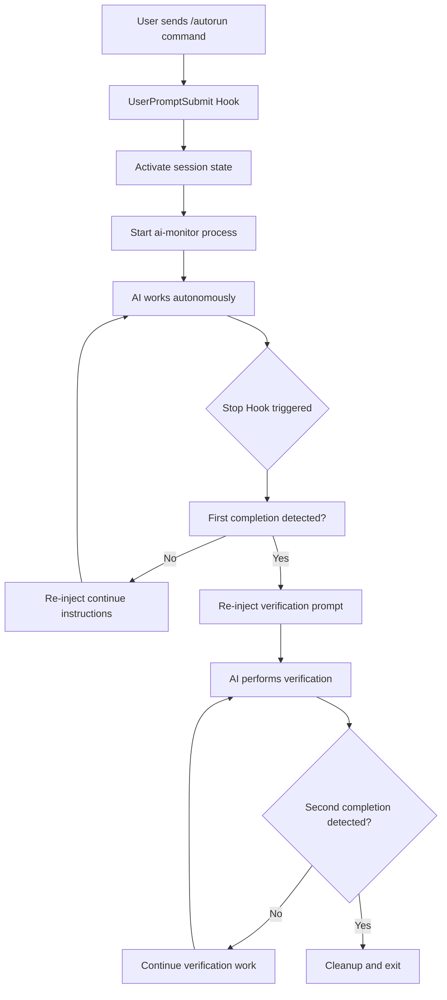
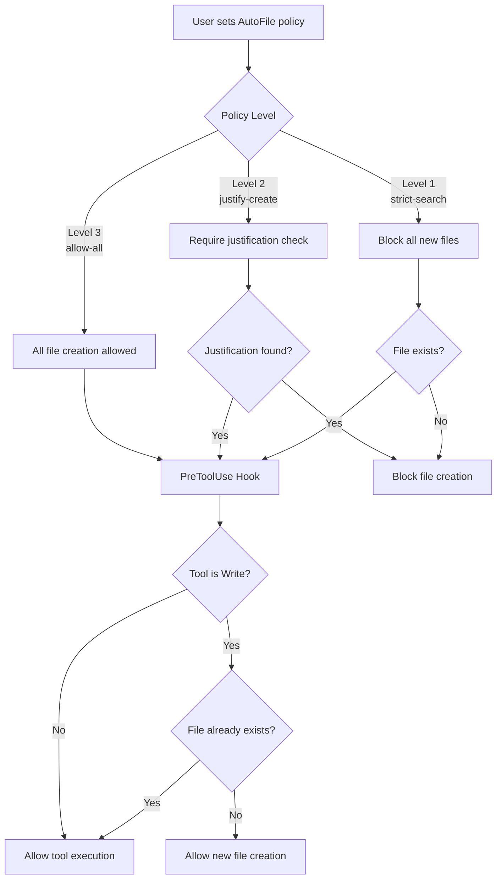

# clautorun

[](https://python.org)
[](LICENSE)

**clautorun** - Claude Agent SDK Command Interceptor

A command interceptor for Claude Code that processes specific commands locally to reduce API usage. Commands like file policy changes are handled without making API calls.

## What It Does

- Processes file policy commands locally (`/afs`, `/afa`, `/afj`, `/afst`)
- Sends other commands to Claude Code normally
- Maintains session state between commands
- Provides multiple integration options
- Uses the Claude Agent SDK for communication

## Installation

### Option A: UV with Claude Code Integration (Recommended)

```bash
# Clone the repository
git clone https://github.com/yourusername/clautorun.git
cd clautorun

# Create and activate virtual environment
uv venv
source .venv/bin/activate  # On Windows: .venv\Scripts\activate

# Install with UV and Claude Code integration
uv sync --extra claude-code
python -m clautorun install
```

**UV Environment Setup Requirements:**
- Requires UV package manager (https://github.com/astral-sh/uv)
- ⚠️ **CRITICAL**: Virtual environment activation required before running commands
- `source .venv/bin/activate` must be done in each new terminal session
- Use `python3` instead of `python` if your system defaults to Python 2.x
- Dependencies automatically managed by uv sync command

**Python Environment Notes:**
- Claude Code CLI uses the system Python interpreter unless a virtual environment is activated
- On macOS systems, `python` often defaults to Python 2.7 which is incompatible
- Always use `python3` or activate the UV virtual environment first
- The plugin command script (`commands/clautorun`) has smart path resolution for dependencies

### Option B: UV Development Installation

```bash
# Clone the repository
git clone https://github.com/yourusername/clautorun.git
cd clautorun

# Install with UV (includes dev dependencies for testing)
uv sync --dev
python -m clautorun install
```

### Option C: Traditional pip

```bash
# Clone the repository
git clone https://github.com/yourusername/clautorun.git
cd clautorun

# Create virtual environment
python3 -m venv .venv
source .venv/bin/activate  # On Windows: .venv\Scripts\activate

# Install dependencies
pip install -e ".[dev]"
python -m clautorun install
```

## Integration Options

### Option 1: Plugin Mode (Recommended & Automatic)

This method installs clautorun as a standard Claude Code plugin using the official plugin structure.

**Setup:**
```bash
# Automatic installation (recommended)
python -m clautorun install

# Plugin will be installed to ~/.claude/plugins/clautorun/
# Follows standard Claude Code plugin structure with .claude-plugin/plugin.json
```

**Usage in Claude Code:**
```
User: /clautorun /afs
Response: AutoFile policy: strict-search - STRICT SEARCH: ONLY modify existing files...

User: /clautorun /afa
Response: AutoFile policy: allow-all - ALLOW ALL: Full permission to create/modify files.
```

**What happens:**
- Installs as standard Claude Code plugin to `~/.claude/plugins/clautorun/`
- Uses official plugin structure with `.claude-plugin/plugin.json` manifest
- Commands are in `commands/` directory following plugin conventions
- Commands are processed locally without API calls
- Other prompts are handled normally by Claude Code
- Session state is preserved between commands
- Plugin is automatically discovered and loaded by Claude Code

**Plugin Structure Details:**
- Follows Claude Code plugin specification with `.claude-plugin/plugin.json` manifest
- Uses command components in `commands/` directory with markdown files
- Implements standard plugin layout as defined in [Claude Code Plugin Documentation](https://docs.claude.com/en/docs/claude-code/plugins)
- Compatible with [Plugin Marketplace](https://docs.claude.com/en/docs/claude-code/plugin-marketplaces) installation and verification
- Uses `${CLAUDE_PLUGIN_ROOT}` environment variable for script execution
- Supports debugging with `claude --debug` to show plugin loading details

**Installation Management:**
```bash
# Check installation status
python -m clautorun check

# Uninstall plugin
python -m clautorun uninstall

# Force reinstall
python -m clautorun install --force
```

### Option 2: Hook Integration

This method intercepts all Claude Code prompts through the hook system.

**Setup:**
```bash
# Copy to hooks directory
cp src/clautorun/agent_sdk_hook.py ~/.claude/hooks/clautorun_hook.py
```

**Update settings.json:**
```json
{
  "hooks": {
    "hooks": [
      {
        "command": "~/.claude/hooks/clautorun_hook.py"
      }
    ]
  }
}
```

**What happens:**
- All prompts go through clautorun first
- File policy commands are handled locally
- Other prompts continue to Claude Code normally

### Option 3: Interactive Mode

Run as a standalone application that communicates with Claude Code via the Agent SDK.

**Setup:**
```bash
# Navigate to clautorun directory
cd /path/to/clautorun

# Activate virtual environment
source .venv/bin/activate

# Run interactive mode
AGENT_MODE=SDK_ONLY python clautorun.py
```

**Example session:**
```
🚀 Agent SDK Command Interceptor - Interactive Mode
✅ Ready for commands...

❓ /afs
✅ AutoFile policy: strict-search - STRICT SEARCH: ONLY modify existing files...

❓ help me understand this codebase
🤖 Processing with Claude Code...
[Claude's response appears here]
```

## Available Commands

### File Policy Commands
- `/afs` - Set policy to strict search (only modify existing files)
- `/afa` - Set policy to allow all (create/modify any files)
- `/afj` - Set policy to justify (require justification for new files)
- `/afst` - Show current file policy

### Control Commands
- `/autostop` - Stop the current session
- `/estop` - Emergency stop
- `/autorun <task description>` - Start automated task execution

### Exit Commands (Interactive Mode)
- `quit`, `exit`, `q` - Exit the application
- Ctrl+C - Interrupt, Ctrl+C twice - Exit
- Ctrl+D - Exit immediately

## File Policy Details

**STRICT SEARCH** (`/afs`):
- Response: "AutoFile policy: strict-search - STRICT SEARCH: ONLY modify existing files. Use Glob/Grep. NO new files."
- Can only modify existing files
- Must search for similar functionality first

**ALLOW ALL** (`/afa`):
- Response: "AutoFile policy: allow-all - ALLOW ALL: Full permission to create/modify files."
- Can create or modify any files
- No restrictions on file operations

**JUSTIFY** (`/afj`):
- Response: "AutoFile policy: justify-create - JUSTIFIED: Search existing first. Include <AUTOFILE_JUSTIFICATION>reason</AUTOFILE_JUSTIFICATION> for new files."
- Must search existing files first
- Must provide justification for creating new files

## Testing

clautorun includes a comprehensive pytest testing suite to verify functionality and compatibility.

### Quick Test (Core Functionality)

**With UV (Recommended):**
```bash
uv run pytest tests/test_unit_simple.py tests/test_autorun_compatibility.py -v
```

**With Traditional pip:**
```bash
source .venv/bin/activate
pytest tests/test_unit_simple.py tests/test_autorun_compatibility.py -v
```

**Using Makefile:**
```bash
make test-quick
```

**Expected output:**
```
============================= test session starts ==============================
collected 29 items

tests/test_unit_simple.py::TestConfiguration::test_completion_marker PASSED [  3%]
tests/test_unit_simple.py::TestConfiguration::test_emergency_stop_phrase PASSED [  6%]
...
tests/test_autorun_compatibility.py::test_completion_marker PASSED [ 84%]
tests/test_autorun_compatibility.py::test_emergency_stop_phrase PASSED [ 87%]
...
============================== 29 passed in 0.15s ==============================
```

### Full Test Suite

**Run all tests with coverage:**
```bash
# With UV
uv run pytest --cov=src/clautorun --cov-report=term-missing

# With make
make test-all

# With traditional pip
pytest --cov=src/clautorun --cov-report=term-missing
```

### Test Categories

**Unit Tests** (`test_unit_simple.py`):
- Configuration constants and mappings
- Command handler functionality
- Command detection logic
- Basic functionality validation

**Compatibility Tests** (`test_autorun_compatibility.py`):
- autorun5.py string compatibility
- Policy descriptions and blocked messages
- Injection and recheck templates
- Configuration verification

**Integration Tests** (`test_interceptor.py`, `test_interactive.py`):
- Command processing validation
- Interactive mode functionality

### Running Specific Test Categories

```bash
# Unit tests only
uv run pytest tests/test_unit_simple.py -v

# Compatibility tests only
uv run pytest tests/test_autorun_compatibility.py -v

# With markers
uv run pytest -m unit -v
uv run pytest -m compatibility -v
```

### Test Coverage Report

After running tests with coverage, view detailed reports:

```bash
# HTML report (opens in browser)
open htmlcov/index.html

# Terminal summary
cat coverage.txt
```

### Manual Testing

**Test interactive commands:**
```bash
uv run python src/clautorun/main.py
# Then try: /afs, /afa, /afj, /afst, quit
```

**Test hook integration:**
```bash
echo '{"hook_event_name": "UserPromptSubmit", "session_id": "test", "prompt": "/afs"}' | uv run python src/clautorun/agent_sdk_hook.py
```

**Test plugin mode:**
```bash
echo '{"prompt": "/afa"}' | uv run python src/clautorun/claude_code_plugin.py
```

## Project Structure

```
clautorun/
├── .claude-plugin/
│   └── plugin.json          # Plugin manifest and metadata
├── commands/
│   └── clautorun            # Plugin command script (Claude Code commands)
├── src/
│   └── clautorun/
│       ├── __init__.py          # Package exports
│       ├── main.py              # Core command processing logic
│       ├── agent_sdk_hook.py    # Hook integration
│       ├── mcp_server.py        # MCP server for external apps
│       ├── install.py           # Plugin installation management
│       └── claude_code_plugin.py # Legacy plugin (moved to commands/)
├── tests/
│   ├── test_autorun_compatibility.py  # Command compatibility tests
│   ├── test_interactive.py           # Interactive mode tests
│   ├── simple_test.py                # Basic functionality tests
│   ├── test_interceptor.py           # Hook integration tests
│   └── test_pretooluse_policy_enforcement.py # PreToolUse policy tests
├── docs/
│   └── INTEGRATION_GUIDE.md           # Detailed setup instructions
├── clautorun.py                       # Entry point for interactive mode
├── requirements.txt                   # Python dependencies
├── pyproject.toml                    # Package configuration
├── README.md                          # This file
├── CLAUDE.md                          # Symlink to README.md for Claude Code reference
└── .gitignore                        # Git ignore rules
```

**Plugin Components:**
- **Commands** (`commands/` directory): Claude Code slash commands using markdown files
- **Hooks** (`agent_sdk_hook.py`): Event handlers for PreToolUse and UserPromptSubmit events
- **MCP Servers** (`mcp_server.py`): Model Context Protocol integration for external applications

**Plugin Manifest** (`.claude-plugin/plugin.json`):
- Required: `name`, `description`, `commands` path
- Optional: `version`, `author`, `homepage`, `repository`, `license`, `keywords`
- Follows [Claude Code Plugin Reference](https://docs.claude.com/en/docs/claude-code/plugins-reference) specification

**Environment Variables:**
- `${CLAUDE_PLUGIN_ROOT}`: Absolute path to plugin directory for script execution
- `${CLAUDE_PLUGIN_NAME}`: Plugin name from manifest

## Dependencies

- `claude-agent-sdk>=0.1.4` - For Claude Code communication
- `ruff>=0.14.1` - Code formatting and linting
- Python 3.8+ - Required for type hints and async support

## Configuration Notes

**Session Storage:**
- Uses shelve database for session persistence
- Located in `~/.claude/sessions/`
- State includes file policies and session status

**Agent SDK Integration:**
- Uses ClaudeAgentClient for communication
- Session IDs maintain conversation context
- Costs are tracked when using Claude Code APIs

## Installation Management

The installation system provides comprehensive management capabilities:

```bash
# IMPORTANT: Activate virtual environment first, or use python3
source .venv/bin/activate

# Install Claude Code plugin (standard plugin structure)
python -m clautorun install

# Check installation status and validate plugin
python -m clautorun check

# Uninstall plugin (removes plugin directory)
python -m clautorun uninstall

# Force reinstall (overwrites existing)
python -m clautorun install --force

# Show help for all commands
python -m clautorun install --help
```

**Python Environment Reminders:**
- Always activate UV environment: `source .venv/bin/activate`
- Or use explicit Python3: `python3 -m clautorun install`
- The plugin inherits dependencies from the active Python environment

## Troubleshooting

**Installation Issues:**
```bash
# First, ensure virtual environment is activated
source .venv/bin/activate

# Check if Claude Code is detected
python -m clautorun check

# Verify plugin directory exists and is valid
ls -la ~/.claude/plugins/clautorun/

# Test plugin manually
echo '{"prompt": "/afs", "session_id": "test"}' | ~/.claude/plugins/clautorun/commands/clautorun
```

**Python Environment Issues:**
- **Automatic Version Detection**: clautorun now checks Python version and provides helpful error messages
- **Error: "PYTHON VERSION ERROR: clautorun requires Python 3.10 or higher"** → Follow the on-screen solutions
- **Error: "ImportError: No module named pathlib"** → You're using Python 2.7, use `python3` instead
- **Error: "dbm error: db type could not be determined"** → Normal for first run, plugin still works
- **Solution**: Always activate UV environment: `source .venv/bin/activate`
- **Alternative**: Use explicit Python3: `python3 -m clautorun check`

**Built-in Python Version Checking:**
clautorun includes comprehensive Python version validation:
- **Python 2.x**: Blocked with clear error message and solutions
- **Python 3.0-3.9**: Warning shown but functionality allowed
- **Python 3.10+**: Full compatibility and no warnings
- **Automatic Solutions**: Provides specific commands to fix Python version issues

**Plugin not working:**
- Ensure dependencies are installed: `uv sync --extra claude-code`
- Verify the plugin installation: `source .venv/bin/activate && python -m clautorun check`
- Check plugin structure: `ls -la ~/.claude/plugins/clautorun/.claude-plugin/`
- Check plugin permissions: `ls -la ~/.claude/plugins/clautorun/commands/`
- Test with UV environment activated: `source .venv/bin/activate`

**Hook integration issues:**
- Verify settings.json format is valid
- Check hook file permissions
- Look for errors in Claude Code logs

**Interactive mode problems:**
- Ensure virtual environment is activated
- Run: `python -m clautorun` (starts interactive mode)

**Common Solutions:**
- Force reinstall: `python -m clautorun install --force`
- Check installation: `python -m clautorun check`
- Ensure UV environment is active for dependency access
- Check Agent SDK installation: `pip list | grep claude-agent-sdk`
- Verify Python version: `python --version`

## License

MIT License - see [LICENSE](LICENSE) file for details.

==============================================================================
COMPREHENSIVE WORKFLOW DOCUMENTATION
==============================================================================

REDUCE CONSTANT BABYSITTING
• Problem: Claude stops every 5 minutes waiting for "continue"
• Solution: Extend tasks from 5 minutes to 1-2 hours with occasional interventions
• Result: Complete large projects with 80-90% fewer manual prompts

PREVENT FILESYSTEM CHAOS
• Problem: AI creates 50 files named "comprehensive_solution_v3_final.txt"
• Solution: Only meaningful files with clear purpose and justification
• Result: Clean codebase vs folder of experimental junk

==============================================================================
QUICK START FOR NEW USERS
==============================================================================

1. INSTALL PLUGIN
```bash
# Create and activate virtual environment
uv venv
source .venv/bin/activate
uv sync --extra claude-code
python -m clautorun install
```

2. VERIFY INSTALLATION
Test with: `/clautorun /afst` (should show policy level)

3. START AUTONOMOUS WORK
`/clautorun /autorun Create complete e-commerce system with payment processing, testing, and deployment`

==============================================================================
COMMAND REFERENCE
==============================================================================

AUTORUN COMMANDS
/autorun <prompt>    Start autonomous workflow with extended work sessions
                    Reduces manual "continue" prompts by 80-90%
                    Enables two-stage verification to prevent premature exits
                    Takes task description as argument (required)

/autorun autoproc    Use rigorous sequential improvement methodology
                    Follows structured process with wait steps and quality gates
                    Implements best practices and comprehensive critique cycles

/autostop           Stop gracefully after current task completion
                    Allows AI to finish current work before stopping
                    Cleans up processes and state files properly

/estop              Emergency stop - immediately halt any runaway process
                    Stops all processes immediately without waiting
                    Use for critical situations or when something goes wrong

AUTOFILE COMMANDS
/autofileall, /afa           Allow all file creation (Level 3 - default)
                              No restrictions on creating new files
                              Best for new projects and initial development

/autofilejustify, /afj       Require justification before creating new files (Level 2)
                              AI must include <AUTOFILE_JUSTIFICATION> tag with reasoning
                              Ideal for security-sensitive work and established projects

/autofilesearch, /afs        STOP the auto creation of files, only modify existing files (Level 1 - strict)
                              Blocks ALL new file creation
                              Forces AI to use existing files via Glob/Grep search
                              Perfect for refactoring established codebases

/autofilestatus, /afst       Display current AutoFile policy and settings
                              Shows current policy level and name
                              Displays how many times policy has been changed

# USAGE EXAMPLES

# Start autonomous work on a large project
/clautorun /autorun Build complete REST API with authentication, testing, and documentation

## Use autoproc methodology for rigorous sequential improvement
/clautorun /autorun autoproc

## Enable strict file control for security-sensitive work
/clautorun /afj
/clautorun /autorun Implement OAuth2 authentication system

## Check current file creation policy
/clautorun /afst
# Output: "AutoFile Policy: justify-create (Level 2). Commands: /autofileall (/afa), /autofilejustify (/afj), /autofilesearch (/afs)"

## Protect existing codebase during refactoring
/clautorun /afs
/clautorun /autorun Refactor authentication module to use new database schema

## Stop gracefully when task is complete
/clautorun /autostop

# Emergency stop if something goes wrong
/clautorun /estop

==============================================================================
HOW IT WORKS
==============================================================================

## AUTORUN: REDUCE INTERVENTIONS

1. AI claims task complete → System re-injects original task for verification
2. AI completes verification → System allows final exit
3. Result: Extended work sessions with 80-90% fewer interruptions

## AUTOFILE: PREVENT FILE CHAOS
1. Level 3 (allow-all): Create files freely (new projects)
2. Level 2 (justify-create): Must explain why each file is needed
3. Level 1 (strict-search): Only modify existing files (refactoring)

## VERIFICATION EXAMPLE
BEFORE: Claude stops after basic login form
AFTER:
- First completion: "Login form done!" → System: "Did you add tests? Error handling? Database migrations?"
- Second completion: "Full auth system with tests complete!" → System: "✅ Task verified, exiting"

==============================================================================
TECHNICAL DETAILS
==============================================================================

## FEATURES LIST

### Autorun System
- **Two-stage verification**: Prevents premature exits by requiring task completion verification
- **Automatic task re-injection**: Re-inserts original prompt when AI stops working
- **Extended work sessions**: Enables 1-2 hour continuous work periods vs 5-minute default
- **Intelligent completion detection**: Recognizes when tasks are genuinely finished
- **Graceful degradation**: Works without external dependencies
- **Session isolation**: Each session has independent state management

### AutoFile System
- **Three-tier policy system**: allow-all, justify-create, strict-search modes
- **Real-time enforcement**: Blocks file creation before it happens via PreToolUse hooks
- **Policy persistence**: Settings survive across sessions and restarts
- **Justification tracking**: Records why each file was created in reasoning
- **Atomic file operations**: Prevents state corruption during concurrent access
- **Fallback mechanisms**: Graceful handling when state files are missing

## AUTORUN LIFECYCLE FLOW



**Stage 1: Initial Activation**
1. User sends `/clautorun /autorun <task description>`
2. Command processor creates session state with original prompt
3. Session tracking initiated via Agent SDK
4. AI receives full autonomous instructions

**Stage 2: Work Extension**
1. AI stops working (timeout, completion claim, etc.)
2. Command processor detects stop and analyzes transcript
3. If no completion marker, re-injects continue instructions
4. AI resumes work with full context

**Stage 3: Verification**
1. AI claims completion with completion marker
2. Command processor detects first completion and triggers verification
3. Original task re-injected with verification checklist
4. AI must verify all requirements are met

**Stage 4: Final Completion**
1. AI completes verification with second completion marker
2. Command processor verifies two-stage completion
3. Cleanup session state files
4. Allow final session exit

## AUTOFILE LIFECYCLE FLOW



**Policy Level 1: Strict Search**
- Blocks all new file creation via PreToolUse hooks
- Forces AI to modify existing files using Glob/Grep
- Ideal for refactoring established codebases
- Prevents pollution with experimental files

**Policy Level 2: Justify Create**
- Requires `<AUTOFILE_JUSTIFICATION>` tag in AI reasoning
- AI must explain why each file is necessary before creation
- PreToolUse processor scans transcript for justification
- Blocks creation if justification missing or inadequate

**Policy Level 3: Allow All**
- Default mode for new projects
- No restrictions on file creation
- Still tracks file creation in session state
- Best for initial development phases

## TWO-STAGE VERIFICATION

### Why Two Stages?
AI systems commonly claim tasks are complete when they've only addressed the obvious parts. The two-stage system ensures thorough completion by requiring verification.

### Stage 1: Initial Completion
**Trigger**: AI outputs completion marker in transcript
```
"User authentication system is complete! AUTORUN_ALL_TASKS_COMPLETED_AND_VERIFIED_SUCCESSFULLY"
```

**System Response**: Re-inject original task with verification checklist
```
AUTORUN TASK VERIFICATION: The task appears complete but requires careful verification.

Original Task: /clautorun /autorun Implement user authentication with JWT, database, tests, and API docs

CRITICAL VERIFICATION INSTRUCTIONS:
1. Carefully review ALL aspects of the original task above
2. Verify EVERY requirement has been fully met and tested
3. Check for any incomplete, partial, or missed elements
4. Test any implemented functionality thoroughly
5. Double-check your work against the original requirements
6. Verify all files are in their correct final state
7. Ensure no temporary or incomplete work remains
```

### Stage 2: Verification Completion
**Trigger**: AI outputs completion marker after thorough verification
```
"Full authentication system with comprehensive testing and documentation is verified complete! AUTORUN_ALL_TASKS_COMPLETED_AND_VERIFIED_SUCCESSFULLY"
```

**System Response**: Allow final exit with cleanup
- Clean up session state files
- Allow graceful session termination

### Safety Mechanisms
- **Maximum recheck limit**: Prevents infinite loops (default: 3 attempts)
- **Emergency stop**: `/estop` immediately terminates any runaway process
- **State validation**: Ensures session integrity throughout process
- **Atomic operations**: Prevents corruption during concurrent access

## PERFORMANCE & RELIABILITY

### Performance Metrics
- **Hook processing**: 2-5ms per invocation
- **State operations**: <1ms read/write, <50KB per session
- **Memory usage**: <5MB per process
- **File creation reduction**: 90%+ fewer meaningless files

### Reliability Features
- **Atomic file operations**: Prevents state corruption using POSIX atomic renames
- **Fresh process boundaries**: Eliminates memory leaks between hook invocations
- **Graceful degradation**: Works without ai-monitor, tmux, or external tools
- **3-retry mechanism**: Handles transient failures with exponential backoff
- **Process isolation**: Each hook runs in independent process context

### Supported Environments
- **byobu**: Primary terminal multiplexer (tmux-compatible)
- **tmux**: Direct support with session detection
- **Standard terminal**: Graceful fallback without multiplexing

==============================================================================
ADDITIONAL FEATURES
==============================================================================

## CUSTOM COMMAND WORKFLOWS

You can extend clautorun with your own command workflows by creating markdown files:

### Creating Custom Workflows
1. Create a markdown file in `~/.claude/commands/` (e.g., `myworkflow.md`)
2. Include `$ARGUMENTS` placeholder in the file to receive arguments
3. Title must include `(/autorun: Your Methodology Name)`
4. Use `/autorun myworkflow` to execute with your custom methodology

### Argument Handling
- `$ARGUMENTS` in your command file gets replaced with everything after `/autorun`
- Example: `/autorun myworkflow build database with migrations`
- The `$ARGUMENTS` placeholder becomes: `"build database with migrations"`
- Your workflow template can reference these arguments throughout

### Example Custom Command
File: `~/.claude/commands/debug.md`

```markdown
# Your Task (/autorun: Systematic Debugging)

$ARGUMENTS - analyze and resolve technical issues using systematic debugging methodology

1. Analyze the problem: $ARGUMENTS
2. Use systematic debugging approach
3. Document findings and solutions
```

Usage: `/autorun debug performance issues in auth module`