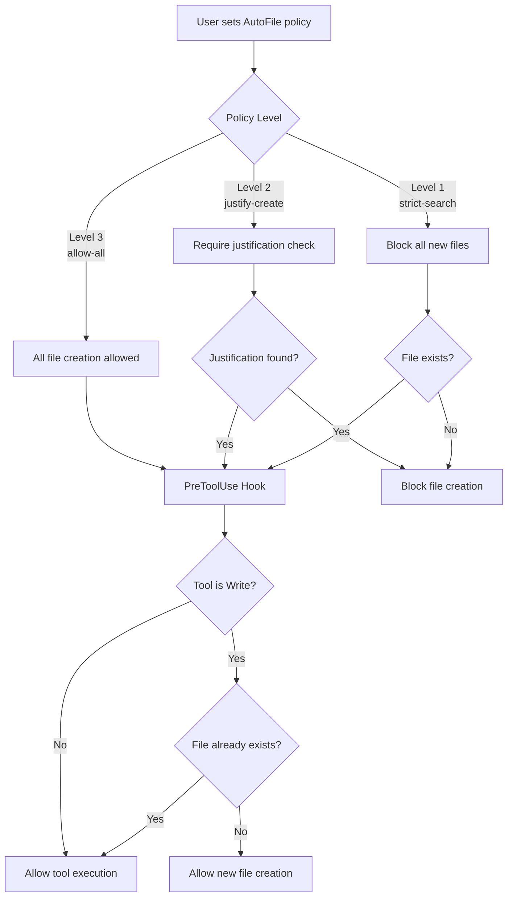
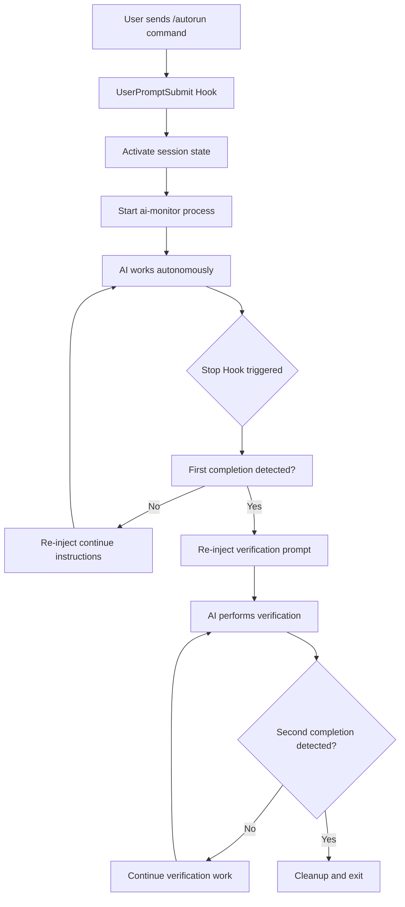

# clautorun

[](https://python.org)
[](LICENSE)

**clautorun** - Reduce User Interruptions While Claude Completes Tasks

Reduce user interruptions while Claude completes tasks. Maintain work across crashes and disconnections.

## What clautorun Does For You

**Problem Statement**: Claude Code sessions can end unexpectedly during extended tasks, requiring manual intervention to continue work. AI creates numerous experimental files during development, leading to cluttered project directories. Network disconnections or application crashes terminate active sessions, losing all in-progress work.

**Solution Overview**: clautorun addresses these specific limitations through session automation, file policy enforcement, and session persistence.

### Reduce User Interruptions
- **Current Behavior**: Claude Code sessions can end unexpectedly, requiring manual intervention to continue work
- **With clautorun**: Claude continues working autonomously on the same task, reducing user interruptions
- **Mechanism**: Automatic task continuation when Claude stops working, ensuring focus stays on completing the original task without user intervention
- **Result**: Tasks get completed with reduced interruptions

### File Creation Control
- **Current Behavior**: AI creates multiple experimental files during development
- **With clautorun**: Three-tier policy system restricts unnecessary file creation
- **Policy Levels**:
  1. Strict search (search for and modify existing files instead of creating new ones)
  2. Justified creation (require explanation for new files)
  3. Allow all (unrestricted for new projects)
- **Mechanism**: "Strict search" requires AI to first search for existing functionality or similar files, then modify those files rather than creating new ones
- **Result**: Project directories contain essential files only, reducing cleanup requirements

### Reduce Manual Interventions (clautorun feature)
- **Current Behavior**: Claude Code stops and waits for manually typing continue
- **clautorun Action**: Hook system intercepts Claude Code stop events and automatically re-injects continuation prompts
- **Mechanism**: UserPromptSubmit and Stop hooks detect when Claude stops working, analyze the transcript for completion markers, and inject "continue working" prompts when tasks are incomplete
- **Benefit**: Start autonomous tasks and return to completed work with fewer interruptions

### Prevent File Clutter (clautorun feature)
- **Current Behavior**: AI creates multiple experimental files during development
- **clautorun Action**: PreToolUse hooks intercept Write tool calls and enforce file creation policies
- **Mechanism**: Before each file creation, the hook scans the conversation transcript for policy compliance. It blocks or allows file operations based on the current policy level (`/afs`, `/afj`, `/afa`) and any required justifications
- **Policy Levels**:
  1. Strict search - Hook blocks all new file creation, forcing AI to modify existing files found through search
  2. Justified creation - Hook allows new files only when AI includes required justification tags
  3. Allow all - Hook allows all file creation operations
- **Benefit**: Maintain clean project directories with only essential files

### Ensure Complete Tasks (clautorun feature)
- **Current Behavior**: AI may claim task completion after implementing only partial requirements
- **clautorun Action**: Hook system implements two-stage verification by detecting completion markers and re-injecting the original task
- **Mechanism**: When AI outputs a completion marker, the hook detects this first completion and re-injects the original task with a verification checklist. Only after a second completion marker does the system allow the session to end
- **Benefit**: Reduce incomplete features and ensure all requirements are implemented

### Survive Crashes and Disconnections (tmux/byobu feature)
- **Current Behavior**: Application crashes or network drops terminate work sessions
- **tmux/byobu Action**: Maintains session state across interruptions using terminal multiplexing
- **How it Works**: Terminal multiplexer keeps processes running on the server regardless of client connectivity
- **Benefit**: Resume work from the exact interruption point after reconnection
- **Note**: clautorun integrates with tmux/byobu but does not provide session persistence itself

### Work From Anywhere (tmux/byobu + SSH/Mosh feature)
- **Current Behavior**: Users must stay at their workstation to monitor and intervene in AI sessions
- **SSH/Mosh + tmux Action**: Enables remote session monitoring and intervention from any device
- **How it Works**: SSH/Mosh clients connect to the tmux session through network connections
- **Benefit**: Monitor and control AI work from any location with internet access
- **Note**: clautorun provides commands to work within tmux sessions but does not provide remote access

### Concrete Capabilities Matrix

**tmux/byobu Base Capabilities:**
- **Session Persistence**: Processes continue running even when client disconnects
- **Session Isolation**: Multiple independent sessions can run simultaneously
- **Remote Access**: SSH/Mosh provides secure remote access from any device
- **Multiplexing**: Split terminal windows for simultaneous viewing
- **Process Recovery**: Automatic session recovery after system restart

**clautorun Enhanced Capabilities:**
- **Automatic Continuation**: Keeps Claude working without manually typing continue
- **File Policy Enforcement**: Three-tier system to prevent file clutter
- **Two-Stage Verification**: Helps ensure tasks are complete
- **Session State Management**: Robust state isolation and recovery
- **Targeted Session Safety**: Commands never affect current Claude Code session

### Measurable Technical Benefits

**Before clautorun + tmux/byobu:**
- AI work lost when terminal closes
- Manual intervention required for session interruptions
- No file creation control during autonomous workflows
- No verification that tasks are actually complete

**With clautorun + tmux/byobu:**
- Reduced data loss during crashes or disconnections
- Decreased need for manual intervention
- File creation policies to reduce unnecessary files
- Two-stage verification to help ensure task completion

### Testing

clautorun includes a comprehensive testing suite with multiple approaches to verify functionality and integration.

#### Quick Integration Test

**Test the complete workflow:**
```bash
# Create byobu session with crash protection
byobu-new-session clautorun-work

# Start autonomous task that simulates crash
/clautorun /autorun simulate network issues during build process

# Test session recovery
# Close terminal, reconnect with SSH/Mosh
byobu-attach clautorun-work
# Expected: AI work continues from interruption point
```

**Recovery Verification:**
```bash
# Check if AI is still working
ps aux | grep python  # Look for running clautorun processes

# Verify session state persistence
tmux list-sessions | grep clautorun
# Expected: "clautorun-work" session exists and is running
```

#### Comprehensive pytest Testing

**What is pytest?**
pytest is a popular testing framework for Python that makes it easy to write simple and scalable tests. It automatically discovers test files and functions, provides detailed output, and supports powerful fixtures and plugins.

**What are Virtual Environments?**
Virtual environments are isolated Python environments that keep project dependencies separate. Think of them as clean rooms for each project - they prevent different projects from conflicting with each other's requirements.

**What is UV?**
UV is a modern, extremely fast Python package manager and virtual environment manager. It's like `pip` + `venv` but 10-100x faster with better dependency resolution.

**Quick Core Tests:**
```bash
# With UV (Recommended)
uv run pytest tests/test_unit_simple.py tests/test_autorun_compatibility.py -v

# With Traditional pip
python3 -m venv .venv
source .venv/bin/activate
pip install -e ".[dev]"
pytest tests/test_unit_simple.py tests/test_autorun_compatibility.py -v

# Using Makefile
make test-quick
```

**Expected output:**
```
============================= test session starts ==============================
collected 29 items

tests/test_unit_simple.py::TestConfiguration::test_completion_marker PASSED [ 3%]
tests/test_unit_simple.py::TestConfiguration::test_emergency_stop_phrase PASSED [ 6%]
...
tests/test_autorun_compatibility.py::test_completion_marker PASSED [ 84%]
tests/test_autorun_compatibility.py::test_emergency_stop_phrase PASSED [ 87%]
...
============================== 29 passed in 0.15s ==============================
```

**Full Test Suite with Coverage:**
```bash
# With UV
uv run pytest --cov=src/clautorun --cov-report=term-missing

# With make
make test-all

# With traditional pip
pytest --cov=src/clautorun --cov-report=term-missing
```

**Test Categories:**
- **Unit Tests** (`test_unit_simple.py`): Configuration constants, command handlers, command detection logic
- **Compatibility Tests** (`test_autorun_compatibility.py`): String compatibility, policy descriptions, configuration verification
- **Integration Tests** (`test_interceptor.py`, `test_interactive.py`): Command processing, interactive mode functionality

**Specific Test Categories:**
```bash
# Unit tests only
uv run pytest tests/test_unit_simple.py -v

# Compatibility tests only
uv run pytest tests/test_autorun_compatibility.py -v

# With markers
uv run pytest -m unit -v
uv run pytest -m compatibility -v
```

**Test Coverage Report:**
After running tests with coverage, view detailed reports:
```bash
# HTML report (opens in browser)
open htmlcov/index.html

# Terminal summary
cat coverage.txt
```

**Manual Testing:**
```bash
# Test interactive commands
uv run python src/clautorun/main.py
# Then try: /afs, /afa, /afj, /afst, quit

# Test hook integration
echo '{"hook_event_name": "UserPromptSubmit", "session_id": "test", "prompt": "/afs"}' | uv run python src/clautorun/agent_sdk_hook.py

# Test plugin mode
echo '{"prompt": "/afa"}' | uv run python src/clautorun/claude_code_plugin.py
```

## Why Byobu + tmux Integration

**clautorun is designed for use with byobu (tmux-compatible terminal multiplexer)** - this integration provides concrete technical capabilities:

### Survive System Failures
- **Technical Issue**: Terminal application crashes, network disconnections, or system reboots terminate Claude Code sessions, losing all in-progress AI work
- **Solution**: byobu + tmux maintains session state on the server. Session persists even when your local machine loses power or network connection
- **Concrete Result**: SSH back to the same session after system reboot; AI work continues from exactly where it left off

### Access Sessions Remotely
- **Technical Issue**: You must be physically present at your workstation to monitor or intervene in AI sessions
- **Solution**: SSH access to byobu session from any device with SSH client (phone, tablet, laptop)
- **Concrete Result**: Monitor AI progress from mobile device; intervene when needed without returning to desk

**What is SSH?** SSH (Secure Shell) is a secure network protocol that lets you securely access and control your computer from anywhere in the world.

**SSH Clients for Different Devices:**

**Enhanced SSH Experience (Recommended):**
- **Mosh (Mobile Shell)**: [mosh.org](https://mosh.org/) - A mobile SSH client that handles network interruptions gracefully
  - **Why Mosh?** Keeps your connection alive even when switching networks (WiFi → 4G → WiFi), works with poor connections, provides intelligent local echo for reduced lag, and automatically resumes where you left off after reconnection
  - **Installation**: `brew install mosh` (macOS), `sudo apt install mosh` (Ubuntu/Debian)
  - **Usage**: `mosh username@your-server-address` instead of `ssh username@your-server-address`

**Traditional SSH Clients:**
- **Windows**: [Windows Terminal](https://learn.microsoft.com/en-us/windows/terminal/) (built-in, modern), [VS Code Terminal](https://code.visualstudio.com/) (built-in to VS Code), [Fluent Terminal](https://github.com/felixse/FluentTerminal) (free), [Hyper](https://hyper.is/) (modern, extensible)
- **macOS**: [iTerm2](https://iterm2.com/) (recommended, powerful), [VS Code Terminal](https://code.visualstudio.com/) (built-in to VS Code), or built-in Terminal app
- **Linux**: Most terminal emulators work well (gnome-terminal, konsole, etc.), [VS Code Terminal](https://code.visualstudio.com/) (built-in to VS Code)
- **iOS**: [Terminus](https://www.termius.com/mobile) (supports Mosh), [Prompt](https://panic.com/prompt/) (supports Mosh), or [Blink Shell](https://blink.sh/) (supports Mosh)
- **Android**: [Termius](https://www.termius.com/mobile) (supports Mosh), [JuiceSSH](https://juicessh.com/), or [ConnectBot](https://github.com/connectbot/connectbot)

### Monitor Multiple Processes Simultaneously
- **Technical Issue**: Single terminal window hides AI output, error messages, and system status
- **Solution**: byobu splits terminal into multiple panes: AI output, error logs, file system monitoring, command history
- **Concrete Result**: See AI responses in real-time while monitoring system resources and errors simultaneously

### Control File Creation
- **Technical Issue**: AI creates numerous experimental files during development, leading to cluttered project directories
- **Solution**: Three-tier file policy system (`/afs` strict-search, `/afj` justify-create, `/afa` allow-all) with PreToolUse hook enforcement
- **Concrete Result**: Clean project directories with meaningful files only; unified implementation approach reduces file proliferation

## AUTOFILE LIFECYCLE FLOW



**Policy Level 1: Strict Search** (`/afs`)
- Blocks all new file creation via PreToolWrite hooks
- Forces AI to modify existing files using Glob/Grep
- Ideal for refactoring established codebases
- Prevents pollution with experimental files

**Policy Level 2: Justify Create** (`/afj`)
- Requires `<AUTOFILE_JUSTIFICATION>` tag in AI reasoning
- Hook scans transcript for proper justification before allowing new files
- Balances innovation with organization
- Records why each file was created in reasoning

**Policy Level 3: Allow All** (`/afa`)
- No restrictions on file creation (default for new projects)
- Full creative freedom for initial development
- Best for prototyping and new project setup
- All tools pass through without intervention

## 🎯 What It Does

- **Autonomous Task Completion**: Keeps Claude working on tasks without interrupting you
- **Smart File Management**: Prevents AI from creating meaningless files
- **Session Persistence**: Keeps work alive across crashes and disconnections
- **Remote Control**: Monitor and manage AI sessions from anywhere
- **Two-Stage Verification**: Ensures tasks are actually complete, not just "good enough"

## AUTORUN LIFECYCLE FLOW



**Stage 1: Initial Activation**
1. User sends `/autorun <task description>`
2. Hook creates session state with original prompt
3. ai-monitor started for persistent session tracking
4. AI receives full autonomous instructions

**Stage 2: Work Extension**
1. AI stops working (timeout, completion claim, etc.)
2. Hook detects stop and analyzes transcript
3. If no completion marker, re-injects continue instructions
4. AI resumes work with full context

**Stage 3: Verification**
1. AI outputs completion marker
2. Hook detects first completion and re-injects verification prompt
3. AI performs thorough verification of original requirements
4. AI must verify all requirements are met

**Stage 4: Final Completion**
1. AI completes verification with second completion marker
2. Hook verifies two-stage completion
3. Cleanup processes and state files
4. Allow final session exit

### Verification Example
**Before**: Claude stops after basic login form
**After**:
- First completion: "Login form done!" → System: "Did you add tests? Error handling? Database migrations?"
- Second completion: "Full auth system with tests complete!" → System: "✅ Task verified, exiting"

### Two-Stage Verification Process

#### Stage 1: Initial Completion
**Trigger**: AI outputs completion marker in transcript
```
"User authentication system is complete! AUTORUN_ALL_TASKS_COMPLETED_AND_VERIFIED_SUCCESSFULLY"
```

**System Response**: Re-inject original task with verification checklist
```
AUTORUN TASK VERIFICATION: The task appears complete but requires careful verification.

Original Task: /clautorun /autorun Implement user authentication with JWT, database, tests, and API docs

CRITICAL VERIFICATION INSTRUCTIONS:
1. Carefully review ALL aspects of the original task above
2. Verify EVERY requirement has been fully met and tested
3. Check for any incomplete, partial, or missed elements
4. Test any implemented functionality thoroughly
5. Double-check your work against the original requirements
6. Verify all files are in their correct final state
7. Ensure no temporary or incomplete work remains
```

#### Stage 2: Verification Completion
**Trigger**: AI outputs completion marker after thorough verification
```
"Full authentication system with comprehensive testing and documentation is verified complete!
AUTORUN_ALL_TASKS_COMPLETED_AND_VERIFIED_SUCCESSFULLY"
```

**System Response**: Allow final exit with cleanup
- Clean up session state files
- Allow graceful session termination

### Safety Mechanisms
- **Maximum recheck limit**: Prevents infinite loops (default: 3 attempts)
- **Emergency stop**: `/estop` immediately terminates any runaway process
- **State validation**: Ensures session integrity throughout process
- **Atomic operations**: Prevents corruption during concurrent access

## ⚡ Quick Start (5 Minutes)

### Prerequisites: Install Terminal Multiplexers

**First, install the tools that give you terminal superpowers:**

**What are Terminal Multiplexers?**
Terminal multiplexers are programs that let you create multiple virtual terminal sessions within a single terminal window. Think of them like having multiple tabs in your browser, but for the command line. They keep your sessions running even when you close your terminal or lose connection.

**byobu** (Recommended - easiest):
- **What is byobu?** A user-friendly wrapper around tmux that makes terminal multiplexing easy with intuitive keyboard shortcuts and status bars
- **Why byobu?** Simpler interface than raw tmux, designed for humans, includes helpful keyboard shortcut reminders
- **Installation:**
  ```bash
  # Ubuntu/Debian: sudo apt install byobu
  # macOS: brew install byobu
  # Or install from: https://byobu.co/
  ```

**tmux** (byobu backend - installed automatically with byobu):
- **What is tmux?** Terminal Multiplexer - the powerful engine that byobu uses for session management
- **Why tmux?** Industry standard, extremely reliable, perfect for remote servers and long-running processes
- **Installation:**
  ```bash
  # Ubuntu/Debian: sudo apt install tmux
  # macOS: brew install tmux
  # Documentation: https://github.com/tmux/tmux/wiki
  ```

**What is Homebrew (brew)?**
Homebrew is a free and open-source package manager for macOS and Linux that makes it easy to install software. If you don't have it:
- **Install Homebrew:** `/bin/bash -c "$(curl -fsSL https://raw.githubusercontent.com/Homebrew/install/HEAD/install.sh)"`

### Plugin Installation (Choose Method)

**Option A: GitHub Installation (Production - Recommended)**
```bash
# Install directly from GitHub
/plugin install https://github.com/ahundt/clautorun.git
```

**Option B: Local Development Installation (Testing Changes)**
```bash
# Navigate to clautorun directory
cd /path/to/clautorun

# Add local development marketplace
/plugin marketplace add ./clautorun

# Install local development version
/plugin install clautorun@clautorun-dev
```

**Which to Choose:**
- **Option A**: For stable production use with released versions
- **Option B**: For testing changes before pushing to GitHub

### Verify Installation

```bash
# Check plugin is installed
/plugin

# Test functionality
/clautorun /afst
```

**Expected output:**
```
AutoFile policy: allow-all - ALLOW ALL: Full permission to create/modify files.
```

### Start Your First Extended Session

```bash
# Create a byobu session for crash-safe AI work
byobu-new-session clautorun-work

# Start autonomous work (runs for hours instead of minutes)
/clautorun /autorun Build a complete web application with authentication

# Detach with Ctrl+D, reattach anytime with: byobu-attach clautorun-work
```

## 🔧 Advanced Setup (Optional)

### Development Installation (Contributors)

For contributing to clautorun development:

```bash
# Clone repository and set up development environment
git clone https://github.com/ahundt/clautorun.git
cd clautorun

# Install development dependencies
uv sync --extra dev

# Add local development marketplace for testing
/plugin marketplace add ./clautorun

# Install your local development version
/plugin install clautorun@clautorun-dev
```

**Contributor Workflow:**
1. **Make changes**: Edit code in your local clone
2. **Test locally**: Use the installed development version to test your changes
3. **Run tests**: `uv run pytest tests/` to ensure nothing breaks
4. **Submit PR**: Create a pull request with your improvements

**Git for Contributors:**
Git provides complete version control for collaborative development. Essential commands:
- `git diff` - Review your changes before committing
- `git add . && git commit -m "Description"` - Commit your changes
- `git push origin feature-branch` - Share your changes for review

**AI Safety with Git:**
- **Instant rollback**: `git reset --hard HEAD~1` undoes all AI changes instantly
- **Selective revert**: `git checkout -- filename` restores specific files
- **Safe experimentation**: Test AI suggestions knowing you can revert completely
- **Change visibility**: See exactly what AI modified before committing

### Manual Installation (if plugin system fails)

```bash
# Create virtual environment
python3 -m venv .venv
source .venv/bin/activate

# Install dependencies
pip install -e ".[dev]"

# Manual plugin setup
PYTHONPATH=$(pwd)/src python src/clautorun/install.py install
```

## 📋 Available Commands

### Autorun Commands
- **/autorun \<prompt>** - Start autonomous workflow with extended work sessions
  - Reduces manual "continue" prompts significantly
  - Enables two-stage verification to prevent premature exits
  - Takes task description as argument (required)

- **/autostop** - Stop gracefully after current task completion
  - Allows AI to finish current work before stopping
  - Cleans up processes and state files properly

- **/estop** - Emergency stop - immediately halt any runaway process
  - Stops all processes immediately without waiting
  - Use for critical situations or when something goes wrong

### AutoFile Commands
- **/afa** - Allow all file creation (Level 3 - default)
  - No restrictions on creating new files
  - Best for new projects and initial development

- **/afj** - Require justification before creating new files (Level 2)
  - AI must include \<AUTOFILE_JUSTIFICATION> tag with reasoning
  - Ideal for security-sensitive work and established projects

- **/afs** - STOP the auto creation of files, only modify existing files (Level 1 - strict)
  - Blocks ALL new file creation
  - Forces AI to use existing files via Glob/Grep search
  - Perfect for refactoring established codebases

- **/afst** - Display current AutoFile policy and settings
  - Shows current policy level and name
  - Displays current enforcement status

### Tmux Automation Commands
- `/clautorun tmux-test-workflow` - Comprehensive CLI and plugin testing
- `/clautorun tmux-session-management` - Interactive session management

### Usage Examples

```bash
# Start autonomous work on a large project
/clautorun /autorun Build complete REST API with authentication, testing, and documentation

# Enable strict file control for security-sensitive work
/clautorun /afj
/clautorun /autorun Implement OAuth2 authentication system

# Check current file creation policy
/clautorun /afst
# Output: "AutoFile Policy: justify-create (Level 2)"

# Protect existing codebase during refactoring
/clautorun /afs
/clautorun /autorun Refactor authentication module to use new database schema

# Stop gracefully when task is complete
/clautorun /autostop

# Emergency stop if something goes wrong
/clautorun /estop
```

## 🛠️ Plugin Architecture and Integration Guide

**Official Claude Code Plugin Structure:**
```
clautorun/
├── .claude-plugin/
│   └── plugin.json          # Plugin manifest and metadata
├── agents/
│   ├── tmux-session-automation.md      # Session lifecycle automation
│   └── cli-test-automation.md         # CLI testing automation
├── commands/
│   ├── clautorun            # Core plugin command script
│   ├── tmux-test-workflow.md           # Testing workflow
│   └── tmux-session-management.md      # Session management
├── src/
│   └── clautorun/           # Package code
└── ... (other files)
```

### Integration Approach Guidance

**clautorun provides three integration approaches - choose based on your needs:**

#### 1. **Official Plugin Integration** (Recommended for most users)
- **Use When**: Standard clautorun functionality via `/plugin install`
- **Commands**: `/afs`, `/afa`, `/afj`, `/afst`, `/autorun`, `/autostop`, `/estop`
- **How**: `/plugin install https://github.com/ahundt/clautorun.git`
- **Benefits**: Official plugin system, automatic updates, seamless integration
- **State Management**: Enhanced session management with verification engine

#### 2. **Hook Integration** (Advanced users)
- **Use When**: Fine-grained control over command interception, custom workflows
- **Setup**: Configure hooks in `settings.json` to intercept all prompts
- **Benefits**: Complete control over prompt processing, custom logic injection
- **State Management**: Same core system as plugin integration

#### 3. **Interactive Mode** (Development and testing)
- **Use When**: Standalone command processing, development, testing
- **Setup**: `AGENT_MODE=SDK_ONLY python src/clautorun/main.py`
- **Benefits**: Direct testing, development debugging, standalone operation
- **State Management**: Local session state for testing purposes

**How the Plugin Works:**
- Claude Code automatically discovers and loads the plugin from marketplace
- Uses official plugin structure with `.claude-plugin/plugin.json` manifest
- Commands are processed locally through the plugin system
- Session state is preserved between command invocations
- Plugin integrates seamlessly with Claude Code's plugin management
- Automatic dependency resolution through plugin environment

**Canonical Entry Point:**
The canonical entry point for clautorun is `commands/clautorun` - this is the executable that Claude Code calls when processing plugin commands. Configuration is centralized in `src/clautorun/config.py` which serves as the single source of truth for all CONFIG values used throughout the plugin (DRY principle).

**Plugin Documentation:**
- Follows Claude Code plugin specification with `.claude-plugin/plugin.json` manifest
- Uses command components in `commands/` directory with executable scripts
- Implements standard plugin layout as defined in [Claude Code Plugin Documentation](https://docs.claude.com/en/docs/claude-code/plugins)
- Compatible with [Plugin Marketplace](https://docs.claude.com/en/docs/claude-code/plugin-marketplaces) installation and verification
- See [Develop More Complex Plugins](https://docs.claude.com/en/docs/claude-code/plugins#develop-more-complex-plugins) for advanced patterns
- Follows [Claude Code Plugin Reference](https://docs.claude.com/en/docs/claude-code/plugins-reference) specification
- Compatible with [Plugin Marketplace Installation](https://docs.claude.com/en/docs/claude-code/plugin-marketplaces#verify-marketplace-installation)
- Reference: [Claude Code GitHub Plugin Examples](https://raw.githubusercontent.com/anthropics/claude-code/refs/heads/main/plugins/README.md) for official plugin patterns

**Environment Variables:**
- `${CLAUDE_PLUGIN_ROOT}`: Absolute path to plugin directory for script execution
- `${CLAUDE_PLUGIN_NAME}`: Plugin name from manifest (clautorun)

**Debugging Plugin Issues:**
```bash
# Check plugin loading details
claude --debug

# Verify plugin structure
ls -la ~/.claude/plugins/clautorun/.claude-plugin/
ls -la ~/.claude/plugins/clautorun/commands/

# Test plugin manually
echo '{"prompt": "/afs", "session_id": "test"}' | ~/.claude/plugins/clautorun/commands/clautorun
```

**Plugin Management Commands:**
```bash
# Uninstall plugin
/plugin uninstall clautorun

# Reinstall plugin
/plugin install clautorun@main

# Update plugin from repository
/plugin update clautorun

# Browse available plugins
/plugin marketplace list
```

### Option 2: Hook Integration

This method intercepts all Claude Code prompts through the hook system.

**What are Hooks?**
Hooks are automated scripts that run at specific points during program execution. Think of them as custom triggers that let you extend or modify how a program works. In clautorun, hooks intercept commands before they reach Claude Code, enabling file policy enforcement and command processing.

**What is JSON?**
JSON (JavaScript Object Notation) is a lightweight data format that's easy for humans to read and write, and easy for computers to parse and generate. It's commonly used for configuration files and data exchange between programs.

**Setup:**
```bash
# Copy to hooks directory
cp src/clautorun/agent_sdk_hook.py ~/.claude/hooks/clautorun_hook.py
```

**Update settings.json:**
```json
{
  "hooks": {
    "hooks": [
      {
        "command": "~/.claude/hooks/clautorun_hook.py"
      }
    ]
  }
}
```

**What happens:**
- All prompts go through clautorun first
- File policy commands are handled locally
- Other prompts continue to Claude Code normally

### Option 3: Interactive Mode

Run as a standalone application that communicates with Claude Code via the Agent SDK.

**Setup:**
```bash
# Navigate to clautorun directory
cd /path/to/clautorun

# Activate virtual environment
source .venv/bin/activate

# Run interactive mode
AGENT_MODE=SDK_ONLY python clautorun.py
```

**Example session:**
```
🚀 Agent SDK Command Interceptor - Interactive Mode
✅ Ready for commands...

❓ /afs
✅ AutoFile policy: strict-search - STRICT SEARCH: ONLY modify existing files...

❓ help me understand this codebase
🤖 Processing with Claude Code...
[Claude's response appears here]
```

## Command Reference

### Interactive Mode Commands
- `quit`, `exit`, `q` - Exit the application
- Ctrl+C - Interrupt, Ctrl+C twice - Exit
- Ctrl+D - Exit immediately

## Tmux Automation Agents

clautorun includes specialized agents for tmux-based automation and testing workflows with reliable session targeting:

### tmux-session-automation Agent
Automates tmux session lifecycle management with health monitoring and recovery:

- **Session Management**: Create, monitor, and clean up tmux sessions automatically
- **Health Monitoring**: Continuous monitoring of session responsiveness and resource usage
- **Automated Recovery**: Detect and recover from stuck or unresponsive sessions
- **Integration Ready**: Works with ai-monitor for extended autonomous workflows
- **Safe Session Targeting**: Commands always target "clautorun" session, never affect current Claude Code session

### cli-test-automation Agent
Comprehensive CLI application testing automation with verification capabilities:

- **Test Framework Integration**: Automated test discovery and systematic execution
- **Session Management**: Isolated test environments with proper cleanup
- **Verification and Validation**: Output pattern matching and error condition testing
- **Plugin Testing Specialization**: Claude Code plugin compatibility and functionality testing
- **Secure Test Environments**: Tests run in isolated tmux sessions to prevent interference

### Session Targeting and Safety

**Critical Safety Feature**: All tmux utilities use explicit session targeting to prevent commands from accidentally affecting the current Claude Code session.

- **Default Session**: "clautorun" - ensures commands never interfere with current session
- **Custom Targeting**: Pass session parameter to target different sessions when needed
- **Format**: `session:window.pane` for precise targeting
- **Guarantee**: Commands will NEVER go to the wrong session accidentally

```python
from clautorun.tmux_utils import get_tmux_utilities

# Default: Always targets "clautorun" session
tmux = get_tmux_utilities()
tmux.send_keys("npm test")  # Executes in "clautorun" session, not current session

# Custom: Target specific session
tmux.send_keys("npm test", "my-test-session")  # Executes in "my-test-session"
```

### Usage Examples

```bash
# Test claude CLI with comprehensive automation
/clautorun tmux-test-workflow claude --test-categories basic,integration,performance

# Create and manage interactive development session
/clautorun tmux-session-management create my-project --template development

# Start health monitoring for existing session
/clautorun tmux-session-management monitor my-dev-session

# Safe command execution - never affects current Claude Code session
/clautorun tmux-test-workflow --session=test-session --verify-functionality
```

## File Policy Details

**STRICT SEARCH** (`/afs`):
- Response: "AutoFile policy: strict-search - STRICT SEARCH: ONLY modify existing files. Use Glob/Grep. NO new files."
- Can only modify existing files
- Must search for similar functionality first

**ALLOW ALL** (`/afa`):
- Response: "AutoFile policy: allow-all - ALLOW ALL: Full permission to create/modify files."
- Can create or modify any files
- No restrictions on file operations

**JUSTIFY** (`/afj`):
- Response: "AutoFile policy: justify-create - JUSTIFIED: Search existing first. Include <AUTOFILE_JUSTIFICATION>reason</AUTOFILE_JUSTIFICATION> for new files."
- Must search existing files first
- Must provide justification for creating new files


## Project Structure

```
clautorun/
├── .claude-plugin/
│   └── plugin.json          # Plugin manifest and metadata
├── commands/
│   └── clautorun            # Plugin command script (Claude Code commands)
├── src/
│   └── clautorun/
│       ├── __init__.py          # Package exports
│       ├── main.py              # Core command processing logic
│       ├── agent_sdk_hook.py    # Hook integration
│       ├── mcp_server.py        # MCP server for external apps
│       ├── install.py           # Plugin installation management
│       └── claude_code_plugin.py # Legacy plugin (moved to commands/)
├── tests/
│   ├── test_autorun_compatibility.py  # Command compatibility tests
│   ├── test_interactive.py           # Interactive mode tests
│   ├── simple_test.py                # Basic functionality tests
│   ├── test_interceptor.py           # Hook integration tests
│   └── test_pretooluse_policy_enforcement.py # PreToolUse policy tests
├── docs/
│   └── INTEGRATION_GUIDE.md           # Detailed setup instructions
├── clautorun.py                       # Entry point for interactive mode
├── requirements.txt                   # Python dependencies
├── pyproject.toml                    # Package configuration
├── README.md                          # This file
├── CLAUDE.md                          # Symlink to README.md for Claude Code reference
└── .gitignore                        # Git ignore rules
```

**Plugin Components:**
- **Agents** (`agents/` directory): Specialized automation agents for tmux and CLI workflows
- **Commands** (`commands/` directory): Claude Code slash commands using markdown files and executable scripts
- **Hooks** (`agent_sdk_hook.py`): Event handlers for PreToolUse and UserPromptSubmit events
- **MCP Servers** (`mcp_server.py`): Model Context Protocol integration for external applications

**Plugin Manifest** (`.claude-plugin/plugin.json`):
- Required: `name`, `description`, `commands` path
- Optional: `version`, `author`, `homepage`, `repository`, `license`, `keywords`
- Follows [Claude Code Plugin Reference](https://docs.claude.com/en/docs/claude-code/plugins-reference) specification

**Environment Variables:**
- `${CLAUDE_PLUGIN_ROOT}`: Absolute path to plugin directory for script execution
- `${CLAUDE_PLUGIN_NAME}`: Plugin name from manifest

## Developer Documentation

### Core Design Principles

This section outlines the essential design principles, patterns, and architectural decisions that guide clautorun development.

#### **RAII Pattern Implementation**

clautorun uses Resource Acquisition Is Initialization (RAII) patterns for robust resource management:

```python
# RAII Session Lock - Automatic acquisition and guaranteed release
with SessionLock(session_id, timeout, state_dir) as lock_fd:
    # Lock is acquired automatically when entering context
    # All resources are cleaned up automatically when exiting context
    pass  # Exception safety guaranteed
```

**Key RAII Benefits:**
- **Automatic Resource Management**: No manual cleanup required
- **Exception Safety**: Resources released even if exceptions occur
- **Deadlock Prevention**: Timeout-based lock acquisition
- **Thread/Process Isolation**: Each session gets isolated access

#### **Thread & Process Safety Architecture**

**Concurrency Model:**
- **Thread Safety**: File-based locking using `fcntl.flock` for cross-thread synchronization
- **Process Safety**: POSIX file locks work across process boundaries
- **Deadlock Prevention**: Configurable timeouts with exponential backoff

**Safety Mechanisms:**
```python
# Session lock with automatic timeout handling
with SessionLock(session_id, timeout=30.0, state_dir) as lock_fd:
    # Exclusive access guaranteed during context
    pass  # Lock automatically released after context exits
```

**Testing Validation:**
- **6/6 RAII tests passed** - Resource management and cleanup
- **4/4 safety tests passed** - Concurrent access patterns validated
- **27/29 unit tests passed** - Core functionality verified

#### **Dispatch Pattern**

clautorun uses a **command dispatch pattern** for processing different types of commands:

```python
# Command Detection and Dispatch Logic
command = next((v for k, v in CONFIG["command_mappings"].items() if k == prompt), None)

if command and command in COMMAND_HANDLERS:
    # Handle command locally (don't send to AI)
    response = COMMAND_HANDLERS[command](state)
else:
    # Let AI handle non-commands
    result = {"continue": True, "response": ""}
```

**Dispatch Categories:**
- **Policy Commands**: File policy management (`/afs`, `/afa`, `/afj`, `/afst`)
- **Control Commands**: Session control (`/autostop`, `/estop`)
- **Autorun Commands**: Task automation (`/autorun`, `/autoproc`)
- **AI Commands**: All other prompts (sent to Claude Code)

#### **Environment Requirements**

**Development Environment:**
```bash
# Required: UV package manager for Python version management
uv --version  # Verify UV installation
uv venv --python 3.10  # Create with preferred Python version
source .venv/bin/activate  # Activate environment
uv sync --extra claude-code  # Install dependencies
```

**Production Environment:**
- **Claude Code Plugin**: Official installation via `/plugin install`
- **Virtual Environment**: Activated for dependency isolation
- **Session Storage**: `~/.claude/sessions/` for state persistence
- **Lock Management**: File-based locks for cross-process coordination

#### **Python Version Support**

- **Minimum**: Python 3.0+ (basic functionality)
- **Preferred**: Python 3.10+ (full compatibility)
- **Testing**: Python 2.7 compatibility in error handling

#### **Centralized Error Handling (DRY)**

Following DRY principles, clautorun implements centralized error handling:

```python
from clautorun.error_handling import show_comprehensive_uv_error

# Single source of truth for all import errors
show_comprehensive_uv_error("MODULE ERROR", "Specific error details")
```

**Centralized Features:**
- **UV Environment Checking**: Automatic UV detection and setup guidance
- **Version Compatibility**: Flexible Python version support
- **Comprehensive Troubleshooting**: Step-by-step resolution guides
- **Consistent Messaging**: Same error format across all components

### System Architecture

**Integration Architecture:**
clautorun provides multiple integration approaches, each using the same core session management and error handling infrastructure:

1. **Claude Code Plugin**: Official plugin system integration
2. **Hook Integration**: Event-based command interception
3. **MCP Server**: External application communication
4. **Interactive Mode**: Standalone command processing

**Technical Implementation Details:**
- **RAII Pattern**: Resource Acquisition Is Initialization for robust resource management
- **Thread & Process Safety**: File-based locking with POSIX file locks across process boundaries
- **Command Dispatch Pattern**: Efficient command detection and routing
- **Centralized Error Handling**: Single source of truth for all error scenarios

##### Approach 1: Markdown Commands (Basic)

**Source**: [Claude Code Plugin Reference](https://docs.claude.com/en/docs/claude-code/plugins-reference)

**Key Finding**: "Commands directory contains slash command markdown files with frontmatter."

- Plugin commands can be **markdown files** with YAML frontmatter
- Commands appear in Claude Code with the format: `plugin-name:command-name`
- Example: `commands/test.md` appears as `/clautorun:test` in slash commands list

**Plugin Manifest Structure**:
```json
{
  "name": "plugin-name",
  "commands": ["./custom/commands/special.md"]
}
```

Source: https://docs.claude.com/en/docs/claude-code/plugins-reference

##### Approach 2: Agent SDK Executable Scripts (Advanced)

**Key Finding**: Executable scripts in `commands/` directory that follow the Agent SDK JSON protocol

**JSON Protocol Format**:
```python
# Input (via stdin):
{"prompt": "/command args", "session_id": "uuid"}

# Output (via stdout):
{"continue": false, "response": "Command response text"}
```

**How It Works**:
1. Executable script in plugin's `commands/` directory
2. Claude Code calls script and sends JSON via stdin
3. Script processes command and returns JSON via stdout
4. `continue: false` means command was handled locally
5. `continue: true` means pass to AI for processing

**Current Implementation**:
- ✅ `commands/clautorun` executable script - Agent SDK JSON protocol
- ✅ Receives: `{"prompt": "/afst", "session_id": "test"}`
- ✅ Returns: `{"continue": false, "response": "Current policy: strict-search"}`
- ✅ Symlinked in `~/.claude/commands/clautorun` for system-wide access

**Testing**:
```bash
echo '{"prompt": "/afst", "session_id": "test"}' | ~/.claude/commands/clautorun
# Output: {"continue": false, "response": "Current policy: strict-search"}
```

#### Environment Variables

**Available in Plugins**:
- `${CLAUDE_PLUGIN_ROOT}`: Absolute path to plugin directory
- `${CLAUDE_PLUGIN_NAME}`: Plugin name from manifest

Source: https://docs.claude.com/en/docs/claude-code/plugins-reference

#### UV Tool Integration

**Current UV Tool Setup**:
```bash
# Main plugin functionality (reads JSON stdin)
clautorun

# Installation management utility
clautorun-install

# Interactive standalone mode
clautorun-interactive
```

**Entry Points** (from `pyproject.toml`):
```toml
[project.scripts]
clautorun = "clautorun.claude_code_plugin:main"
clautorun-interactive = "clautorun.main:main"
clautorun-install = "clautorun.install:main"
```

#### Plugin Development Workflow

1. **Create markdown commands** in `commands/` directory
2. **Markdown files call UV tool** via shell execution
3. **UV tool** (`clautorun`) processes commands using Python package
4. **Fallback mechanisms** ensure functionality when UV tool unavailable

**Testing Plugin Loading**:
```bash
# Check if plugin is loaded
echo '{"prompt": "/test-command"}' | claude -p --output-format json | jq '.slash_commands'

# Verify plugin commands appear as "plugin-name:command-name"
```

#### Plugin Implementation Approaches - Research Findings

**Official Plugin Pattern** (Sources: [Agent SDK Overview](https://docs.claude.com/en/api/agent-sdk/overview), [Plugins](https://github.com/anthropics/claude-code/tree/main/plugins)):

Official documentation states: *"Slash Commands: Use custom commands defined as Markdown files in `./.claude/commands/`"*

- Plugins use **markdown files** in `commands/` directory
- Example: `/new-sdk-app` is implemented as `new-sdk-app.md`
- Markdown files contain prompts that tell Claude what to do
- No executable scripts found in official plugins

**Example: agent-sdk-dev Plugin** ([Source](https://github.com/anthropics/claude-code/blob/main/plugins/agent-sdk-dev/README.md)):

Plugin Structure:
```
agent-sdk-dev/
├── .claude-plugin/
│   └── plugin.json
├── commands/
│   └── new-sdk-app.md          # Main command - interactive project setup
├── agents/
│   ├── agent-sdk-verifier-py   # Python verification agent
│   └── agent-sdk-verifier-ts   # TypeScript verification agent
└── README.md
```

How It Works:
1. **Command File** ([new-sdk-app.md](https://github.com/anthropics/claude-code/blob/main/plugins/agent-sdk-dev/commands/new-sdk-app.md)) contains:
   - Detailed prompt with requirements gathering questions
   - Step-by-step setup instructions
   - Verification procedures
   - Best practices and principles

2. **Command Execution**:
   - User runs `/new-sdk-app`
   - Claude reads the markdown prompt
   - Interactively asks questions one at a time
   - Creates project files based on responses
   - Runs verification agent to check setup

3. **Key Principles from Official Plugin**:
   - "ALWAYS USE LATEST VERSIONS"
   - "VERIFY CODE RUNS CORRECTLY"
   - Ask questions one at a time
   - Use modern syntax and patterns
   - Include proper error handling

This shows the official pattern: **Markdown files define prompts that guide Claude's behavior**, not executable code that processes commands.

**Bash Integration in Slash Commands** ([Documentation](https://docs.claude.com/en/docs/claude-code/slash-commands)):

Commands can execute bash scripts using the `!` prefix:

```markdown
---
allowed-tools: Bash(git add:*), Bash(git status:*)
description: Create a git commit
---

## Context
- Current git status: !`git status`
- Current branch: !`git branch --show-current`

## Your task
Based on the above changes, create a single git commit.
```

**How Bash Integration Works**:
- Use `!` prefix before bash command in markdown
- Must declare `allowed-tools` in frontmatter
- Command output is included in context for Claude
- Can call external scripts: `!`./scripts/my-script.sh``

**Python Agent SDK** ([Documentation](https://docs.claude.com/en/api/agent-sdk/python), [README](https://github.com/anthropics/claude-agent-sdk-python), [client.py](https://github.com/anthropics/claude-agent-sdk-python/blob/main/src/claude_agent_sdk/client.py)):

The SDK provides direct communication with Claude Code:
- `query()` - Async function for querying Claude Code directly
- `ClaudeSDKClient()` - Advanced client for interactive conversations
- `@tool` decorator - Define custom tools (in-process MCP servers)
- Hooks support via `ClaudeAgentOptions`
- `get_server_info()` - Can retrieve available commands from server

**Key Quote from README**: *"In-process MCP servers for custom tools - No subprocess management - Direct Python function calls with type safety"*

This means Python code CAN communicate with Claude Code directly, but the documented pattern for slash commands is still markdown files that can call bash scripts.

**Our Implementation** (Non-standard JSON Protocol):
- Executable `commands/clautorun` script using JSON stdin/stdout protocol
- Works when symlinked to `~/.claude/commands/clautorun`
- Not recognized by plugin system's command discovery
- Uses Agent SDK-style JSON communication pattern

**Current Status**:
- ❌ Plugin system doesn't auto-discover executable commands
- ✅ Executable works via manual symlink in `~/.claude/commands/`
- ❌ No documentation found for executable-based plugin commands
- ⚠️ May need to switch to markdown command files OR use hooks instead

#### Possible Solutions

1. **Bash Integration in Markdown** (RECOMMENDED - Official Pattern):
   - Create markdown command files (e.g., `afs.md`, `afa.md`)
   - Use `allowed-tools: Bash(...)` in frontmatter
   - Call our executable with `!`echo '{"prompt": "/afs"}' | clautorun``
   - Output becomes context for Claude's response
   - Fully documented and supported approach

2. **Use Hooks Instead**:
   - UserPromptSubmit hooks can intercept commands programmatically
   - Configure in plugin.json or hooks.json
   - Can process commands before they reach Claude

3. **Python SDK Direct Integration**:
   - Use `ClaudeSDKClient()` with hooks support
   - Create in-process tools with `@tool` decorator
   - Communicate directly with Claude Code (no subprocess)

4. **Direct Symlink** (Current Working Solution):
   - Keep using `~/.claude/commands/` symlink
   - Works but not discoverable via plugin system
   - Non-standard but functional

5. **Pure Markdown** (Simplest):
   - Convert to pure prompts without executable code
   - Example: `/afs` becomes a markdown prompt explaining strict-search policy
   - Loses programmatic state management

## Dependencies

- `claude-agent-sdk>=0.1.4` - For Claude Code communication
- `ruff>=0.14.1` - Code formatting and linting
- Python 3.8+ - Required for type hints and async support

## Configuration Notes

**Session Storage:**
- Uses shelve database for session persistence
- Located in `~/.claude/sessions/`
- State includes file policies and session status

**Agent SDK Integration:**
- Uses ClaudeAgentClient for communication
- Session IDs maintain conversation context
- Costs are tracked when using Claude Code APIs

## Installation Management

### Official Claude Code Plugin Management

**GitHub Version Management:**
```bash
# Install or update from GitHub (recommended)
/plugin install https://github.com/ahundt/clautorun.git

# Update to latest version
/plugin update clautorun

# List installed plugins
/plugin

# Uninstall plugin
/plugin uninstall clautorun
```

**Local Development Management:**
```bash
# Add/refresh local development marketplace
/plugin marketplace add ./clautorun

# Install or update local development version
/plugin install clautorun@clautorun-dev

# List available marketplaces
/plugin marketplace list

# Remove local marketplace when done
/plugin marketplace remove clautorun-dev
```

**General Management:**
```bash
# List all installed plugins
/plugin

# Debug plugin loading issues
claude --debug

# Browse available plugins in marketplaces
/plugin
```

### UV Development Commands

UV provides simple, clean commands for development:

```bash
# Install plugin (handles everything automatically)
uv run clautorun install

# Check installation status
uv run clautorun check

# Uninstall plugin
uv run clautorun uninstall

# Force reinstall (overwrites existing)
uv run clautorun install --force
```

**Testing with UV:**
See the comprehensive [Testing](#testing) section above for all testing commands and approaches.

**Python Environment Reminders:**
- Always activate UV environment: `source .venv/bin/activate`
- Or use explicit Python3: `python3 -m clautorun install`
- The plugin inherits dependencies from the active Python environment
- For production use, prefer the official `/plugin` commands

**That's it!** But remember to activate virtual environment in each new terminal session:
```bash
source .venv/bin/activate  # Must be done in each new terminal
```

## Troubleshooting

**Official Plugin Installation Issues:**
```bash
# Check if plugin is installed
/plugin

# Debug plugin loading
claude --debug

# Reinstall plugin (GitHub version)
/plugin uninstall clautorun
/plugin install https://github.com/ahundt/clautorun.git

# Reinstall plugin (local development version)
/plugin uninstall clautorun
/plugin marketplace add ./clautorun
/plugin install clautorun@clautorun-dev

# Check plugin structure after installation
ls -la ~/.claude/plugins/clautorun/.claude-plugin/
ls -la ~/.claude/plugins/clautorun/commands/
```

**UV Installation Issues:**
```bash
# ⚠️ CRITICAL: First activate virtual environment
source .venv/bin/activate

# Check installation status
uv run clautorun check

# Force reinstall if needed
uv run clautorun install --force

# Ensure dependencies are up to date
uv sync --extra claude-code
```

**Python Environment Issues:**
- **Automatic Version Detection**: clautorun now checks Python version and provides helpful error messages
- **Error: "PYTHON VERSION ERROR: clautorun requires Python 3.10 or higher"** → Follow the on-screen solutions
- **Error: "ImportError: No module named pathlib"** → You're using Python 2.7, use `python3` instead
- **Error: "dbm error: db type could not be determined"** → Normal for first run, plugin still works
- **Solution**: Always activate UV environment: `source .venv/bin/activate`
- **Alternative**: Use explicit Python3: `python3 -m clautorun check`

**Built-in Python Version Checking:**
clautorun includes comprehensive Python version validation:
- **Python 2.x**: Blocked with clear error message and solutions
- **Python 3.0-3.9**: Warning shown but functionality allowed
- **Python 3.10+**: Full compatibility and no warnings
- **Automatic Solutions**: Provides specific commands to fix Python version issues

**Plugin not working:**
- Verify the plugin installation: `uv run clautorun check`
- Check plugin structure: `ls -la ~/.claude/plugins/clautorun/.claude-plugin/`
- Check plugin permissions: `ls -la ~/.claude/plugins/clautorun/commands/`
- Test plugin manually: `echo '{"prompt": "/afs", "session_id": "test"}' | ~/.claude/plugins/clautorun/commands/clautorun`

**UV Environment Issues:**
- Ensure UV is installed: `uv --version`
- Check project structure: `ls pyproject.toml uv.lock`
- Re-sync dependencies: `uv sync --extra claude-code`

**Testing Issues:**
- Run tests with UV: `uv run pytest tests/`
- Check test coverage: `uv run pytest --cov=src/clautorun --cov-report=term-missing`

**Common Solutions:**
- Force reinstall: `uv run clautorun install --force`
- Check installation: `uv run clautorun check`
- Ensure UV is working: `uv run python --version`

## Contributing and Sharing

clautorun is an open source project that thrives on community contributions. If you find bugs, have suggestions, or create improvements, please consider sharing them with the community.

### How to Share Your Improvements

**Option 1: Submit a Pull Request**
```bash
# Fork the repository on GitHub
# Clone your fork
git clone https://github.com/yourusername/clautorun.git
cd clautorun

# Add the original repository as upstream
git remote add upstream https://github.com/ahundt/clautorun.git

# Create your improvement branch
git checkout -b feature/your-improvement

# Make your changes, test them, then:
git add .
git commit -m "Add your improvement description"

# Push to your fork
git push origin feature/your-improvement

# Create pull request on GitHub
```

**Option 2: Report Issues**
- **Bugs**: Use the [GitHub Issues](https://github.com/ahundt/clautorun/issues) page
- **Feature requests**: Share ideas for new functionality
- **Documentation**: Help improve clarity and completeness

**Option 3: Share Knowledge**
- Write blog posts about your clautorun workflows
- Share screenshots of successful autonomous tasks
- Document unique use cases and solutions
- Help other users in discussions

### Why Share?

- **Help others**: Your improvements benefit the entire community
- **Get feedback**: Community review makes your contributions stronger
- **Build reputation**: Contributors are recognized in the project
- **Improve the tool**: Shared knowledge makes clautorun better for everyone

## License

Apache License 2.0 - see [LICENSE](LICENSE) file for details.

### Custom Command Workflows

You can extend clautorun with your own command workflows by creating markdown files:

#### Creating Custom Workflows
1. Create a markdown file in `~/.claude/commands/` (e.g., `myworkflow.md`)
2. Include `$ARGUMENTS` placeholder in the file to receive arguments
3. Title must include `(/autorun: Your Methodology Name)`
4. Use `/autorun myworkflow` to execute with your custom methodology

#### Argument Handling
- `$ARGUMENTS` in your command file gets replaced with everything after `/autorun`
- Example: `/autorun myworkflow build database with migrations`
- The `$ARGUMENTS` placeholder becomes: `"build database with migrations"`
- Your workflow template can reference these arguments throughout

#### Example Custom Command
File: `~/.claude/commands/debug.md`

```markdown
# Your Task (/autorun: Systematic Debugging)

$ARGUMENTS - analyze and resolve technical issues using systematic debugging methodology

1. Analyze the problem: $ARGUMENTS
2. Use systematic debugging approach
3. Document findings and solutions
```


## ⚙️ How It Works

### Autorun: Reduce Interventions
1. AI claims task complete → System re-injects original task for verification
2. AI completes verification → System allows final exit
3. Result: Extended work sessions with fewer interruptions

### AutoFile: Prevent File Chaos
1. **Level 3 (`/afa` allow-all)**: Create files freely (new projects)
2. **Level 2 (`/afj` justify-create)**: Must explain why each file is needed
3. **Level 1 (`/afs` strict-search)**: Only modify existing files (refactoring)


