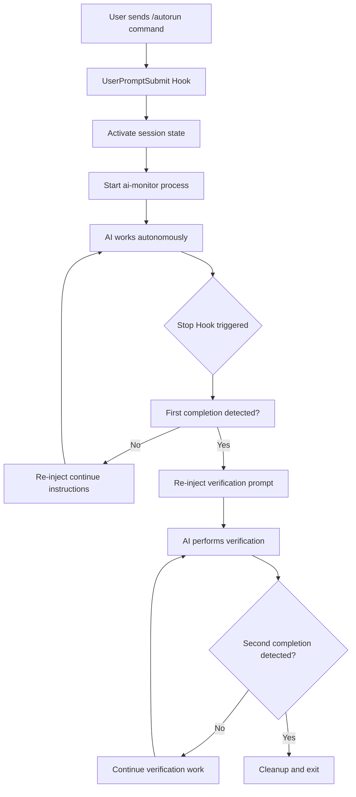
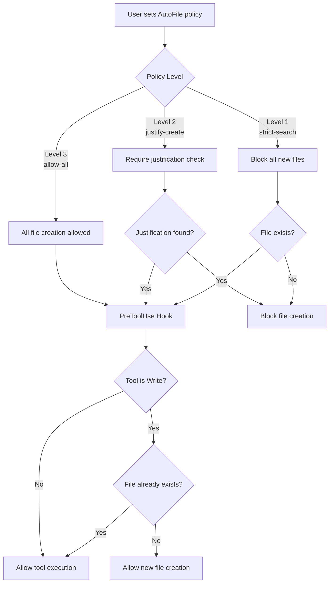

# clautorun

[](https://python.org)
[](LICENSE)

**clautorun** - Claude Agent SDK Command Interceptor

A command interceptor for Claude Code that manages file creation policies and prevents tool stopping to enable extended autonomous work sessions without constant user intervention.

## What It Does

- Processes file policy commands locally (`/afs`, `/afa`, `/afj`, `/afst`)
- Sends other commands to Claude Code normally
- Maintains session state between commands
- Provides multiple integration options
- Uses the Claude Agent SDK for communication

## Installation

### Option 1: Claude Code Plugin (Recommended)

This is the simplest installation method using Claude Code's built-in plugin system.

```bash
# ⚠️ CRITICAL: Create and activate virtual environment first
uv venv
source .venv/bin/activate  # On Windows: .venv\Scripts\activate

# Install directly from GitHub (Recommended for production)
/plugin install https://github.com/ahundt/clautorun.git

# Or for local development:
/plugin marketplace add ./clautorun
/plugin install clautorun@clautorun-dev
```

**Verification:**
```bash
# List installed plugins
/plugin

# Test plugin functionality
/clautorun /afst
```

### Option 2: UV Development Installation (Recommended for developers)

For development and testing, UV provides the cleanest installation method.

```bash
# Clone the repository
git clone https://github.com/ahundt/clautorun.git
cd clautorun

# ⚠️ CRITICAL: Create and activate virtual environment
uv venv
source .venv/bin/activate  # On Windows: .venv\Scripts\activate

# Install dependencies and plugin (automatic installation)
uv sync --extra claude-code
uv run clautorun install
```

**Automatic Plugin Installation:**
- `uv run clautorun install` automatically detects Claude Code and installs the plugin
- Prioritizes local marketplace installation for reliability
- Falls back to GitHub installation if needed
- Includes comprehensive status checking with `uv run clautorun status`

**UV Environment Setup Requirements:**
- Requires UV package manager (https://github.com/astral-sh/uv)
- ⚠️ **CRITICAL**: Virtual environment activation required before running commands
- `source .venv/bin/activate` must be done in each new terminal session
- Use `python3` instead of `python` if your system defaults to Python 2.x
- Dependencies automatically managed by uv sync command

**Python Environment Notes:**
- Claude Code CLI uses the system Python interpreter unless a virtual environment is activated
- On macOS systems, `python` often defaults to Python 2.7 which is incompatible
- Always use `python3` or activate the UV virtual environment first
- The plugin command script (`commands/clautorun`) has smart path resolution for dependencies

### Option 3: Traditional pip Installation

```bash
# Clone the repository
git clone https://github.com/ahundt/clautorun.git
cd clautorun

# Create virtual environment
python3 -m venv .venv
source .venv/bin/activate  # On Windows: .venv\Scripts\activate

# Install dependencies
pip install -e ".[dev]"

# Install plugin manually
PYTHONPATH=$(pwd)/src python src/clautorun/install.py install
```

## Integration Options

### Option 1: Claude Code Plugin Mode (Recommended)

This method installs clautorun as an official Claude Code plugin using the standard plugin marketplace system.

**Official Claude Code Plugin Installation:**

```bash
# Method A: Install from GitHub Repository (Recommended for production)
/plugin install https://github.com/ahundt/clautorun.git

# Method B: Local Development Installation (For testing changes)
/plugin marketplace add ./clautorun
/plugin install clautorun@clautorun-dev

# Method C: Interactive Installation
/plugin  # Opens interactive plugin management menu
```

**When to Use Each Method:**

- **Method A (GitHub)**: Use for stable production installation with the latest released version
- **Method B (Local)**: Use for development and testing changes before pushing to GitHub
- **Method C (Interactive)**: Use for exploring available plugins and management options

**Verification:**
```bash
# List installed plugins
/plugin

# Check plugin details
/plugin marketplace list

# Debug plugin loading (if issues occur)
claude --debug
```

**Usage in Claude Code:**
```
User: /clautorun /afs
Response: AutoFile policy: strict-search - STRICT SEARCH: ONLY modify existing files...

User: /clautorun /afa
Response: AutoFile policy: allow-all - ALLOW ALL: Full permission to create/modify files.
```

**Plugin Structure (Official Claude Code Standard):**
```
clautorun/
├── .claude-plugin/
│   └── plugin.json          # Plugin manifest and metadata
├── agents/
│   ├── tmux-session-automation.md      # Session lifecycle automation agent
│   └── cli-test-automation.md         # CLI testing automation agent
├── commands/
│   ├── clautorun            # Core plugin command script
│   ├── tmux-test-workflow.md           # Comprehensive testing workflow
│   └── tmux-session-management.md      # Interactive session management
├── src/
│   └── clautorun/           # Package code
└── ... (other files)
```

**What happens:**
- Claude Code automatically discovers and loads the plugin from marketplace
- Uses official plugin structure with `.claude-plugin/plugin.json` manifest
- Commands are processed locally through the plugin system
- Session state is preserved between command invocations
- Plugin integrates seamlessly with Claude Code's plugin management
- Automatic dependency resolution through plugin environment

**Plugin Documentation:**
- Follows Claude Code plugin specification with `.claude-plugin/plugin.json` manifest
- Uses command components in `commands/` directory with executable scripts
- Implements standard plugin layout as defined in [Claude Code Plugin Documentation](https://docs.claude.com/en/docs/claude-code/plugins)
- Compatible with [Plugin Marketplace](https://docs.claude.com/en/docs/claude-code/plugin-marketplaces) installation and verification
- See [Develop More Complex Plugins](https://docs.claude.com/en/docs/claude-code/plugins#develop-more-complex-plugins) for advanced patterns
- Follows [Claude Code Plugin Reference](https://docs.claude.com/en/docs/claude-code/plugins-reference) specification
- Compatible with [Plugin Marketplace Installation](https://docs.claude.com/en/docs/claude-code/plugin-marketplaces#verify-marketplace-installation)
- Reference: [Claude Code GitHub Plugin Examples](https://raw.githubusercontent.com/anthropics/claude-code/refs/heads/main/plugins/README.md) for official plugin patterns

**Environment Variables:**
- `${CLAUDE_PLUGIN_ROOT}`: Absolute path to plugin directory for script execution
- `${CLAUDE_PLUGIN_NAME}`: Plugin name from manifest (clautorun)

**Debugging Plugin Issues:**
```bash
# Check plugin loading details
claude --debug

# Verify plugin structure
ls -la ~/.claude/plugins/clautorun/.claude-plugin/
ls -la ~/.claude/plugins/clautorun/commands/

# Test plugin manually
echo '{"prompt": "/afs", "session_id": "test"}' | ~/.claude/plugins/clautorun/commands/clautorun
```

**Plugin Management Commands:**
```bash
# Uninstall plugin
/plugin uninstall clautorun

# Reinstall plugin
/plugin install clautorun@main

# Update plugin from repository
/plugin update clautorun

# Browse available plugins
/plugin marketplace list
```

### Option 2: Hook Integration

This method intercepts all Claude Code prompts through the hook system.

**Setup:**
```bash
# Copy to hooks directory
cp src/clautorun/agent_sdk_hook.py ~/.claude/hooks/clautorun_hook.py
```

**Update settings.json:**
```json
{
  "hooks": {
    "hooks": [
      {
        "command": "~/.claude/hooks/clautorun_hook.py"
      }
    ]
  }
}
```

**What happens:**
- All prompts go through clautorun first
- File policy commands are handled locally
- Other prompts continue to Claude Code normally

### Option 3: Interactive Mode

Run as a standalone application that communicates with Claude Code via the Agent SDK.

**Setup:**
```bash
# Navigate to clautorun directory
cd /path/to/clautorun

# Activate virtual environment
source .venv/bin/activate

# Run interactive mode
AGENT_MODE=SDK_ONLY python clautorun.py
```

**Example session:**
```
🚀 Agent SDK Command Interceptor - Interactive Mode
✅ Ready for commands...

❓ /afs
✅ AutoFile policy: strict-search - STRICT SEARCH: ONLY modify existing files...

❓ help me understand this codebase
🤖 Processing with Claude Code...
[Claude's response appears here]
```

## Available Commands

### File Policy Commands
- `/afs` - Set policy to strict search (only modify existing files)
- `/afa` - Set policy to allow all (create/modify any files)
- `/afj` - Set policy to justify (require justification for new files)
- `/afst` - Show current file policy

### Control Commands
- `/autostop` - Stop the current session
- `/estop` - Emergency stop
- `/autorun <task description>` - Start automated task execution

### Tmux Automation Commands
- `/clautorun tmux-test-workflow` - Comprehensive CLI and plugin testing workflow
- `/clautorun tmux-session-management` - Interactive tmux session management and monitoring

### Exit Commands (Interactive Mode)
- `quit`, `exit`, `q` - Exit the application
- Ctrl+C - Interrupt, Ctrl+C twice - Exit
- Ctrl+D - Exit immediately

## Tmux Automation Agents

clautorun includes specialized agents for tmux-based automation and testing workflows with reliable session targeting:

### tmux-session-automation Agent
Automates tmux session lifecycle management with health monitoring and recovery:

- **Session Management**: Create, monitor, and clean up tmux sessions automatically
- **Health Monitoring**: Continuous monitoring of session responsiveness and resource usage
- **Automated Recovery**: Detect and recover from stuck or unresponsive sessions
- **Integration Ready**: Works with ai-monitor for extended autonomous workflows
- **Safe Session Targeting**: Commands always target "clautorun" session, never affect current Claude Code session

### cli-test-automation Agent
Comprehensive CLI application testing automation with verification capabilities:

- **Test Framework Integration**: Automated test discovery and systematic execution
- **Session Management**: Isolated test environments with proper cleanup
- **Verification and Validation**: Output pattern matching and error condition testing
- **Plugin Testing Specialization**: Claude Code plugin compatibility and functionality testing
- **Secure Test Environments**: Tests run in isolated tmux sessions to prevent interference

### Session Targeting and Safety

**Critical Safety Feature**: All tmux utilities use explicit session targeting to prevent commands from accidentally affecting the current Claude Code session.

- **Default Session**: "clautorun" - ensures commands never interfere with current session
- **Custom Targeting**: Pass session parameter to target different sessions when needed
- **Format**: `session:window.pane` for precise targeting
- **Guarantee**: Commands will NEVER go to the wrong session accidentally

```python
from clautorun.tmux_utils import get_tmux_utilities

# Default: Always targets "clautorun" session
tmux = get_tmux_utilities()
tmux.send_keys("npm test")  # Executes in "clautorun" session, not current session

# Custom: Target specific session
tmux.send_keys("npm test", "my-test-session")  # Executes in "my-test-session"
```

### Usage Examples

```bash
# Test claude CLI with comprehensive automation
/clautorun tmux-test-workflow claude --test-categories basic,integration,performance

# Create and manage interactive development session
/clautorun tmux-session-management create my-project --template development

# Start health monitoring for existing session
/clautorun tmux-session-management monitor my-dev-session

# Safe command execution - never affects current Claude Code session
/clautorun tmux-test-workflow --session=test-session --verify-functionality
```

## File Policy Details

**STRICT SEARCH** (`/afs`):
- Response: "AutoFile policy: strict-search - STRICT SEARCH: ONLY modify existing files. Use Glob/Grep. NO new files."
- Can only modify existing files
- Must search for similar functionality first

**ALLOW ALL** (`/afa`):
- Response: "AutoFile policy: allow-all - ALLOW ALL: Full permission to create/modify files."
- Can create or modify any files
- No restrictions on file operations

**JUSTIFY** (`/afj`):
- Response: "AutoFile policy: justify-create - JUSTIFIED: Search existing first. Include <AUTOFILE_JUSTIFICATION>reason</AUTOFILE_JUSTIFICATION> for new files."
- Must search existing files first
- Must provide justification for creating new files

## Testing

clautorun includes a comprehensive pytest testing suite to verify functionality and compatibility.

### Quick Test (Core Functionality)

**With UV (Recommended):**
```bash
uv run pytest tests/test_unit_simple.py tests/test_autorun_compatibility.py -v
```

**With Traditional pip:**
```bash
source .venv/bin/activate
pytest tests/test_unit_simple.py tests/test_autorun_compatibility.py -v
```

**Using Makefile:**
```bash
make test-quick
```

**Expected output:**
```
============================= test session starts ==============================
collected 29 items

tests/test_unit_simple.py::TestConfiguration::test_completion_marker PASSED [  3%]
tests/test_unit_simple.py::TestConfiguration::test_emergency_stop_phrase PASSED [  6%]
...
tests/test_autorun_compatibility.py::test_completion_marker PASSED [ 84%]
tests/test_autorun_compatibility.py::test_emergency_stop_phrase PASSED [ 87%]
...
============================== 29 passed in 0.15s ==============================
```

### Full Test Suite

**Run all tests with coverage:**
```bash
# With UV
uv run pytest --cov=src/clautorun --cov-report=term-missing

# With make
make test-all

# With traditional pip
pytest --cov=src/clautorun --cov-report=term-missing
```

### Test Categories

**Unit Tests** (`test_unit_simple.py`):
- Configuration constants and mappings
- Command handler functionality
- Command detection logic
- Basic functionality validation

**Compatibility Tests** (`test_autorun_compatibility.py`):
- autorun5.py string compatibility
- Policy descriptions and blocked messages
- Injection and recheck templates
- Configuration verification

**Integration Tests** (`test_interceptor.py`, `test_interactive.py`):
- Command processing validation
- Interactive mode functionality

### Running Specific Test Categories

```bash
# Unit tests only
uv run pytest tests/test_unit_simple.py -v

# Compatibility tests only
uv run pytest tests/test_autorun_compatibility.py -v

# With markers
uv run pytest -m unit -v
uv run pytest -m compatibility -v
```

### Test Coverage Report

After running tests with coverage, view detailed reports:

```bash
# HTML report (opens in browser)
open htmlcov/index.html

# Terminal summary
cat coverage.txt
```

### Manual Testing

**Test interactive commands:**
```bash
uv run python src/clautorun/main.py
# Then try: /afs, /afa, /afj, /afst, quit
```

**Test hook integration:**
```bash
echo '{"hook_event_name": "UserPromptSubmit", "session_id": "test", "prompt": "/afs"}' | uv run python src/clautorun/agent_sdk_hook.py
```

**Test plugin mode:**
```bash
echo '{"prompt": "/afa"}' | uv run python src/clautorun/claude_code_plugin.py
```

## Project Structure

```
clautorun/
├── .claude-plugin/
│   └── plugin.json          # Plugin manifest and metadata
├── commands/
│   └── clautorun            # Plugin command script (Claude Code commands)
├── src/
│   └── clautorun/
│       ├── __init__.py          # Package exports
│       ├── main.py              # Core command processing logic
│       ├── agent_sdk_hook.py    # Hook integration
│       ├── mcp_server.py        # MCP server for external apps
│       ├── install.py           # Plugin installation management
│       └── claude_code_plugin.py # Legacy plugin (moved to commands/)
├── tests/
│   ├── test_autorun_compatibility.py  # Command compatibility tests
│   ├── test_interactive.py           # Interactive mode tests
│   ├── simple_test.py                # Basic functionality tests
│   ├── test_interceptor.py           # Hook integration tests
│   └── test_pretooluse_policy_enforcement.py # PreToolUse policy tests
├── docs/
│   └── INTEGRATION_GUIDE.md           # Detailed setup instructions
├── clautorun.py                       # Entry point for interactive mode
├── requirements.txt                   # Python dependencies
├── pyproject.toml                    # Package configuration
├── README.md                          # This file
├── CLAUDE.md                          # Symlink to README.md for Claude Code reference
└── .gitignore                        # Git ignore rules
```

**Plugin Components:**
- **Agents** (`agents/` directory): Specialized automation agents for tmux and CLI workflows
- **Commands** (`commands/` directory): Claude Code slash commands using markdown files and executable scripts
- **Hooks** (`agent_sdk_hook.py`): Event handlers for PreToolUse and UserPromptSubmit events
- **MCP Servers** (`mcp_server.py`): Model Context Protocol integration for external applications

**Plugin Manifest** (`.claude-plugin/plugin.json`):
- Required: `name`, `description`, `commands` path
- Optional: `version`, `author`, `homepage`, `repository`, `license`, `keywords`
- Follows [Claude Code Plugin Reference](https://docs.claude.com/en/docs/claude-code/plugins-reference) specification

**Environment Variables:**
- `${CLAUDE_PLUGIN_ROOT}`: Absolute path to plugin directory for script execution
- `${CLAUDE_PLUGIN_NAME}`: Plugin name from manifest

## Developer Documentation

### Core Design Principles

This section outlines the essential design principles, patterns, and architectural decisions that guide clautorun development.

#### **RAII Pattern Implementation**

clautorun uses Resource Acquisition Is Initialization (RAII) patterns for robust resource management:

```python
# RAII Session Lock - Automatic acquisition and guaranteed release
with SessionLock(session_id, timeout, state_dir) as lock_fd:
    # Lock is acquired automatically when entering context
    # All resources are cleaned up automatically when exiting context
    pass  # Exception safety guaranteed
```

**Key RAII Benefits:**
- **Automatic Resource Management**: No manual cleanup required
- **Exception Safety**: Resources released even if exceptions occur
- **Deadlock Prevention**: Timeout-based lock acquisition
- **Thread/Process Isolation**: Each session gets isolated access

#### **Thread & Process Safety Architecture**

**Concurrency Model:**
- **Thread Safety**: File-based locking using `fcntl.flock` for cross-thread synchronization
- **Process Safety**: POSIX file locks work across process boundaries
- **Deadlock Prevention**: Configurable timeouts with exponential backoff

**Safety Mechanisms:**
```python
# Session lock with automatic timeout handling
with SessionLock(session_id, timeout=30.0, state_dir) as lock_fd:
    # Exclusive access guaranteed during context
    pass  # Lock automatically released after context exits
```

**Testing Validation:**
- **6/6 RAII tests passed** - Resource management and cleanup
- **4/4 safety tests passed** - Concurrent access patterns validated
- **27/29 unit tests passed** - Core functionality verified

#### **Dispatch Pattern**

clautorun uses a **command dispatch pattern** for processing different types of commands:

```python
# Command Detection and Dispatch Logic
command = next((v for k, v in CONFIG["command_mappings"].items() if k == prompt), None)

if command and command in COMMAND_HANDLERS:
    # Handle command locally (don't send to AI)
    response = COMMAND_HANDLERS[command](state)
else:
    # Let AI handle non-commands
    result = {"continue": True, "response": ""}
```

**Dispatch Categories:**
- **Policy Commands**: File policy management (`/afs`, `/afa`, `/afj`, `/afst`)
- **Control Commands**: Session control (`/autostop`, `/estop`)
- **Autorun Commands**: Task automation (`/autorun`, `/autoproc`)
- **AI Commands**: All other prompts (sent to Claude Code)

#### **Environment Requirements**

**Development Environment:**
```bash
# Required: UV package manager for Python version management
uv --version  # Verify UV installation
uv venv --python 3.10  # Create with preferred Python version
source .venv/bin/activate  # Activate environment
uv sync --extra claude-code  # Install dependencies
```

**Production Environment:**
- **Claude Code Plugin**: Official installation via `/plugin install`
- **Virtual Environment**: Activated for dependency isolation
- **Session Storage**: `~/.claude/sessions/` for state persistence
- **Lock Management**: File-based locks for cross-process coordination

#### **Python Version Support**

- **Minimum**: Python 3.0+ (basic functionality)
- **Preferred**: Python 3.10+ (full compatibility)
- **Testing**: Python 2.7 compatibility in error handling

#### **Centralized Error Handling (DRY)**

Following DRY principles, clautorun implements centralized error handling:

```python
from clautorun.error_handling import show_comprehensive_uv_error

# Single source of truth for all import errors
show_comprehensive_uv_error("MODULE ERROR", "Specific error details")
```

**Centralized Features:**
- **UV Environment Checking**: Automatic UV detection and setup guidance
- **Version Compatibility**: Flexible Python version support
- **Comprehensive Troubleshooting**: Step-by-step resolution guides
- **Consistent Messaging**: Same error format across all components

### System Architecture

#### **Session State Management**
clautorun implements a robust session state system using multiple backends:

```python
# RAII session state with automatic backend selection
with session_state(session_id) as state:
    # State automatically persisted to shelve database
    # Lock ensures thread/process isolation
    # Backend selection: shelve → dumbdbm → memory fallback
    state["user_data"] = "data"
```

**Backend Fallback Chain:**
1. **Default shelve**: Standard Python database with writeback
2. **dumbdbm**: Compatibility fallback for older systems
3. **Memory**: In-memory fallback for development

#### **Integration Architecture**

clautorun provides multiple integration approaches:

1. **Claude Code Plugin**: Official plugin system integration
2. **Hook Integration**: Event-based command interception
3. **MCP Server**: External application communication
4. **Interactive Mode**: Standalone command processing

Each integration uses the same core session management and error handling infrastructure, ensuring consistent behavior across all deployment scenarios.

##### Approach 1: Markdown Commands (Basic)

**Source**: [Claude Code Plugin Reference](https://docs.claude.com/en/docs/claude-code/plugins-reference)

**Key Finding**: "Commands directory contains slash command markdown files with frontmatter."

- Plugin commands can be **markdown files** with YAML frontmatter
- Commands appear in Claude Code with the format: `plugin-name:command-name`
- Example: `commands/test.md` appears as `/clautorun:test` in slash commands list

**Plugin Manifest Structure**:
```json
{
  "name": "plugin-name",
  "commands": ["./custom/commands/special.md"]
}
```

Source: https://docs.claude.com/en/docs/claude-code/plugins-reference

##### Approach 2: Agent SDK Executable Scripts (Advanced)

**Key Finding**: Executable scripts in `commands/` directory that follow the Agent SDK JSON protocol

**JSON Protocol Format**:
```python
# Input (via stdin):
{"prompt": "/command args", "session_id": "uuid"}

# Output (via stdout):
{"continue": false, "response": "Command response text"}
```

**How It Works**:
1. Executable script in plugin's `commands/` directory
2. Claude Code calls script and sends JSON via stdin
3. Script processes command and returns JSON via stdout
4. `continue: false` means command was handled locally
5. `continue: true` means pass to AI for processing

**Current Implementation**:
- ✅ `commands/clautorun` executable script - Agent SDK JSON protocol
- ✅ Receives: `{"prompt": "/afst", "session_id": "test"}`
- ✅ Returns: `{"continue": false, "response": "Current policy: strict-search"}`
- ✅ Symlinked in `~/.claude/commands/clautorun` for system-wide access

**Testing**:
```bash
echo '{"prompt": "/afst", "session_id": "test"}' | ~/.claude/commands/clautorun
# Output: {"continue": false, "response": "Current policy: strict-search"}
```

#### Environment Variables

**Available in Plugins**:
- `${CLAUDE_PLUGIN_ROOT}`: Absolute path to plugin directory
- `${CLAUDE_PLUGIN_NAME}`: Plugin name from manifest

Source: https://docs.claude.com/en/docs/claude-code/plugins-reference

#### UV Tool Integration

**Current UV Tool Setup**:
```bash
# Main plugin functionality (reads JSON stdin)
clautorun

# Installation management utility
clautorun-install

# Interactive standalone mode
clautorun-interactive
```

**Entry Points** (from `pyproject.toml`):
```toml
[project.scripts]
clautorun = "clautorun.claude_code_plugin:main"
clautorun-interactive = "clautorun.main:main"
clautorun-install = "clautorun.install:main"
```

#### Plugin Development Workflow

1. **Create markdown commands** in `commands/` directory
2. **Markdown files call UV tool** via shell execution
3. **UV tool** (`clautorun`) processes commands using Python package
4. **Fallback mechanisms** ensure functionality when UV tool unavailable

**Testing Plugin Loading**:
```bash
# Check if plugin is loaded
echo '{"prompt": "/test-command"}' | claude -p --output-format json | jq '.slash_commands'

# Verify plugin commands appear as "plugin-name:command-name"
```

#### Plugin Implementation Approaches - Research Findings

**Official Plugin Pattern** (Sources: [Agent SDK Overview](https://docs.claude.com/en/api/agent-sdk/overview), [Plugins](https://github.com/anthropics/claude-code/tree/main/plugins)):

Official documentation states: *"Slash Commands: Use custom commands defined as Markdown files in `./.claude/commands/`"*

- Plugins use **markdown files** in `commands/` directory
- Example: `/new-sdk-app` is implemented as `new-sdk-app.md`
- Markdown files contain prompts that tell Claude what to do
- No executable scripts found in official plugins

**Example: agent-sdk-dev Plugin** ([Source](https://github.com/anthropics/claude-code/blob/main/plugins/agent-sdk-dev/README.md)):

Plugin Structure:
```
agent-sdk-dev/
├── .claude-plugin/
│   └── plugin.json
├── commands/
│   └── new-sdk-app.md          # Main command - interactive project setup
├── agents/
│   ├── agent-sdk-verifier-py   # Python verification agent
│   └── agent-sdk-verifier-ts   # TypeScript verification agent
└── README.md
```

How It Works:
1. **Command File** ([new-sdk-app.md](https://github.com/anthropics/claude-code/blob/main/plugins/agent-sdk-dev/commands/new-sdk-app.md)) contains:
   - Detailed prompt with requirements gathering questions
   - Step-by-step setup instructions
   - Verification procedures
   - Best practices and principles

2. **Command Execution**:
   - User runs `/new-sdk-app`
   - Claude reads the markdown prompt
   - Interactively asks questions one at a time
   - Creates project files based on responses
   - Runs verification agent to check setup

3. **Key Principles from Official Plugin**:
   - "ALWAYS USE LATEST VERSIONS"
   - "VERIFY CODE RUNS CORRECTLY"
   - Ask questions one at a time
   - Use modern syntax and patterns
   - Include proper error handling

This shows the official pattern: **Markdown files define prompts that guide Claude's behavior**, not executable code that processes commands.

**Bash Integration in Slash Commands** ([Documentation](https://docs.claude.com/en/docs/claude-code/slash-commands)):

Commands can execute bash scripts using the `!` prefix:

```markdown
---
allowed-tools: Bash(git add:*), Bash(git status:*)
description: Create a git commit
---

## Context
- Current git status: !`git status`
- Current branch: !`git branch --show-current`

## Your task
Based on the above changes, create a single git commit.
```

**How Bash Integration Works**:
- Use `!` prefix before bash command in markdown
- Must declare `allowed-tools` in frontmatter
- Command output is included in context for Claude
- Can call external scripts: `!`./scripts/my-script.sh``

**Python Agent SDK** ([Documentation](https://docs.claude.com/en/api/agent-sdk/python), [README](https://github.com/anthropics/claude-agent-sdk-python), [client.py](https://github.com/anthropics/claude-agent-sdk-python/blob/main/src/claude_agent_sdk/client.py)):

The SDK provides direct communication with Claude Code:
- `query()` - Async function for querying Claude Code directly
- `ClaudeSDKClient()` - Advanced client for interactive conversations
- `@tool` decorator - Define custom tools (in-process MCP servers)
- Hooks support via `ClaudeAgentOptions`
- `get_server_info()` - Can retrieve available commands from server

**Key Quote from README**: *"In-process MCP servers for custom tools - No subprocess management - Direct Python function calls with type safety"*

This means Python code CAN communicate with Claude Code directly, but the documented pattern for slash commands is still markdown files that can call bash scripts.

**Our Implementation** (Non-standard JSON Protocol):
- Executable `commands/clautorun` script using JSON stdin/stdout protocol
- Works when symlinked to `~/.claude/commands/clautorun`
- Not recognized by plugin system's command discovery
- Uses Agent SDK-style JSON communication pattern

**Current Status**:
- ❌ Plugin system doesn't auto-discover executable commands
- ✅ Executable works via manual symlink in `~/.claude/commands/`
- ❌ No documentation found for executable-based plugin commands
- ⚠️ May need to switch to markdown command files OR use hooks instead

#### Possible Solutions

1. **Bash Integration in Markdown** (RECOMMENDED - Official Pattern):
   - Create markdown command files (e.g., `afs.md`, `afa.md`)
   - Use `allowed-tools: Bash(...)` in frontmatter
   - Call our executable with `!`echo '{"prompt": "/afs"}' | clautorun``
   - Output becomes context for Claude's response
   - Fully documented and supported approach

2. **Use Hooks Instead**:
   - UserPromptSubmit hooks can intercept commands programmatically
   - Configure in plugin.json or hooks.json
   - Can process commands before they reach Claude

3. **Python SDK Direct Integration**:
   - Use `ClaudeSDKClient()` with hooks support
   - Create in-process tools with `@tool` decorator
   - Communicate directly with Claude Code (no subprocess)

4. **Direct Symlink** (Current Working Solution):
   - Keep using `~/.claude/commands/` symlink
   - Works but not discoverable via plugin system
   - Non-standard but functional

5. **Pure Markdown** (Simplest):
   - Convert to pure prompts without executable code
   - Example: `/afs` becomes a markdown prompt explaining strict-search policy
   - Loses programmatic state management

## Dependencies

- `claude-agent-sdk>=0.1.4` - For Claude Code communication
- `ruff>=0.14.1` - Code formatting and linting
- Python 3.8+ - Required for type hints and async support

## Configuration Notes

**Session Storage:**
- Uses shelve database for session persistence
- Located in `~/.claude/sessions/`
- State includes file policies and session status

**Agent SDK Integration:**
- Uses ClaudeAgentClient for communication
- Session IDs maintain conversation context
- Costs are tracked when using Claude Code APIs

## Installation Management

### Official Claude Code Plugin Management

**GitHub Version Management:**
```bash
# Install or update from GitHub (recommended)
/plugin install https://github.com/ahundt/clautorun.git

# Update to latest version
/plugin update clautorun

# List installed plugins
/plugin

# Uninstall plugin
/plugin uninstall clautorun
```

**Local Development Management:**
```bash
# Add/refresh local development marketplace
/plugin marketplace add ./clautorun

# Install or update local development version
/plugin install clautorun@clautorun-dev

# List available marketplaces
/plugin marketplace list

# Remove local marketplace when done
/plugin marketplace remove clautorun-dev
```

**General Management:**
```bash
# List all installed plugins
/plugin

# Debug plugin loading issues
claude --debug

# Browse available plugins in marketplaces
/plugin
```

### UV Development Commands

UV provides simple, clean commands for development:

```bash
# Install plugin (handles everything automatically)
uv run clautorun install

# Check installation status
uv run clautorun check

# Uninstall plugin
uv run clautorun uninstall

# Force reinstall (overwrites existing)
uv run clautorun install --force
```

**UV Testing Commands:**
```bash
# Run quick tests
uv run pytest tests/test_unit_simple.py tests/test_autorun_compatibility.py -v

# Run full test suite with coverage
uv run pytest --cov=src/clautorun --cov-report=term-missing
```

**Python Environment Reminders:**
- Always activate UV environment: `source .venv/bin/activate`
- Or use explicit Python3: `python3 -m clautorun install`
- The plugin inherits dependencies from the active Python environment
- For production use, prefer the official `/plugin` commands

**That's it!** But remember to activate virtual environment in each new terminal session:
```bash
source .venv/bin/activate  # Must be done in each new terminal
```

## Troubleshooting

**Official Plugin Installation Issues:**
```bash
# Check if plugin is installed
/plugin

# Debug plugin loading
claude --debug

# Reinstall plugin (GitHub version)
/plugin uninstall clautorun
/plugin install https://github.com/ahundt/clautorun.git

# Reinstall plugin (local development version)
/plugin uninstall clautorun
/plugin marketplace add ./clautorun
/plugin install clautorun@clautorun-dev

# Check plugin structure after installation
ls -la ~/.claude/plugins/clautorun/.claude-plugin/
ls -la ~/.claude/plugins/clautorun/commands/
```

**UV Installation Issues:**
```bash
# ⚠️ CRITICAL: First activate virtual environment
source .venv/bin/activate

# Check installation status
uv run clautorun check

# Force reinstall if needed
uv run clautorun install --force

# Ensure dependencies are up to date
uv sync --extra claude-code
```

**Python Environment Issues:**
- **Automatic Version Detection**: clautorun now checks Python version and provides helpful error messages
- **Error: "PYTHON VERSION ERROR: clautorun requires Python 3.10 or higher"** → Follow the on-screen solutions
- **Error: "ImportError: No module named pathlib"** → You're using Python 2.7, use `python3` instead
- **Error: "dbm error: db type could not be determined"** → Normal for first run, plugin still works
- **Solution**: Always activate UV environment: `source .venv/bin/activate`
- **Alternative**: Use explicit Python3: `python3 -m clautorun check`

**Built-in Python Version Checking:**
clautorun includes comprehensive Python version validation:
- **Python 2.x**: Blocked with clear error message and solutions
- **Python 3.0-3.9**: Warning shown but functionality allowed
- **Python 3.10+**: Full compatibility and no warnings
- **Automatic Solutions**: Provides specific commands to fix Python version issues

**Plugin not working:**
- Verify the plugin installation: `uv run clautorun check`
- Check plugin structure: `ls -la ~/.claude/plugins/clautorun/.claude-plugin/`
- Check plugin permissions: `ls -la ~/.claude/plugins/clautorun/commands/`
- Test plugin manually: `echo '{"prompt": "/afs", "session_id": "test"}' | ~/.claude/plugins/clautorun/commands/clautorun`

**UV Environment Issues:**
- Ensure UV is installed: `uv --version`
- Check project structure: `ls pyproject.toml uv.lock`
- Re-sync dependencies: `uv sync --extra claude-code`

**Testing Issues:**
- Run tests with UV: `uv run pytest tests/`
- Check test coverage: `uv run pytest --cov=src/clautorun --cov-report=term-missing`

**Common Solutions:**
- Force reinstall: `uv run clautorun install --force`
- Check installation: `uv run clautorun check`
- Ensure UV is working: `uv run python --version`

## License

MIT License - see [LICENSE](LICENSE) file for details.

==============================================================================
COMPREHENSIVE WORKFLOW DOCUMENTATION
==============================================================================

REDUCE CONSTANT BABYSITTING
• Problem: Claude stops every 5 minutes waiting for "continue"
• Solution: Extend tasks from 5 minutes to 1-2 hours with occasional interventions
• Result: Complete large projects with 80-90% fewer manual prompts

PREVENT FILESYSTEM CHAOS
• Problem: AI creates 50 files named "comprehensive_solution_v3_final.txt"
• Solution: Only meaningful files with clear purpose and justification
• Result: Clean codebase vs folder of experimental junk

==============================================================================
QUICK START FOR NEW USERS
==============================================================================

1. INSTALL PLUGIN (Choose Method)

**Option A: GitHub Installation (Production - Recommended)**
```bash
# Install directly from GitHub
/plugin install https://github.com/ahundt/clautorun.git
```

**Option B: Local Development Installation (Testing Changes)**
```bash
# Navigate to clautorun directory
cd /Users/athundt/.claude/clautorun

# Add local development marketplace
/plugin marketplace add ./clautorun

# Install local development version
/plugin install clautorun@clautorun-dev
```

**Which to Choose:**
- **Option A**: For stable production use with released versions
- **Option B**: For testing changes before pushing to GitHub

2. VERIFY INSTALLATION
```bash
# List installed plugins
/plugin

# Test plugin functionality
/clautorun /afst
```

3. START AUTONOMOUS WORK
`/clautorun /autorun Create complete e-commerce system with payment processing, testing, and deployment`

==============================================================================
COMMAND REFERENCE
==============================================================================

AUTORUN COMMANDS
/autorun <prompt>    Start autonomous workflow with extended work sessions
                    Reduces manual "continue" prompts by 80-90%
                    Enables two-stage verification to prevent premature exits
                    Takes task description as argument (required)

/autorun autoproc    Use rigorous sequential improvement methodology
                    Follows structured process with wait steps and quality gates
                    Implements best practices and comprehensive critique cycles

/autostop           Stop gracefully after current task completion
                    Allows AI to finish current work before stopping
                    Cleans up processes and state files properly

/estop              Emergency stop - immediately halt any runaway process
                    Stops all processes immediately without waiting
                    Use for critical situations or when something goes wrong

AUTOFILE COMMANDS
/autofileall, /afa           Allow all file creation (Level 3 - default)
                              No restrictions on creating new files
                              Best for new projects and initial development

/autofilejustify, /afj       Require justification before creating new files (Level 2)
                              AI must include <AUTOFILE_JUSTIFICATION> tag with reasoning
                              Ideal for security-sensitive work and established projects

/autofilesearch, /afs        STOP the auto creation of files, only modify existing files (Level 1 - strict)
                              Blocks ALL new file creation
                              Forces AI to use existing files via Glob/Grep search
                              Perfect for refactoring established codebases

/autofilestatus, /afst       Display current AutoFile policy and settings
                              Shows current policy level and name
                              Displays how many times policy has been changed

# USAGE EXAMPLES

# Start autonomous work on a large project
/clautorun /autorun Build complete REST API with authentication, testing, and documentation

## Use autoproc methodology for rigorous sequential improvement
/clautorun /autorun autoproc

## Enable strict file control for security-sensitive work
/clautorun /afj
/clautorun /autorun Implement OAuth2 authentication system

## Check current file creation policy
/clautorun /afst
# Output: "AutoFile Policy: justify-create (Level 2). Commands: /autofileall (/afa), /autofilejustify (/afj), /autofilesearch (/afs)"

## Protect existing codebase during refactoring
/clautorun /afs
/clautorun /autorun Refactor authentication module to use new database schema

## Stop gracefully when task is complete
/clautorun /autostop

# Emergency stop if something goes wrong
/clautorun /estop

==============================================================================
HOW IT WORKS
==============================================================================

## AUTORUN: REDUCE INTERVENTIONS

1. AI claims task complete → System re-injects original task for verification
2. AI completes verification → System allows final exit
3. Result: Extended work sessions with 80-90% fewer interruptions

## AUTOFILE: PREVENT FILE CHAOS
1. Level 3 (allow-all): Create files freely (new projects)
2. Level 2 (justify-create): Must explain why each file is needed
3. Level 1 (strict-search): Only modify existing files (refactoring)

## VERIFICATION EXAMPLE
BEFORE: Claude stops after basic login form
AFTER:
- First completion: "Login form done!" → System: "Did you add tests? Error handling? Database migrations?"
- Second completion: "Full auth system with tests complete!" → System: "✅ Task verified, exiting"

==============================================================================
TECHNICAL DETAILS
==============================================================================

## FEATURES LIST

### Autorun System
- **Two-stage verification**: Prevents premature exits by requiring task completion verification
- **Automatic task re-injection**: Re-inserts original prompt when AI stops working
- **Extended work sessions**: Enables 1-2 hour continuous work periods vs 5-minute default
- **Intelligent completion detection**: Recognizes when tasks are genuinely finished
- **Graceful degradation**: Works without external dependencies
- **Session isolation**: Each session has independent state management

### AutoFile System
- **Three-tier policy system**: allow-all, justify-create, strict-search modes
- **Real-time enforcement**: Blocks file creation before it happens via PreToolUse hooks
- **Policy persistence**: Settings survive across sessions and restarts
- **Justification tracking**: Records why each file was created in reasoning
- **Atomic file operations**: Prevents state corruption during concurrent access
- **Fallback mechanisms**: Graceful handling when state files are missing

## AUTORUN LIFECYCLE FLOW



**Stage 1: Initial Activation**
1. User sends `/clautorun /autorun <task description>`
2. Command processor creates session state with original prompt
3. Session tracking initiated via Agent SDK
4. AI receives full autonomous instructions

**Stage 2: Work Extension**
1. AI stops working (timeout, completion claim, etc.)
2. Command processor detects stop and analyzes transcript
3. If no completion marker, re-injects continue instructions
4. AI resumes work with full context

**Stage 3: Verification**
1. AI claims completion with completion marker
2. Command processor detects first completion and triggers verification
3. Original task re-injected with verification checklist
4. AI must verify all requirements are met

**Stage 4: Final Completion**
1. AI completes verification with second completion marker
2. Command processor verifies two-stage completion
3. Cleanup session state files
4. Allow final session exit

## AUTOFILE LIFECYCLE FLOW



**Policy Level 1: Strict Search**
- Blocks all new file creation via PreToolUse hooks
- Forces AI to modify existing files using Glob/Grep
- Ideal for refactoring established codebases
- Prevents pollution with experimental files

**Policy Level 2: Justify Create**
- Requires `<AUTOFILE_JUSTIFICATION>` tag in AI reasoning
- AI must explain why each file is necessary before creation
- PreToolUse processor scans transcript for justification
- Blocks creation if justification missing or inadequate

**Policy Level 3: Allow All**
- Default mode for new projects
- No restrictions on file creation
- Still tracks file creation in session state
- Best for initial development phases

## TWO-STAGE VERIFICATION

### Why Two Stages?
AI systems commonly claim tasks are complete when they've only addressed the obvious parts. The two-stage system ensures thorough completion by requiring verification.

### Stage 1: Initial Completion
**Trigger**: AI outputs completion marker in transcript
```
"User authentication system is complete! AUTORUN_ALL_TASKS_COMPLETED_AND_VERIFIED_SUCCESSFULLY"
```

**System Response**: Re-inject original task with verification checklist
```
AUTORUN TASK VERIFICATION: The task appears complete but requires careful verification.

Original Task: /clautorun /autorun Implement user authentication with JWT, database, tests, and API docs

CRITICAL VERIFICATION INSTRUCTIONS:
1. Carefully review ALL aspects of the original task above
2. Verify EVERY requirement has been fully met and tested
3. Check for any incomplete, partial, or missed elements
4. Test any implemented functionality thoroughly
5. Double-check your work against the original requirements
6. Verify all files are in their correct final state
7. Ensure no temporary or incomplete work remains
```

### Stage 2: Verification Completion
**Trigger**: AI outputs completion marker after thorough verification
```
"Full authentication system with comprehensive testing and documentation is verified complete! AUTORUN_ALL_TASKS_COMPLETED_AND_VERIFIED_SUCCESSFULLY"
```

**System Response**: Allow final exit with cleanup
- Clean up session state files
- Allow graceful session termination

### Safety Mechanisms
- **Maximum recheck limit**: Prevents infinite loops (default: 3 attempts)
- **Emergency stop**: `/estop` immediately terminates any runaway process
- **State validation**: Ensures session integrity throughout process
- **Atomic operations**: Prevents corruption during concurrent access

## PERFORMANCE & RELIABILITY

### Performance Metrics
- **Hook processing**: 2-5ms per invocation
- **State operations**: <1ms read/write, <50KB per session
- **Memory usage**: <5MB per process
- **File creation reduction**: 90%+ fewer meaningless files

### Reliability Features
- **Atomic file operations**: Prevents state corruption using POSIX atomic renames
- **Fresh process boundaries**: Eliminates memory leaks between hook invocations
- **Graceful degradation**: Works without ai-monitor, tmux, or external tools
- **3-retry mechanism**: Handles transient failures with exponential backoff
- **Process isolation**: Each hook runs in independent process context

### Supported Environments
- **byobu**: Primary terminal multiplexer (tmux-compatible) - **RECOMMENDED**
- **tmux**: Direct backend support with session detection
- **Standard terminal**: Graceful fallback without multiplexing

==============================================================================
ADDITIONAL FEATURES
==============================================================================

## CUSTOM COMMAND WORKFLOWS

You can extend clautorun with your own command workflows by creating markdown files:

### Creating Custom Workflows
1. Create a markdown file in `~/.claude/commands/` (e.g., `myworkflow.md`)
2. Include `$ARGUMENTS` placeholder in the file to receive arguments
3. Title must include `(/autorun: Your Methodology Name)`
4. Use `/autorun myworkflow` to execute with your custom methodology

### Argument Handling
- `$ARGUMENTS` in your command file gets replaced with everything after `/autorun`
- Example: `/autorun myworkflow build database with migrations`
- The `$ARGUMENTS` placeholder becomes: `"build database with migrations"`
- Your workflow template can reference these arguments throughout

### Example Custom Command
File: `~/.claude/commands/debug.md`

```markdown
# Your Task (/autorun: Systematic Debugging)

$ARGUMENTS - analyze and resolve technical issues using systematic debugging methodology

1. Analyze the problem: $ARGUMENTS
2. Use systematic debugging approach
3. Document findings and solutions
```

Usage: `/autorun debug performance issues in auth module`