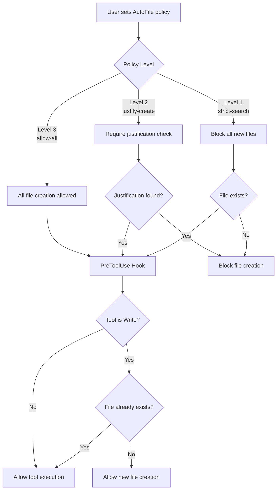
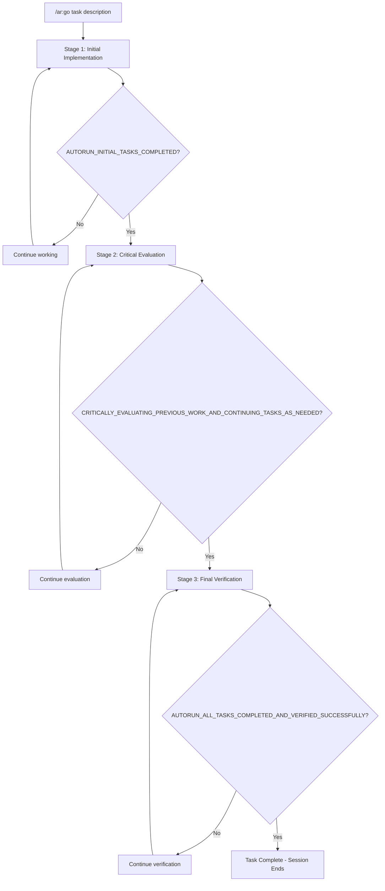

# autorun

[](https://python.org)
[](LICENSE)


## Key Features

1. **Fewer Interruptions**: Claude/Gemini keeps working without "continue" prompts so you can step away
2. **Verify Plans Before Starting**: Plans get critiqued and refined before code is written
3. **Implement, Evaluate, Verify**: AI must pass all three stages. Prevents claiming half-done work is complete
4. **Control AI File Creation**: Choose whether AI can create files freely, must justify them, or edit-only
5. **Dangerous Commands Get Redirected**: `rm` becomes `trash`, `git reset --hard` becomes `git stash`
6. **Works with Claude Code and Gemini CLI**: Same commands, same safety, both platforms
7. **80+ Slash Commands**: Plan auto-export, task tracking, git commit guidelines, design philosophy, and more



## Quick Start

```bash
# Install (requires UV - see UV Installation below)
uv pip install git+https://github.com/ahundt/autorun.git
autorun --install

# Verify installation
/ar:st
# Expected: "AutoFile policy: allow-all"
```

**Plan & Execute** (most common workflow):

```bash
/ar:plannew Design a REST API with authentication and tests
/ar:planrefine                          # Critique and improve the plan
/ar:planprocess                         # Execute the plan

/ar:go Build a login form with tests    # Or run a task directly
```

**File Policy** (prevent file clutter):

```bash
/ar:f                    # Strict: only modify existing files
/ar:j                    # Justify: require justification for new files
/ar:a                    # Allow: create files freely (default)
```

**Safety**:

```bash
/ar:sos                  # Emergency stop
```

> Works with both **Claude Code** and **Gemini CLI** — see [Dual CLI Support](#dual-cli-support-claude-code--gemini-cli).

## Table of Contents

- [Key Features](#key-features)
- [Quick Start](#quick-start)
- [UV Installation](#uv-installation-recommended)
  - [Dual CLI Support (Claude Code + Gemini CLI)](#dual-cli-support-claude-code--gemini-cli)
- [What autorun Does For You](#what-autorun-does-for-you)
- [Why Byobu + tmux Integration](#why-byobu--tmux-integration)
- [AutoFile Lifecycle Flow](#autofile-lifecycle-flow)
- [How It Works](#how-it-works)
  - [Three-Stage Autorun System](#three-stage-autorun-system)
- [Tmux Integration](#tmux-integration)
- [Development](#development)
- [Available Commands](#available-commands)
  - [AutoFile (File Creation Control)](#autofile-file-creation-control)
  - [Command Redirecting](#command-redirecting)
  - [Autorun Commands (Autonomous Execution)](#autorun-commands-autonomous-execution)
  - [Plan Management Commands](#plan-management-commands)
  - [Task Lifecycle Tracking](#task-lifecycle-tracking)
  - [Documentation Commands](#documentation-commands)
  - [Tmux Automation Commands](#tmux-automation-commands)
  - [Usage Examples](#usage-examples)
- [CLI Reference](#cli-reference)
- [Plugin Architecture and Integration Guide](#plugin-architecture-and-integration-guide)
- [Tmux Automation Agents](#tmux-automation-agents)
- [Project Structure](#project-structure)
- [Developer Documentation](#developer-documentation)
- [Dependencies](#dependencies)
- [Companion Tools](#companion-tools)
- [Troubleshooting](#troubleshooting)
- [Contributing and Sharing](#contributing-and-sharing)
- [References](#references)
- [License](#license)

## UV Installation (Recommended)

The autorun marketplace includes 2 plugins: **autorun** and **pdf-extractor**.

> **Note:** plan-export functionality is now built into the autorun plugin. Use `/ar:planexport` commands for plan management.

### GitHub Installation

Install the entire marketplace directly from GitHub:

```bash
# Install plugins from GitHub
uv pip install git+https://github.com/ahundt/autorun.git

# Register plugins with Claude Code
autorun --install
```

### Local Installation

Install from a local clone:

```bash
# Clone repository
git clone https://github.com/ahundt/autorun.git
cd autorun

# Install marketplace
uv pip install .

# Register plugins with Claude Code
autorun --install
```

> **Note:** Use `autorun --install` to ensure the command runs in the correct UV environment. If `autorun-marketplace` is in your PATH, you can run it directly without `uv run`.

### Development Installation

For contributors and developers:

```bash
# Clone repository
git clone https://github.com/ahundt/autorun.git
cd autorun

# Option 1: UV (recommended - faster, better dependency management)
uv run python -m plugins.autorun.src.autorun.install --install --force

# Option 2: pip fallback (if UV not available)
pip install -e . && python -m plugins.autorun.src.autorun.install --install --force

# REQUIRED: Install as UV tool for global CLI availability
# This makes 'autorun' and 'aise' commands globally available
# which are needed for proper daemon operation and session management
cd plugins/autorun && uv tool install --force --editable .

# Verify installation
autorun --status  # Verifies UV tool installation works
```

**Install UV (if needed):**
```bash
# macOS/Linux:
curl -LsSf https://astral.sh/uv/install.sh | sh

# Homebrew:
brew install uv

# Windows:
powershell -c "irm https://astral.sh/uv/install.ps1 | iex"
```

### Verification

After installation, verify plugins are registered:

```bash
# Check installed plugins
claude plugin marketplace list

# See all available commands
/help

# Test autorun
/ar:st
# Expected: "AutoFile policy: allow-all"
```

### Dual CLI Support (Claude Code + Gemini CLI)

**autorun works identically in both Claude Code and Gemini CLI**, providing the same safety features, commands, and autonomous execution capabilities across both platforms.

#### Gemini CLI Requirements

**Version**: Gemini CLI v0.28.0 or later (hooks require explicit enablement)

**Required Settings**: Edit `~/.gemini/settings.json` and add:

```json
{
  "tools": {
    "enableHooks": true,
    "enableMessageBusIntegration": true
  }
}
```

**Update Gemini CLI**:

```bash
# Using Bun (recommended - 2x faster)
bun install -g @google/gemini-cli@latest

# Or using npm
npm install -g @google/gemini-cli@latest

# Verify version
gemini --version  # Should show 0.28.0 or later
```

For troubleshooting, see [TROUBLESHOOTING.md](plugins/autorun/TROUBLESHOOTING.md).

#### Gemini CLI Installation

```bash
# Clone and install
git clone https://github.com/ahundt/autorun.git && cd autorun

# Option 1: UV (recommended)
uv run python -m plugins.autorun.src.autorun.install --install --force
uv run python plugins/autorun/scripts/restart_daemon.py

# Option 2: pip fallback
pip install -e . && \
python -m plugins.autorun.src.autorun.install --install --force && \
python plugins/autorun/scripts/restart_daemon.py

# Verify installation
gemini extensions list
# Should show: autorun-workspace@0.9.0

# Test in Gemini CLI
gemini
/ar:st
# Expected: "AutoFile policy: allow-all"
```

#### Multi-Model Workflows

Use autorun's safety features across both CLIs:

```bash
# Claude Code creates implementation
claude
/ar:go "Implement user authentication system"

# Gemini CLI reviews with vision capabilities
gemini
"Review the authentication code and analyze this architecture diagram"
# Attach: architecture.png

# Both sessions use autorun safety:
# - File policies enforce consistently
# - Command blocking prevents dangerous operations
# - Sessions are isolated (no state leakage)
```

#### Gemini-Specific Features

**Vision + Safety**: Analyze images/diagrams with autorun safety guards active:

```bash
gemini -i screenshot.png -c "Convert this UI mockup to React components"
```

Autorun ensures generated code respects file policies (`/ar:f` for strict mode) and blocks dangerous operations.

**Cross-Model Code Review**: Use Gemini to review Claude's work with safety features active:

```bash
# After Claude creates code
gemini -c "Review src/auth.py for security issues and suggest improvements"
# File policies and command redirecting stay active during review
```

#### Installation Notes

1. **Single install command**: `autorun --install` detects both CLIs and installs for whichever are present
2. **Same commands**: All `/ar:*` and `/pdf-extractor:*` commands work identically
3. **Isolated sessions**: Claude and Gemini sessions don't interfere with each other
4. **Shared safety**: File policies, command redirecting, and hooks work the same in both CLIs

For more details, see [GEMINI.md](GEMINI.md) for Gemini-specific usage patterns.

## What autorun Does For You

| Problem | autorun Solution |
|---------|-----------------|
| Claude stops mid-task, requiring manual "continue" | **Automatic continuation** — hooks detect incomplete work and re-inject the task |
| AI claims "done" with partial implementation | **Implement, evaluate, verify** before session ends. Reduces premature exits |
| AI creates dozens of experimental files | **File policy control** — strict search (`/ar:f`), justified creation (`/ar:j`), or allow all (`/ar:a`) |
| Dangerous commands run without warning | **Command redirecting** — blocks `rm`, `git reset --hard`, etc. and suggests safer alternatives |
| Terminal crash loses all progress | **Session persistence** — [tmux](https://github.com/tmux/tmux)/[byobu](https://www.byobu.org/) keeps sessions alive across crashes, reboots, and network drops |
| Must be at workstation to monitor AI | **Work from anywhere** — access sessions remotely via SSH/[Mosh](https://mosh.org/) from any device |

### Testing

```bash
# Quick core tests
uv run pytest plugins/autorun/tests/test_unit_simple.py -v

# Full suite with coverage
uv run pytest plugins/autorun/tests/ --cov=plugins/autorun/src/autorun --cov-report=term-missing
```

**Integration test**: Create a byobu session (`byobu-new-session autorun-work`), run `/ar:go <task>`, close terminal, reattach (`byobu-attach autorun-work`) — AI work should continue from where it left off.

## Why Byobu + tmux Integration

**autorun is designed for use with [byobu](https://www.byobu.org/)** (tmux wrapper) for session persistence, remote access, and multi-pane monitoring:

1. **Survive failures**: Sessions persist through crashes, reboots, and network drops — SSH back and resume exactly where you left off
2. **Work from anywhere**: Access sessions from any device via SSH/Mosh (see [References](#references) for client recommendations)
3. **Multi-pane monitoring**: Split terminal into panes for AI output, error logs, file system monitoring, and command history simultaneously

## AUTOFILE LIFECYCLE FLOW



**Policy Level 1: Strict Search** (`/afs`)
- Blocks all new file creation via PreToolWrite hooks
- Forces AI to modify existing files using Glob/Grep
- Ideal for refactoring established codebases
- Prevents pollution with experimental files

**Policy Level 2: Justify Create** (`/afj`)
- Requires `<AUTOFILE_JUSTIFICATION>` tag in AI reasoning
- Hook scans transcript for proper justification before allowing new files
- Balances innovation with organization
- Records why each file was created in reasoning

**Policy Level 3: Allow All** (`/afa`)
- No restrictions on file creation (default for new projects)
- Full creative freedom for initial development
- Best for prototyping and new project setup
- All tools pass through without intervention

## How It Works

### Three-Stage Autorun System



**Stage 1 - Initial Implementation**: Claude works on the task, outputs `AUTORUN_INITIAL_TASKS_COMPLETED` when done.

**Stage 2 - Critical Evaluation**: Claude critically evaluates work, identifies gaps, outputs `CRITICALLY_EVALUATING_PREVIOUS_WORK_AND_CONTINUING_TASKS_AS_NEEDED` when satisfied.

**Stage 3 - Final Verification**: Claude verifies all requirements met, outputs `AUTORUN_ALL_TASKS_COMPLETED_AND_VERIFIED_SUCCESSFULLY` to finish.

**Emergency Stop**: At any point, `/ar:sos` outputs `AUTORUN_STATE_PRESERVATION_EMERGENCY_STOP` and immediately halts.

**Hook mechanism**: User sends `/ar:go <task>` → UserPromptSubmit hook activates stage tracking → AI works autonomously → system validates completion markers at each stage boundary (implement, evaluate, verify) → session ends only after all stages complete.

### Safety Mechanisms
- **Maximum recheck limit**: Prevents infinite loops (default: 3 attempts per stage)
- **Emergency stop**: `/ar:sos` immediately terminates any runaway process
- **Plan acceptance**: Plans can auto-trigger autorun via "PLAN ACCEPTED" marker
- **State validation**: Ensures session integrity throughout process

### Verification Example

**Before autorun**: Claude stops after implementing basic login form
**With autorun (implement, evaluate, verify)**:
1. Stage 1: "Login form implemented!" → `AUTORUN_INITIAL_TASKS_COMPLETED`
2. Stage 2: "Critically evaluated - added error handling, tests missing" → continues working → `CRITICALLY_EVALUATING_PREVIOUS_WORK_AND_CONTINUING_TASKS_AS_NEEDED`
3. Stage 3: "Verified: Form works, tests pass, error handling complete" → `AUTORUN_ALL_TASKS_COMPLETED_AND_VERIFIED_SUCCESSFULLY` → Session ends

## Tmux Integration

For crash-safe sessions that survive disconnections, use [byobu](https://www.byobu.org/) (recommended tmux wrapper). Install: `brew install byobu` (macOS), `sudo apt install byobu` (Linux).

```bash
# Create session, start autonomous work, detach
byobu-new-session autorun-work
/ar:go Build a complete web application with authentication
# Detach: Ctrl+A, D (or close terminal)

# Reattach from anywhere (SSH/Mosh)
byobu-attach autorun-work
```

**Why byobu over raw tmux?** Simpler keybindings, status bar, session persistence out of the box:
- **F3/F4** — switch between tabs (windows)
- **Ctrl+A, D** — detach (session keeps running)
- **`byobu-attach autorun-work`** — reattach from any terminal/device
- **F1** — help with all shortcuts

More: [byobu docs](https://www.byobu.org/documentation), [Mosh](https://mosh.org/) for mobile connections, [SSH/Mosh clients](#references) by platform.

## Development

1. **Edit source**: `plugins/autorun/src/autorun/` in the git repository (NOT the plugin cache at `~/.claude/plugins/cache/`)
2. **Run tests**: `uv run pytest plugins/autorun/tests/ -v`
3. **Reinstall after changes**: See [Development Installation](#development-installation-contributors)
4. **Update plugin**: `/plugin update autorun`

## Advanced Setup (Optional)

### Development Installation (Contributors)

For contributing to autorun development:

```bash
# Clone repository
git clone https://github.com/ahundt/autorun.git
cd autorun

# Install plugin + UV tool + restart daemon (one-liner)
(uv run --project plugins/autorun python -m autorun --install --force && \
  cd plugins/autorun && \
  uv tool install --force --editable . && \
  cd ../.. && \
  autorun --restart-daemon) 2>&1 | tee "install-$(date +%Y%m%d-%H%M%S).log"
```

**Contributor Workflow:**
1. **Make changes**: Edit code in your local clone
2. **Test locally**: Use the installed development version to test your changes
3. **Run tests**: `uv run pytest tests/` to ensure nothing breaks
4. **Submit PR**: Create a pull request with your improvements

**AI Safety with Git:**
- **Undo last commit**: `git reset --soft HEAD~1` undoes commit, keeps changes staged
- **Stash changes**: `git stash` temporarily shelves changes, `git stash pop` restores
- **Restore a file**: `git restore filename` reverts specific file to last commit
- **Change visibility**: `git diff` shows exactly what was modified before committing

### Manual Installation (if plugin system fails)

```bash
# Option 1: UV (recommended)
uv run python -m plugins.autorun.src.autorun.install --install --force

# Option 2: pip fallback (if UV not available)
python3 -m venv .venv
source .venv/bin/activate
pip install -e ".[dev]"
python -m plugins.autorun.src.autorun.install --install --force
```

## Available Commands

- **Project/Repo name**: `autorun`
- **Marketplace name**: `autorun` (used for `/plugin install autorun@autorun`)
- **Command prefix**: `ar` (short forms like `/ar:st` for speed, long forms like `/ar:status` for discoverability)

| Short | Long | Legacy | Description |
|-------|------|--------|-------------|
| `/ar:a` | `/ar:allow` | `/afa` | Allow all file creation (Level 3) |
| `/ar:j` | `/ar:justify` | `/afj` | Require justification for new files (Level 2) |
| `/ar:f` | `/ar:find` | `/afs` | Find existing files only - no creation (Level 1) |
| `/ar:st` | `/ar:status` | `/afst` | Show current policy status |
| `/ar:go` | `/ar:run` | `/autorun` | Start autonomous task execution |
| `/ar:gp` | `/ar:proc` | `/autoproc` | Procedural autonomous workflow |
| `/ar:gc` | `/ar:commit` | - | Display Git Commit Requirements (17-step process) |
| `/ar:ph` | `/ar:philosophy` | - | Display Universal System Design Philosophy (17 principles) |
| `/ar:pn` | `/ar:plannew` | - | Create new structured plan |
| `/ar:x` | `/ar:stop` | `/autostop` | Graceful stop |
| `/ar:sos` | `/ar:estop` | `/estop` | Emergency stop |
| `/ar:pr` | `/ar:planrefine` | - | Refine and improve existing plan |
| `/ar:pu` | `/ar:planupdate` | - | Update plan with new information |
| `/ar:pp` | `/ar:planprocess` | - | Execute plan with development process |
| `/ar:tm` | `/ar:tmux` | - | Tmux session management |
| `/ar:tt` | `/ar:ttest` | - | Tmux test workflow |
| `/ar:tabs` | - | - | Discover and manage Claude sessions across tmux |
| `/ar:no <p>` | - | - | Block command pattern in session |
| `/ar:ok <p>` | - | - | Allow command pattern in session |
| `/ar:clear` | - | - | Clear session blocks |
| `/ar:globalno <p>` | - | - | Block command pattern globally |
| `/ar:globalok <p>` | - | - | Allow command pattern globally |
| `/ar:blocks` | - | - | Show active session-level blocks and allows |
| `/ar:globalstatus` | - | - | Show global blocks |
| `/ar:globalclear` | - | - | Clear all global blocks |
| `/ar:reload` | - | - | Reload integration rules from config files |
| `/ar:restart-daemon` | - | - | Restart daemon to reload Python code changes |
| `/ar:tasks` | - | - | Toggle task staleness reminders on/off or set threshold |
| `/ar:task-status` | - | - | Show task lifecycle status and incomplete tasks |
| `/ar:task-ignore <id>` | - | - | Mark task as ignored (unblock stop) |
| `/ar:pe` | `/ar:planexport` | - | Show plan export status |
| `/ar:pe-on` | `/ar:planexport-enable` | - | Enable auto-export |
| `/ar:pe-off` | `/ar:planexport-disable` | - | Disable auto-export |
| `/ar:pe-cfg` | `/ar:planexport-configure` | - | Interactive configuration |
| `/ar:pe-dir` | `/ar:planexport-dir` | - | Set output directory |
| `/ar:pe-fmt` | `/ar:planexport-pattern` | - | Set filename pattern |
| `/ar:pe-reset` | `/ar:planexport-reset` | - | Reset to defaults |
| `/ar:pe-rej` | `/ar:planexport-rejected` | - | Toggle rejected plan export |
| `/ar:pe-rdir` | `/ar:planexport-rejected-dir` | - | Set rejected plan output directory |
| `/ar:tabw` | - | - | Cross-window session actions |
| `/ar:gemini` | - | - | Gemini CLI reference guide |
| `/ar:test` | - | - | Test command guidelines |
| `/ar:marketplace-test` | - | - | Run marketplace tests |

### AutoFile (File Creation Control)

Three-tier policy system enforced via PreToolUse hooks:
- **Level 3** `/ar:a` — Allow all (default). Best for new projects
- **Level 2** `/ar:j` — Require `<AUTOFILE_JUSTIFICATION>` tag. For established codebases
- **Level 1** `/ar:f` — Block all new files, force search-and-modify. For refactoring

### Command Redirecting

**General-purpose command redirecting with actionable suggestions** — When a dangerous command is blocked, autorun doesn't just say "no" — it suggests a safer alternative (e.g., `rm` → `trash`, `git reset --hard` → `git stash`). This is one of autorun's most important safety features. Block commands per-session or globally.

**Session Commands:**
- **/ar:no \<pattern> [description]** - Block pattern in this session
- **/ar:ok \<pattern>** - Allow pattern in this session
- **/ar:clear [pattern]** - Clear session blocks (or specific pattern)
- **/ar:blocks** - Show active session-level pattern blocks and allows
- **/ar:status** - Show blocked patterns

**Global Commands:**
- **/ar:globalno \<pattern> [description]** - Block pattern globally (all sessions)
- **/ar:globalok \<pattern>** - Allow pattern globally
- **/ar:globalstatus** - Show global blocks
- **/ar:globalclear** - Clear all global pattern blocks and allows

**Developer/Admin Commands:**
- **/ar:reload** - Force-reload all integration rules from config files
- **/ar:restart-daemon** - Restart daemon to reload Python code changes

**Pattern Type Prefixes:**
- **regex:\<pattern>** - Use regular expression matching
- **glob:\<pattern>** - Use glob pattern matching
- **/\<pattern>/** - Auto-detects regex when pattern contains metacharacters
- *(default)* - Literal substring matching

**Examples:**
```bash
# Basic blocking (uses DEFAULT_INTEGRATIONS for suggestions)
/ar:no rm

# Custom description for specific guidance
/ar:no "exec(" unsafe exec function - use alternatives

# Regex pattern matching for flexible patterns
/ar:no regex:eval\( dangerous eval usage - blocked for security

# Glob pattern matching for wildcards
/ar:no glob:*.tmp temporary files are not allowed in this session

# Global blocking with custom description
/ar:globalno "git reset --hard" PERMANENTLY DESTRUCTIVE - use git restore instead

# Auto-detect regex when pattern contains metacharacters
/ar:no /eval\(.*assert/ matches eval( or assert(
```

**Pattern Type Examples:**

| Type | Prefix | Description | Example Pattern | Matches |
|------|--------|-------------|---------------|--------|
| Literal | *(none)* | Substring/part matching (default) | `rm` | `rm file.txt` |
| Regex | `regex:` | Regular expression | `regex:eval\(` | `code(eval(x))` |
| Glob | `glob:` | Glob pattern matching | `glob:*.tmp` | `file.tmp` |
| Auto | `/.../` | Auto-detects regex | `/eval\(./` | `eval(...` |

**Default Integrations (21 entries):**
- `rm` → Suggests 'trash' CLI (safe file deletion with recovery)
- `rm -rf` → Dangerous, suggests trash CLI alternatives
- `git reset --hard` → CRITICAL: Permanently discards uncommitted changes, suggests safer git alternatives
- `git checkout .` → DANGEROUS: Discards ALL uncommitted changes, suggests git stash
- `git checkout --` → CAUTION: Discards unstaged changes to specific file, suggests git stash push
- `git checkout` → CAUTION: Discards unstaged changes (modern syntax without --), suggests git restore
- `git stash drop` → CAUTION: Permanently deletes stashed changes, suggests git stash pop
- `git clean -f` → DANGEROUS: Permanently deletes untracked files, suggests git clean -n dry-run first
- `git reset HEAD~` → CAUTION: Undoes commits, suggests backup branch or git revert
- `dd if=` → Disk write warning, suggests backup tools
- `mkfs` → Filesystem warning, suggests backup first
- `fdisk` → Partition warning, suggests GUI alternatives
- `sed` → Suggests {edit} AI tool instead of bash sed for file modifications
- `awk` → Suggests Python or {read} AI tool instead of awk for text processing
- `grep` → Suggests {grep} AI tool instead (blocked when not in a pipe)
- `find` → Suggests {glob} AI tool instead (blocked when not in a pipe)
- `cat` → Suggests {read} AI tool instead (blocked when not in a pipe)
- `head` → Suggests {read} AI tool with limit parameter (blocked when not in a pipe)
- `tail` → Suggests {read} AI tool with offset parameter (blocked when not in a pipe)
- `echo >` → Suggests {write} AI tool instead of echo redirection
- `git` → Warning only (action: warn): reminds to check CLAUDE.md git commit requirements

**Installing trash CLI:**
- macOS: `brew install trash`
- Linux: `go install github.com/andraschume/trash-cli@latest`
- Restores files from: `trash-restore` or system trash

**State Hierarchy:**
1. Session blocks (highest priority)
2. Global blocks (fallback)
3. Default integrations (built-in suggestions)

**Backward Compatibility:**
All existing patterns without type prefixes default to literal matching. Existing blocks continue to work as before.

### Autorun Commands (Autonomous Execution)

Start a task and walk away. Autorun keeps Claude/Gemini working through implement, evaluate, and verify so you don't have to type "continue" repeatedly:

- **/ar:go** or **/ar:run** \<prompt> - Start autonomous workflow with extended work sessions
  - Reduces manual "continue" prompts significantly
  - Requires implement, evaluate, and verify stages to reduce premature exits
  - Takes task description as argument (required)

- **/ar:gp** or **/ar:proc** \<prompt> - Procedural autonomous workflow
  - Uses Sequential Improvement Methodology
  - Includes wait process and best practices generation

- **/ar:x** or **/ar:stop** - Stop gracefully after current task completion
  - Allows AI to finish current work before stopping
  - Cleans up processes and state files properly

- **/ar:sos** or **/ar:estop** - Emergency stop — immediately halt any runaway process
  - Stops all processes immediately without waiting
  - Use for critical situations or when something goes wrong

### Plan Management Commands

Structured planning for complex development tasks — reduces mistakes and ensures nothing is missed.

| Short | Long | Description |
|-------|------|-------------|
| `/ar:pn` | `/ar:plannew` | Create a new structured plan |
| `/ar:pr` | `/ar:planrefine` | Refine and improve an existing plan |
| `/ar:pu` | `/ar:planupdate` | Update plan with new information |
| `/ar:pp` | `/ar:planprocess` | Execute plan with development process |

- **/ar:pn** or **/ar:plannew** - Create a new development plan
  - Generates structured plan with checkboxes and dependencies
  - Includes task breakdown and verification criteria

- **/ar:pr** or **/ar:planrefine** - Refine an existing plan
  - Critically evaluates and improves plan quality
  - Identifies gaps and adds missing steps

- **/ar:pu** or **/ar:planupdate** - Update plan with new context
  - Incorporates new requirements or changes
  - Maintains plan consistency

- **/ar:pp** or **/ar:planprocess** - Execute development process
  - Follows the plan with Sequential Improvement Methodology
  - Auto-triggers autorun when plan is approved ("PLAN ACCEPTED" marker)

### Task Lifecycle Tracking

Ensures AI continues working while tasks are outstanding. The stop hook blocks session exit until tasks are complete (with escape hatch after 3 attempts).

**Slash commands:**

- **/ar:task-status** — Show current tasks and incomplete work
- **/ar:task-ignore** \<id> — Mark task as ignored (user override to unblock stop)

**CLI:**

```bash
autorun task status                  # Show task status for session
autorun task status --verbose        # Detailed task information
autorun task export tasks.json       # Export task history to JSON
autorun task clear                   # Clear task data
autorun task gc --dry-run            # Preview cleanup of old data
autorun task gc --no-confirm         # Clean up old task data without prompt
```

**Key features:** Stop hook enforcement, SessionStart resume detection, plan context injection, blockedBy/blocks dependency ordering, escape hatch, full audit trail.

#### Task Staleness Reminders (v0.9)

Injects a reminder when 25+ tool calls pass without TaskCreate/TaskUpdate, preventing the AI from losing track of outstanding work.

- **/ar:tasks** — Show staleness status (enabled/disabled, count, threshold)
- **/ar:tasks on** — Enable reminders
- **/ar:tasks off** — Disable reminders
- **/ar:tasks \<number>** — Set custom threshold (default: 25)

Integrates with three-stage system: resets Stage 2 Completed → Stage 2 when tasks are outstanding, preventing premature completion.

**Settings:**
- `enabled`: Enable/disable task lifecycle tracking (default: true)
- `max_resume_tasks`: Max tasks shown in resume prompt (default: 20)
- `stop_block_max_count`: Stop override threshold (default: 3)
- `task_ttl_days`: Auto-prune completed tasks after N days (default: 30)
- `debug_logging`: Enable audit logging (default: false)

**Storage:**
- **State**: `~/.claude/sessions/daemon_state.json` (single JSON file via filelock+JSON backend)
- **Logs**: `~/.autorun/task-tracking/{session_id}/audit.log` (per-session)
- **Config**: `~/.autorun/task-lifecycle.config.json`

### Documentation Commands

#### Commit Command

- **/ar:gc** or **/ar:commit** — Display Git Commit Requirements (17-step process)
  - **Before committing:** Always review requirements before making git commits
  - **PR review:** Verify commit messages follow guidelines
  - **Training:** Learn commit message best practices

**Key requirements:**
1. **Concrete & Actionable** - Use specific, measurable descriptions
2. **Subject Line Format** - Follow `<files>:` or `type(scope):` convention
3. **Security Check** - Explicitly check for secrets before committing

#### Philosophy Command

- **/ar:ph** or **/ar:philosophy** — Display Universal System Design Philosophy
  - Core principles for building systems that "just work"
  - Use during planning, code review, and architecture decisions

**When to use `/ar:philosophy`:**
- **Before planning:** Apply principles when designing new features
- **During code review:** Verify implementations follow guidelines
- **Architecture decisions:** Reference technical and communication principles

**Key principles:**
- **Automatic and Correct** - Make things "just work" without user intervention
- **Concrete Communication** - Specific, actionable messages with exact error codes, file paths, and test commands
- **One Problem, One Solution** - Avoid over-engineering; the simplest correct solution wins
- **Solve Problems FOR Users** - Don't just report issues, fix them automatically

### Tmux Automation Commands

- **/ar:tm** or **/ar:tmux** - Session lifecycle management (create, list, cleanup)
- **/ar:tt** or **/ar:ttest** - Comprehensive CLI and plugin testing in isolated sessions
- **/ar:tabs** - Discover and manage Claude sessions running across tmux windows
- **/ar:tabw** - Execute actions on Claude sessions across tmux windows (DANGEROUS: sends keystrokes to other sessions)
  - Scans all tmux panes for Claude Code sessions using pattern matching
  - Displays organized table with session letter (A, B, C), directory, purpose, and status
  - Supports batch actions: `all:continue`, `awaiting:continue`, `A:git status, B:pwd`
  - Interactive workflow with user approval before executing commands

#### Session Status Types

When `/ar:tabs` discovers sessions, it displays these status indicators:

| Status | Description | Action |
|--------|-------------|--------|
| `awaiting input` | Claude waiting for user prompt | Can send commands |
| `working` | Claude actively generating | Use `:escape` to stop |
| `plan approval` | Awaiting plan approval | Respond with approval |
| `tool permission` | Awaiting tool permission | Use `:y` or `:n` |
| `idle` | Session inactive, no Claude | Safe to send commands |
| `error` | Error state detected | Investigate before acting |

**See also**:
- `/ar:tmux` or `/ar:tm` - Create and manage isolated tmux sessions
- `/ar:ttest` or `/ar:tt` - Automated CLI testing in isolated sessions
- `tmux-session-automation.md` agent - Advanced session lifecycle automation

### Usage Examples

```bash
# Start autonomous work on a large project
/ar:go Build complete REST API with authentication, testing, and documentation

# Enable strict file control for security-sensitive work
/ar:j
/ar:go Implement OAuth2 authentication system

# Check current file creation policy
/ar:st
# Output: "Current policy: justify-create"

# Protect existing codebase during refactoring (find existing files, don't create new ones)
/ar:f
/ar:go Refactor authentication module to use new database schema

# Stop gracefully when task is complete
/ar:x

# Emergency stop if something goes wrong
/ar:sos

# Tmux session management
/ar:tm create my-project
/ar:tm list
/ar:tm cleanup

# Discover and manage Claude sessions across tmux windows
/ar:tabs
# Shows table of sessions (A, B, C...) with status
# Then respond with selections like: "A, B:git status, all:continue"

# Continue all sessions awaiting input
/ar:tabs awaiting:continue

# Run different commands on specific sessions
/ar:tabs A:git status, B:pwd, C:ls -la

# Emergency stop all active sessions
/ar:tabs all:escape

# Check status of all sessions
/ar:tabs all:pwd
```

### Legacy Commands (Backward Compatible)

All legacy commands continue to work: `/afa`, `/afj`, `/afs`, `/afst`, `/autorun`, `/autoproc`, `/autostop`, `/estop`

## CLI Reference

The `autorun` CLI command is available after installation for managing plugins, file policies, and task lifecycle outside of Claude Code/Gemini sessions.

**Installation:**

```bash
autorun --install                    # Register all plugins with Claude Code + Gemini
autorun --install autorun            # Register only autorun plugin
autorun --install --claude           # Register for Claude Code only
autorun --install --gemini           # Register for Gemini CLI only
autorun --install --force            # Force reinstall (development)
autorun --install --tool             # Also run uv tool install for global CLI
autorun --uninstall                  # Uninstall plugins and UV tools
```

**Information:**

```bash
autorun --status                     # Show installation status for all CLIs
autorun --version                    # Show version
autorun --help                       # Full help with all options
```

**Maintenance:**

```bash
autorun --restart-daemon             # Restart the autorun daemon
autorun --update                     # Check for and install updates
autorun --update-method uv           # Force specific update method (auto|plugin|uv|pip|aix)
autorun --no-bootstrap               # Disable automatic bootstrap in hooks
autorun --enable-bootstrap           # Re-enable automatic bootstrap
```

**AutoFile subcommand** (control file creation policy):

```bash
autorun file status                  # Show current policy (aliases: st, s)
autorun file allow                   # Allow all file creation (alias: a)
autorun file justify                 # Require justification for new files (alias: j)
autorun file search                  # Only modify existing files (aliases: find, f)
```

**Task subcommand** (task lifecycle management):

```bash
autorun task status                  # Show task status for session
autorun task status --verbose        # Detailed task information
autorun task export tasks.json       # Export task history to JSON
autorun task clear                   # Clear task data
autorun task gc --dry-run            # Preview cleanup of old data
autorun task gc --no-confirm         # Clean up old task data without prompt
```

**Advanced options:**

```bash
autorun --exit2-mode auto            # Claude Code bug #4669 workaround: auto|always|never
autorun --conductor                  # Install Conductor extension for Gemini (default)
autorun --no-conductor               # Skip Conductor extension
autorun --aix                        # Force AIX installation (local only)
autorun --no-aix                     # Skip AIX even if installed
autorun --cli claude                 # Set CLI type (used internally by hooks)
```

> `--exit2-mode` works around a Claude Code bug ([anthropics/claude-code#4669](https://github.com/anthropics/claude-code/issues/4669)). Controls whether hook deny decisions use exit code 2 + stderr (Claude Code) or JSON decision field (Gemini CLI).

## Plugin Architecture and Integration Guide

See [Project Structure](#project-structure) for full directory layout.

### Integration Approaches

Claude Code discovers the plugin via `.claude-plugin/plugin.json`, calls `commands/autorun` (the entry point) with JSON stdin, and preserves session state between invocations.

#### 1. Plugin Integration (Recommended)

Standard installation via `/plugin install https://github.com/ahundt/autorun.git`. Automatic updates, seamless integration. All `/ar:*` commands available.

#### 2. Hook Integration (Advanced)

Fine-grained control over command interception. Hooks are scripts triggered at specific execution points — autorun uses them for policy enforcement. See [Hooks docs](https://docs.claude.com/en/docs/claude-code/hooks).

**Setup:**
```bash
# The hooks entry point is hooks/hook_entry.py, configured via hooks/claude-hooks.json
# Install the plugin to register hooks automatically:
uv run --project plugins/autorun python -m autorun --install --force
```

**Hook configuration** (`hooks/claude-hooks.json`) registers these events:

| Event | Matcher | Purpose |
|-------|---------|---------|
| `UserPromptSubmit` | `/afs\|/afa\|/afj\|/afst\|/autorun\|/autostop\|/estop\|/ar:` | Command dispatch |
| `PreToolUse` | `Write\|Edit\|Bash\|ExitPlanMode` | File policy enforcement, command redirecting |
| `PostToolUse` | `ExitPlanMode\|Write\|Edit\|Bash\|TaskCreate\|TaskUpdate\|TaskGet\|TaskList` | Plan export, task staleness, task tracking |
| `SessionStart` | *(all)* | Resume detection, plan recovery |
| `Stop` | *(all)* | Task lifecycle enforcement |
| `SubagentStop` | *(all)* | Subagent completion tracking |

**What happens:**
1. All matching prompts go through autorun first
2. File policy commands are handled locally
3. Other prompts continue to Claude Code normally

#### 3. Interactive Mode (Development/Testing)

Standalone testing via Agent SDK:

```bash
cd plugins/autorun && AGENT_MODE=SDK_ONLY uv run python autorun.py
```

Exit: `quit`, `exit`, `q`, Ctrl+C (twice), or Ctrl+D.

### Key Locations

1. **Config**: `src/autorun/config.py` — single source of truth for all CONFIG values (stages, policies, templates, DEFAULT_INTEGRATIONS)
2. **Session state**: `~/.claude/sessions/daemon_state.json`
3. **Plugin root**: `${CLAUDE_PLUGIN_ROOT}` (absolute path to plugin directory)
4. **Plugin name**: `${CLAUDE_PLUGIN_NAME}` (from manifest: autorun)

### Plugin Management

```bash
/plugin install https://github.com/ahundt/autorun.git   # Install from GitHub
/plugin update autorun                                    # Update to latest
/plugin uninstall autorun                                 # Uninstall
/plugin marketplace list                                  # Browse plugins
```

**Debug:** `claude --debug` to check plugin loading, or test manually: `echo '{"prompt": "/afs", "session_id": "test"}' | ~/.claude/plugins/autorun/commands/autorun`

## Tmux Automation Agents

autorun includes specialized agents for tmux-based automation and testing:

1. **tmux-session-automation** — Session lifecycle management with health monitoring, automated recovery from stuck sessions, and ai-monitor integration
2. **cli-test-automation** — Automated CLI and plugin testing in isolated tmux sessions with output pattern matching and error verification

### Session Targeting Safety

All tmux utilities use explicit session targeting — commands always target the "autorun" session by default, never the current Claude Code session.

1. **Default session**: "autorun" — ensures commands never interfere with your active session
2. **Custom targeting**: Pass session parameter for different sessions (format: `session:window.pane`)

```python
from autorun.tmux_utils import get_tmux_utilities

tmux = get_tmux_utilities()
tmux.send_keys("npm test")                         # Targets "autorun" session
tmux.send_keys("npm test", "my-test-session")      # Targets specific session
```

### Tmux Agent Examples

```bash
/autorun tmux-test-workflow claude --test-categories basic,integration,performance
/autorun tmux-session-management create my-project --template development
/autorun tmux-session-management monitor my-dev-session
```

## Project Structure

```
autorun/
├── .claude-plugin/
│   └── plugin.json          # Plugin manifest and metadata
├── agents/                    # Tmux and CLI automation agents
├── commands/                  # 77 slash command .md files + autorun entry point
│   └── autorun              # Plugin command script (JSON stdin/stdout)
├── hooks/
│   ├── hook_entry.py          # Event handler (UserPromptSubmit, PreToolUse, Stop, SubagentStop)
│   └── claude-hooks.json      # Hook configuration
├── src/autorun/
│   ├── config.py              # CONFIG constants and DEFAULT_INTEGRATIONS (single source of truth)
│   ├── core.py                # Core hook processing logic
│   ├── client.py              # Hook response output and CLI detection
│   ├── plugins.py             # Command handlers and dispatch logic
│   ├── integrations.py        # Unified command integrations
│   ├── plan_export.py         # Plan export logic, PlanExport class, daemon handlers
│   ├── session_manager.py     # filelock+JSON session state backend
│   ├── task_lifecycle.py      # Task lifecycle tracking and stop-hook enforcement
│   ├── tmux_utils.py          # Tmux session utilities
│   ├── install.py             # Plugin installation management
│   └── __main__.py            # CLI entry point (autorun command)
├── tests/                     # pytest test suite
└── pyproject.toml             # Package configuration
```

**Plugin Manifest** (`.claude-plugin/plugin.json`): `name`, `description`, `commands` path (required); `version`, `author`, `homepage`, `repository`, `license`, `keywords` (optional). See [Plugin Reference](https://docs.claude.com/en/docs/claude-code/plugins-reference).

## Developer Documentation

### Core Design Principles

Key patterns: DRY code generation, thread safety, multiprocess safety, RAII resource management. For detailed locking and error handling internals, see [docs/developer-internals.md](docs/developer-internals.md).

#### **DRY Code Patterns**

**Factory Functions**: `_make_policy_handler(name)` and `_make_block_op(scope, op)` in `plugins.py` generate handlers from data, reducing 180+ lines to ~25 lines.

**Data-Driven Registration**: `_BLOCK_COMMANDS` tuple list + loop registers commands without repetition.

#### **Session Safety**

Thread and process-safe session state via RAII context managers:

```python
# Exclusive session access: filelock (cross-process) + threading.RLock (same-process)
# Atomic tempfile+rename writes for crash safety
with session_manager.session_state(session_id, timeout=30.0) as state:
    state["policy"] = "strict-search"  # Lock auto-released on exit
```

- **Cross-process**: `filelock.FileLock` for mutual exclusion
- **Same-process**: `threading.RLock` for thread serialization
- **Daemon lock**: `fcntl.flock` (separate from session state)

#### **Dispatch Pattern**

autorun uses a **command dispatch pattern** for processing different types of commands:

```python
# Command Detection and Dispatch Logic
command = next((v for k, v in CONFIG["command_mappings"].items() if k == prompt), None)

if command and command in COMMAND_HANDLERS:
    # Handle command locally (don't send to AI)
    response = COMMAND_HANDLERS[command](state)
else:
    # Let AI handle non-commands
    result = {"continue": True, "response": ""}
```

**Dispatch Categories:**
- **Policy Commands**: File policy management (`/afs`, `/afa`, `/afj`, `/afst`)
- **Control Commands**: Session control (`/autostop`, `/estop`)
- **Autorun Commands**: Task automation (`/autorun`, `/autoproc`)
- **AI Commands**: All other prompts (sent to Claude Code)

#### **Environment**

- **Python**: 3.10+ required (`requires-python = ">=3.10"`)
- **Development**: See [Development Installation](#development-installation-contributors) for install command
- **Production**: `/plugin install` handles everything
- **Session storage**: `~/.claude/sessions/` for state persistence

### JSON Protocol & Entry Points

The `commands/autorun` script uses JSON stdin/stdout for Claude Code communication:
```python
# Input:  {"prompt": "/afst", "session_id": "uuid"}
# Output: {"continue": false, "response": "Current policy: strict-search"}
```

**UV Tool Entry Points** (from `pyproject.toml`):
1. `autorun` — Main plugin functionality
2. `autorun-install` — Installation management
3. `aise` — Session history analysis (ai-session-tools; `aise --help` for commands)

See [References](#references) for plugin development documentation links.

## Dependencies

1. `claude-agent-sdk>=0.1.4` - Claude Code communication
2. `ruff>=0.14.1` - Code formatting and linting
3. `bashlex>=0.18` - Bash command parsing for pipe-context detection
4. `psutil` - Process and system utilities
5. `filelock>=3.12.0` - Cross-process file locking for session state
6. Python 3.10+ (matches `requires-python = ">=3.10"` in pyproject.toml)

## Companion Tools

1. **git-transfer-commits** — Cross-repository commit transfer via `git format-patch` + `git am`. Usage: `/git-transfer-commits`
2. **session-explorer** — Find and analyze Claude sessions across tmux windows, inspect conversation history, and discover active sessions. Usage: `/session-explorer` or `/ar:tabs` for quick session overview

## Troubleshooting

**Official Plugin Installation Issues:**
```bash
# Check if plugin is installed
/plugin

# Debug plugin loading
claude --debug

# Reinstall plugin (GitHub version)
/plugin uninstall autorun
/plugin install https://github.com/ahundt/autorun.git

# Reinstall plugin (local development version)
/plugin uninstall autorun
/plugin marketplace add ./autorun
/plugin install autorun@autorun

# Check plugin structure after installation
ls -la ~/.claude/plugins/autorun/.claude-plugin/
ls -la ~/.claude/plugins/autorun/commands/
```

**UV/Python Issues:** [UV](https://docs.astral.sh/uv/) manages Python versions and dependencies — most issues are solved by force reinstalling: `uv run --project plugins/autorun python -m autorun --install --force`. Requires Python 3.10+ (auto-detected). `"dbm error"` on first run is normal.

**Plugin not working:** Test manually: `echo '{"prompt": "/afs", "session_id": "test"}' | ~/.claude/plugins/autorun/commands/autorun`

**Plugin management (Claude Code):**
```bash
/plugin install https://github.com/ahundt/autorun.git   # Install/update from GitHub
/plugin update autorun                                    # Update to latest
/plugin uninstall autorun                                 # Uninstall
/plugin                                                   # List installed plugins
/plugin marketplace add ./autorun                         # Add local marketplace (dev)
/plugin install autorun@autorun                           # Install local version (dev)
uv run python -m autorun --install --force                # Install/reinstall via UV
```

## Contributing and Sharing

autorun is an open source project that thrives on community contributions. If you find bugs, have suggestions, or create improvements, please consider sharing them with the community.

### How to Share Your Improvements

**Option 1: Submit a Pull Request**
```bash
# Fork the repository on GitHub
# Clone your fork
git clone https://github.com/yourusername/autorun.git
cd autorun

# Add the original repository as upstream
git remote add upstream https://github.com/ahundt/autorun.git

# Create your improvement branch
git checkout -b feature/your-improvement

# Make your changes, test them, then:
git add <changed-files>
git commit -m "Add your improvement description"

# Push to your fork
git push origin feature/your-improvement

# Create pull request on GitHub
```

**Report Issues:** Use the [GitHub Issues](https://github.com/ahundt/autorun/issues) page for bugs, feature requests, and documentation improvements.

## References

**Claude Code:**
- [Plugins](https://docs.claude.com/en/docs/claude-code/plugins) — Plugin structure, development, and [advanced patterns](https://docs.claude.com/en/docs/claude-code/plugins#develop-more-complex-plugins)
- [Plugin Reference](https://docs.claude.com/en/docs/claude-code/plugins-reference) — Manifest format, environment variables
- [Plugin Marketplace](https://docs.claude.com/en/docs/claude-code/plugin-marketplaces) — Installation and [verification](https://docs.claude.com/en/docs/claude-code/plugin-marketplaces#verify-marketplace-installation)
- [Slash Commands](https://docs.claude.com/en/docs/claude-code/slash-commands) — Markdown commands with bash integration (`!` prefix)
- [Hooks](https://docs.claude.com/en/docs/claude-code/hooks) — Event-driven command interception
- [Agent SDK (Python)](https://docs.claude.com/en/api/agent-sdk/python) — Direct Claude Code communication via `ClaudeSDKClient`
- [Official Plugin Examples](https://raw.githubusercontent.com/anthropics/claude-code/refs/heads/main/plugins/README.md) — Reference implementations

**Terminal Multiplexers:**
- [byobu](https://www.byobu.org/) — Recommended wrapper for tmux ([docs](https://www.byobu.org/documentation), [Ubuntu guide](https://help.ubuntu.com/community/Byobu)). Install: `brew install byobu` (macOS), `sudo apt install byobu` (Linux)
- [tmux](https://github.com/tmux/tmux) — Terminal multiplexer (byobu backend)

**Remote Access:**
- [Mosh](https://mosh.org/) — Recommended for mobile/unreliable connections (auto-reconnects across WiFi/cellular). Install: `brew install mosh` (macOS), `sudo apt install mosh` (Linux). Usage: `mosh user@server` then `byobu-attach autorun-work`
- [SSH (OpenSSH)](https://www.openssh.com/) — Standard secure remote access. Usage: `ssh user@server` then `byobu-attach autorun-work`

**SSH/Mosh Clients:**
- **macOS**: [iTerm2](https://iterm2.com/) (recommended), Terminal (built-in), [VS Code Terminal](https://code.visualstudio.com/)
- **Windows**: [Windows Terminal](https://learn.microsoft.com/en-us/windows/terminal/) (built-in), [VS Code Terminal](https://code.visualstudio.com/)
- **Linux**: gnome-terminal, konsole, [VS Code Terminal](https://code.visualstudio.com/)
- **iOS**: [Blink Shell](https://blink.sh/) (Mosh support), [Termius](https://www.termius.com/mobile), [Prompt](https://panic.com/prompt/)
- **Android**: [Termius](https://www.termius.com/mobile), [JuiceSSH](https://juicessh.com/), [ConnectBot](https://github.com/connectbot/connectbot)

**Python Tooling:**
- [UV](https://docs.astral.sh/uv/) — Fast Python package/environment manager
- [pytest](https://docs.pytest.org/) — Testing framework

**Hooks API Documentation:**
- [Hooks API Reference](docs/hooks_api_reference.md) — Comprehensive hooks specification, event types, and response formats
- [Claude Code Hooks API](docs/claude-code-hooks-api.md) — Claude Code-specific hooks behavior and bug workarounds
- [Gemini CLI Hooks API](docs/gemini-cli-hooks-api.md) — Gemini CLI hooks compatibility and differences

**Project:**
- [GitHub Repository](https://github.com/ahundt/autorun)
- [Issues](https://github.com/ahundt/autorun/issues)

## License

Apache License 2.0 - see [LICENSE](LICENSE) file for details.

