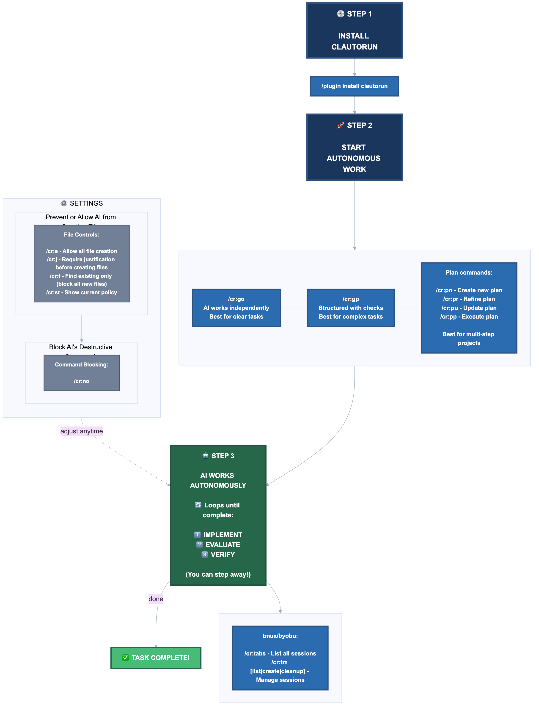
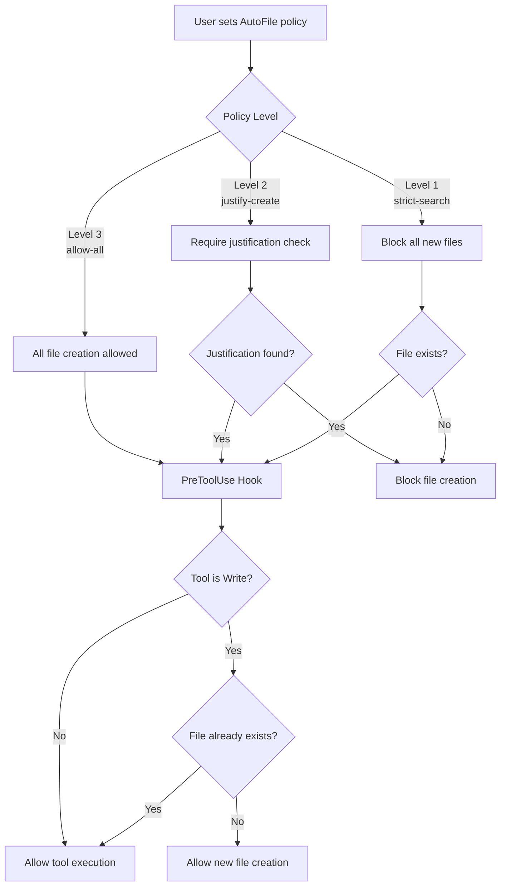
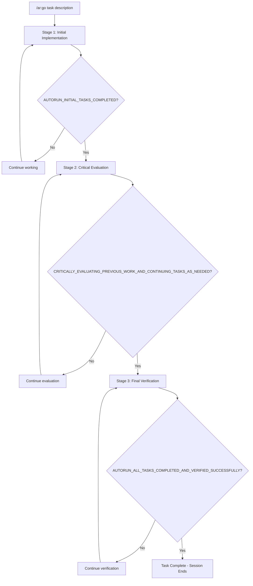

# autorun

[](https://python.org)
[](LICENSE)



**autorun** - Reduce interruptions while Claude completes tasks more safely and autonomously.

## Table of Contents

- [Key Features](#key-features)
- [Quick Start](#quick-start)
- [Command Reference](#command-reference)
  - [AutoFile Policy Commands](#autofile-commands-file-creation-control)
  - [Autorun Commands](#autorun-commands-autonomous-execution)
  - [Plan Management Commands](#plan-management-commands)
  - [Task Lifecycle Tracking](#task-lifecycle-tracking-v071)
  - [Command Blocking](#command-blocking-commands-new-in-v060)
  - [Tmux Session Commands](#tmux-automation-commands)
  - [Legacy Commands](#legacy-commands-backward-compatible)
- [How It Works](#how-it-works)
  - [Three-Stage Autorun System](#three-stage-autorun-system)
  - [AutoFile Policy System](#autofile-policy-system)
  - [Command Blocking System](#command-blocking-v060)
- [Tmux Integration](#why-byobu--tmux-integration)
- [Development](#development)
- [Testing](#testing)
- [Plugin Architecture](#plugin-architecture-and-integration-guide)
- [Troubleshooting](#troubleshooting)
- [Contributing](#contributing-and-sharing)
- [License](#license)

## Key Features

- **Autonomous Execution**: Claude continues working without constant "continue" prompts
- **Three-Stage Verification**: Ensures tasks are actually complete before stopping
- **File Policy Control**: Prevent AI from creating unnecessary files
- **Command Blocking**: Block dangerous commands with safer alternatives
- **Plan Management**: Create, refine, update, and execute structured plans
- **Session Management**: Work with tmux/byobu for crash-safe sessions

## Quick Start

```bash
# Install from GitHub
/plugin install https://github.com/ahundt/autorun.git

# Verify installation
/ar:st
# Expected: "AutoFile policy: allow-all"

# Start autonomous task
/ar:go Build a REST API with authentication and tests

# Set file policy (prevent file clutter)
/ar:f                    # Strict: only modify existing files
/ar:j                    # Justify: require justification for new files
/ar:a                    # Allow: create files freely (default)

# Emergency stop
/ar:sos
```

## UV Installation (Recommended)

The autorun marketplace includes 2 plugins: **autorun** and **pdf-extractor**.

> **Note:** plan-export functionality is now built into the autorun plugin. Use `/ar:planexport` commands for plan management.

### GitHub Installation

Install the entire marketplace directly from GitHub:

```bash
# Install all 3 plugins from GitHub
uv pip install git+https://github.com/ahundt/autorun.git

# Register plugins with Claude Code
autorun --install
```

### Local Installation

Install from a local clone:

```bash
# Clone repository
git clone https://github.com/ahundt/autorun.git
cd autorun

# Install marketplace
uv pip install .

# Register plugins with Claude Code
autorun --install
```

> **Note:** Use `autorun --install` to ensure the command runs in the correct UV environment. If `autorun-marketplace` is in your PATH, you can run it directly without `uv run`.

### Development Installation

For contributors and developers:

```bash
# Clone repository
git clone https://github.com/ahundt/autorun.git
cd autorun

# Option 1: UV (recommended - faster, better dependency management)
uv run python -m plugins.autorun.src.autorun.install --install --force

# Option 2: pip fallback (if UV not available)
pip install -e . && python -m plugins.autorun.src.autorun.install --install --force

# REQUIRED: Install as UV tool for global CLI availability
# This makes 'autorun' and 'claude-session-tools' commands globally available
# which are needed for proper daemon operation and session management
cd plugins/autorun && uv tool install --force --editable .

# Verify installation
autorun --status  # Verifies UV tool installation works
```

**Install UV (if needed):**
```bash
# macOS/Linux:
curl -LsSf https://astral.sh/uv/install.sh | sh

# Homebrew:
brew install uv

# Windows:
powershell -c "irm https://astral.sh/uv/install.ps1 | iex"
```

### Verification

After installation, verify plugins are registered:

```bash
# Check installed plugins
claude plugin marketplace list

# See all available commands
/help

# Test autorun
/ar:st
# Expected: "AutoFile policy: allow-all"
```

### Dual CLI Support (Claude Code + Gemini CLI)

**autorun works identically in both Claude Code and Gemini CLI**, providing the same safety features, commands, and autonomous execution capabilities across both platforms.

#### Gemini CLI Requirements

**Version**: Gemini CLI v0.28.0 or later (hooks require explicit enablement)

**Required Settings**: Edit `~/.gemini/settings.json` and add:

```json
{
  "tools": {
    "enableHooks": true,
    "enableMessageBusIntegration": true
  }
}
```

**Update Gemini CLI**:

```bash
# Using Bun (recommended - 2x faster)
bun install -g @google/gemini-cli@latest

# Or using npm
npm install -g @google/gemini-cli@latest

# Verify version
gemini --version  # Should show 0.28.0 or later
```

For troubleshooting, see [TROUBLESHOOTING.md](plugins/autorun/TROUBLESHOOTING.md).

#### Gemini CLI Installation

```bash
# Clone and install
git clone https://github.com/ahundt/autorun.git && cd autorun

# Option 1: UV (recommended)
uv run python -m plugins.autorun.src.autorun.install --install --force
uv run python plugins/autorun/scripts/restart_daemon.py

# Option 2: pip fallback
pip install -e . && \
python -m plugins.autorun.src.autorun.install --install --force && \
python plugins/autorun/scripts/restart_daemon.py

# Verify installation
gemini extensions list
# Should show: autorun-workspace@0.8.0

# Test in Gemini CLI
gemini
/ar:st
# Expected: "AutoFile policy: allow-all"
```

#### Multi-Model Workflows

Use autorun's safety features across both CLIs:

```bash
# Claude Code creates implementation
claude
/ar:go "Implement user authentication system"

# Gemini CLI reviews with vision capabilities
gemini
"Review the authentication code and analyze this architecture diagram"
# Attach: architecture.png

# Both sessions use autorun safety:
# - File policies enforce consistently
# - Command blocking prevents dangerous operations
# - Sessions are isolated (no state leakage)
```

#### Gemini-Specific Features

**Vision + Safety**: Analyze images/diagrams with autorun safety guards active:

```bash
gemini -i screenshot.png -c "Convert this UI mockup to React components"
```

Autorun ensures generated code respects file policies (`/ar:f` for strict mode) and blocks dangerous operations.

**Cross-Model Code Review**: Use Gemini to review Claude's work with safety features active:

```bash
# After Claude creates code
gemini -c "Review src/auth.py for security issues and suggest improvements"
# File policies and command blocking stay active during review
```

#### Installation Notes

- **Single install command**: `autorun --install` detects both CLIs and installs for whichever are present
- **Same commands**: All `/ar:*` and `/pdf-extractor:*` commands work identically
- **Isolated sessions**: Claude and Gemini sessions don't interfere with each other
- **Shared safety**: File policies, command blocking, and hooks work the same in both CLIs

For more details, see [GEMINI.md](GEMINI.md) for Gemini-specific usage patterns.

## What autorun Does For You

**Problem Statement**: Claude Code sessions can end unexpectedly during extended tasks, requiring manual intervention to continue work. AI creates numerous experimental files during development, leading to cluttered project directories. Network disconnections or application crashes terminate active sessions, losing all in-progress work.

**Solution Overview**: autorun addresses these specific limitations through session automation, file policy enforcement, and session persistence.

### Reduce User Interruptions
- **Current Behavior**: Claude Code sessions can end unexpectedly, requiring manual intervention to continue work
- **With autorun**: Claude continues working autonomously on the same task, reducing user interruptions
- **Mechanism**: Automatic task continuation when Claude stops working, ensuring focus stays on completing the original task without user intervention
- **Result**: Tasks get completed with reduced interruptions

### File Creation Control
- **Current Behavior**: AI creates multiple experimental files during development
- **With autorun**: Three-tier policy system restricts unnecessary file creation
- **Policy Levels**:
  1. Strict search (search for and modify existing files instead of creating new ones)
  2. Justified creation (require explanation for new files)
  3. Allow all (unrestricted for new projects)
- **Mechanism**: "Strict search" requires AI to first search for existing functionality or similar files, then modify those files rather than creating new ones
- **Result**: Project directories contain essential files only, reducing cleanup requirements

### Reduce Manual Interventions (autorun feature)
- **Current Behavior**: Claude Code stops and waits for manually typing continue
- **autorun Action**: Hook system intercepts Claude Code stop events and automatically re-injects continuation prompts
- **Mechanism**: UserPromptSubmit and Stop hooks detect when Claude stops working, analyze the transcript for completion markers, and inject "continue working" prompts when tasks are incomplete
- **Benefit**: Start autonomous tasks and return to completed work with fewer interruptions

### Prevent File Clutter (autorun feature)
- **Current Behavior**: AI creates multiple experimental files during development
- **autorun Action**: PreToolUse hooks intercept Write tool calls and enforce file creation policies
- **Mechanism**: Before each file creation, the hook scans the conversation transcript for policy compliance. It blocks or allows file operations based on the current policy level (`/afs`, `/afj`, `/afa`) and any required justifications
- **Policy Levels**:
  1. Strict search - Hook blocks all new file creation, forcing AI to modify existing files found through search
  2. Justified creation - Hook allows new files only when AI includes required justification tags
  3. Allow all - Hook allows all file creation operations
- **Benefit**: Maintain clean project directories with only essential files

### Ensure Complete Tasks (autorun feature)
- **Current Behavior**: AI may claim task completion after implementing only partial requirements
- **autorun Action**: Hook system implements three-stage verification by detecting completion markers and re-injecting the original task
- **Mechanism**: When AI outputs a completion marker, the hook detects this first completion and re-injects the original task with a verification checklist. Only after a second completion marker does the system allow the session to end
- **Benefit**: Reduce incomplete features and ensure all requirements are implemented

### Survive Crashes and Disconnections (tmux/byobu feature)
- **Current Behavior**: Application crashes or network drops terminate work sessions
- **tmux/byobu Action**: Maintains session state across interruptions using terminal multiplexing
- **How it Works**: Terminal multiplexer keeps processes running on the server regardless of client connectivity
- **Benefit**: Resume work from the exact interruption point after reconnection
- **Note**: autorun integrates with tmux/byobu but does not provide session persistence itself

### Work From Anywhere (tmux/byobu + SSH/Mosh feature)
- **Current Behavior**: Users must stay at their workstation to monitor and intervene in AI sessions
- **SSH/Mosh + tmux Action**: Enables remote session monitoring and intervention from any device
- **How it Works**: SSH/Mosh clients connect to the tmux session through network connections
- **Benefit**: Monitor and control AI work from any location with internet access
- **Note**: autorun provides commands to work within tmux sessions but does not provide remote access

### Concrete Capabilities Matrix

**tmux/byobu Base Capabilities:**
- **Session Persistence**: Processes continue running even when client disconnects
- **Session Isolation**: Multiple independent sessions can run simultaneously
- **Remote Access**: SSH/Mosh provides secure remote access from any device
- **Multiplexing**: Split terminal windows for simultaneous viewing
- **Process Recovery**: Automatic session recovery after system restart

**autorun Enhanced Capabilities:**
- **Automatic Continuation**: Keeps Claude working without manually typing continue
- **File Policy Enforcement**: Three-tier system to prevent file clutter
- **Three-Stage Verification**: Helps ensure tasks are complete
- **Session State Management**: Robust state isolation and recovery
- **Targeted Session Safety**: Commands never affect current Claude Code session

### Measurable Technical Benefits

**Before autorun + tmux/byobu:**
- AI work lost when terminal closes
- Manual intervention required for session interruptions
- No file creation control during autonomous workflows
- No verification that tasks are actually complete

**With autorun + tmux/byobu:**
- Reduced data loss during crashes or disconnections
- Decreased need for manual intervention
- File creation policies to reduce unnecessary files
- Three-stage verification to help ensure task completion

### Testing

autorun includes a comprehensive testing suite with multiple approaches to verify functionality and integration.

#### Quick Integration Test

**Test the complete workflow:**
```bash
# Create byobu session with crash protection
byobu-new-session autorun-work

# Start autonomous task that simulates crash
/autorun /autorun simulate network issues during build process

# Test session recovery
# Close terminal, reconnect with SSH/Mosh
byobu-attach autorun-work
# Expected: AI work continues from interruption point
```

**Recovery Verification:**
```bash
# Check if AI is still working
ps aux | grep python  # Look for running autorun processes

# Verify session state persistence
tmux list-sessions | grep autorun
# Expected: "autorun-work" session exists and is running
```

#### Comprehensive pytest Testing

**What is pytest?**
pytest is a popular testing framework for Python that makes it easy to write simple and scalable tests. It automatically discovers test files and functions, provides detailed output, and supports powerful fixtures and plugins.

**What are Virtual Environments?**
Virtual environments are isolated Python environments that keep project dependencies separate. Think of them as clean rooms for each project - they prevent different projects from conflicting with each other's requirements.

**What is UV?**
UV is a modern, extremely fast Python package manager and virtual environment manager. It's like `pip` + `venv` but 10-100x faster with better dependency resolution.

**Quick Core Tests:**
```bash
# With UV (Recommended)
uv run pytest plugins/autorun/tests/test_unit_simple.py -v

# With Traditional pip
python3 -m venv .venv
source .venv/bin/activate
pip install -e ".[dev]"
pytest plugins/autorun/tests/test_unit_simple.py -v

# Using Makefile
make test-quick
```

**Expected output:**
```
============================= test session starts ==============================

tests/test_unit_simple.py::TestConfiguration::test_completion_marker PASSED
tests/test_unit_simple.py::TestConfiguration::test_emergency_stop_phrase PASSED
...
```

**Full Test Suite with Coverage:**
```bash
# With UV
uv run pytest --cov=plugins/autorun/src/autorun --cov-report=term-missing

# With make
make test-all

# With traditional pip
pytest --cov=plugins/autorun/src/autorun --cov-report=term-missing
```

**Test Categories:**
- **Unit Tests** (`test_unit_simple.py`): Configuration constants, command handlers, command detection logic
- **Integration Tests** (`test_interceptor.py`, `test_interactive.py`): Command processing, interactive mode functionality

**Specific Test Categories:**
```bash
# Unit tests only
uv run pytest plugins/autorun/tests/test_unit_simple.py -v

# With markers
uv run pytest -m unit -v
```

**Test Coverage Report:**
After running tests with coverage, view detailed reports:
```bash
# HTML report (opens in browser)
open htmlcov/index.html

# Terminal summary
cat coverage.txt
```

**Manual Testing:**
```bash
# Test interactive commands
uv run python src/autorun/main.py
# Then try: /afs, /afa, /afj, /afst, quit

# Test hook integration
echo '{"hook_event_name": "UserPromptSubmit", "session_id": "test", "prompt": "/afs"}' | uv run python src/autorun/main.py

# Test plugin mode (same as hook integration now)
echo '{"hook_event_name": "UserPromptSubmit", "prompt": "/afa", "session_id": "test"}' | uv run python src/autorun/main.py
```

## Why Byobu + tmux Integration

**autorun is designed for use with byobu (tmux-compatible terminal multiplexer)** - this integration provides concrete technical capabilities:

### Survive System Failures
- **Technical Issue**: Terminal application crashes, network disconnections, or system reboots terminate Claude Code sessions, losing all in-progress AI work
- **Solution**: byobu + tmux maintains session state on the server. Session persists even when your local machine loses power or network connection
- **Concrete Result**: SSH back to the same session after system reboot; AI work continues from exactly where it left off

### Access Sessions Remotely
- **Technical Issue**: You must be physically present at your workstation to monitor or intervene in AI sessions
- **Solution**: SSH access to byobu session from any device with SSH client (phone, tablet, laptop)
- **Concrete Result**: Monitor AI progress from mobile device; intervene when needed without returning to desk

**What is SSH?** SSH (Secure Shell) is a secure network protocol that lets you securely access and control your computer from anywhere in the world.

**SSH Clients for Different Devices:**

**Enhanced SSH Experience (Recommended):**
- **Mosh (Mobile Shell)**: [mosh.org](https://mosh.org/) - A mobile SSH client that handles network interruptions gracefully
  - **Why Mosh?** Keeps your connection alive even when switching networks (WiFi → 4G → WiFi), works with poor connections, provides intelligent local echo for reduced lag, and automatically resumes where you left off after reconnection
  - **Installation**: `brew install mosh` (macOS), `sudo apt install mosh` (Ubuntu/Debian)
  - **Usage**: `mosh username@your-server-address` instead of `ssh username@your-server-address`

**Traditional SSH Clients:**
- **Windows**: [Windows Terminal](https://learn.microsoft.com/en-us/windows/terminal/) (built-in, modern), [VS Code Terminal](https://code.visualstudio.com/) (built-in to VS Code), [Fluent Terminal](https://github.com/felixse/FluentTerminal) (free), [Hyper](https://hyper.is/) (modern, extensible)
- **macOS**: [iTerm2](https://iterm2.com/) (recommended, powerful), [VS Code Terminal](https://code.visualstudio.com/) (built-in to VS Code), or built-in Terminal app
- **Linux**: Most terminal emulators work well (gnome-terminal, konsole, etc.), [VS Code Terminal](https://code.visualstudio.com/) (built-in to VS Code)
- **iOS**: [Terminus](https://www.termius.com/mobile) (supports Mosh), [Prompt](https://panic.com/prompt/) (supports Mosh), or [Blink Shell](https://blink.sh/) (supports Mosh)
- **Android**: [Termius](https://www.termius.com/mobile) (supports Mosh), [JuiceSSH](https://juicessh.com/), or [ConnectBot](https://github.com/connectbot/connectbot)

### Monitor Multiple Processes Simultaneously
- **Technical Issue**: Single terminal window hides AI output, error messages, and system status
- **Solution**: byobu splits terminal into multiple panes: AI output, error logs, file system monitoring, command history
- **Concrete Result**: See AI responses in real-time while monitoring system resources and errors simultaneously

### Control File Creation
- **Technical Issue**: AI creates numerous experimental files during development, leading to cluttered project directories
- **Solution**: Three-tier file policy system (`/afs` strict-search, `/afj` justify-create, `/afa` allow-all) with PreToolUse hook enforcement
- **Concrete Result**: Clean project directories with meaningful files only; unified implementation approach reduces file proliferation

## AUTOFILE LIFECYCLE FLOW



**Policy Level 1: Strict Search** (`/afs`)
- Blocks all new file creation via PreToolWrite hooks
- Forces AI to modify existing files using Glob/Grep
- Ideal for refactoring established codebases
- Prevents pollution with experimental files

**Policy Level 2: Justify Create** (`/afj`)
- Requires `<AUTOFILE_JUSTIFICATION>` tag in AI reasoning
- Hook scans transcript for proper justification before allowing new files
- Balances innovation with organization
- Records why each file was created in reasoning

**Policy Level 3: Allow All** (`/afa`)
- No restrictions on file creation (default for new projects)
- Full creative freedom for initial development
- Best for prototyping and new project setup
- All tools pass through without intervention

## How It Works

### Three-Stage Autorun System



**Stage 1 - Initial Implementation**: Claude works on the task, outputs `AUTORUN_INITIAL_TASKS_COMPLETED` when done.

**Stage 2 - Critical Evaluation**: Claude critically evaluates work, identifies gaps, outputs `CRITICALLY_EVALUATING_PREVIOUS_WORK_AND_CONTINUING_TASKS_AS_NEEDED` when satisfied.

**Stage 3 - Final Verification**: Claude verifies all requirements met, outputs `AUTORUN_ALL_TASKS_COMPLETED_AND_VERIFIED_SUCCESSFULLY` to finish.

**Emergency Stop**: At any point, `/ar:sos` outputs `AUTORUN_STATE_PRESERVATION_EMERGENCY_STOP` and immediately halts.

### How It Works

1. User sends `/ar:go <task description>` (or legacy `/autorun`)
2. UserPromptSubmit hook activates session state with three-stage tracking
3. AI works autonomously through each stage
4. At each stage boundary, the system validates completion markers
5. Only after all three stages complete does the session end
6. Emergency stop (`/ar:sos`) immediately halts at any point

### Safety Mechanisms
- **Maximum recheck limit**: Prevents infinite loops (default: 3 attempts per stage)
- **Emergency stop**: `/ar:sos` immediately terminates any runaway process
- **Plan acceptance**: Plans can auto-trigger autorun via "PLAN ACCEPTED" marker
- **State validation**: Ensures session integrity throughout process

### Verification Example

**Before autorun**: Claude stops after implementing basic login form
**With autorun three-stage verification**:
1. Stage 1: "Login form implemented!" → `AUTORUN_INITIAL_TASKS_COMPLETED`
2. Stage 2: "Critically evaluated - added error handling, tests missing" → continues working → `CRITICALLY_EVALUATING_PREVIOUS_WORK_AND_CONTINUING_TASKS_AS_NEEDED`
3. Stage 3: "Verified: Form works, tests pass, error handling complete" → `AUTORUN_ALL_TASKS_COMPLETED_AND_VERIFIED_SUCCESSFULLY` → Session ends

## Tmux Integration

For crash-safe sessions that survive disconnections, use **byobu** (recommended) with autorun.

### Install byobu (Recommended)

**[byobu](https://www.byobu.org/)** is a user-friendly terminal multiplexer that wraps tmux with helpful defaults and keyboard shortcuts.

```bash
# macOS
brew install byobu

# Ubuntu/Debian
sudo apt install byobu
```

**Why byobu?**
- Simpler than raw tmux - designed for humans
- **F3/F4** or **Cmd+Left/Right** to switch between tabs (windows)
- Helpful status bar and keyboard shortcut reminders (press F1 for help)
- Session persistence across disconnections
- Multiple windows/panes in one terminal
- Remote session access via SSH/Mosh

**Resources:**
- [byobu.org](https://www.byobu.org/) - Official site and documentation
- [byobu Quick Start](https://www.byobu.org/documentation) - Getting started guide
- [Ubuntu byobu Guide](https://help.ubuntu.com/community/Byobu) - Community documentation

### Start a Crash-Safe Session

```bash
# Create byobu session
byobu-new-session autorun-work

# Start autonomous work
/ar:go Build a complete web application with authentication

# Detach: Ctrl+A, D (or close terminal)
# Reattach anytime: byobu-attach autorun-work
```

### Remote Access with Mosh (Optional)

For better mobile/unreliable connections, use [Mosh](https://mosh.org/) instead of SSH:
```bash
# Install: brew install mosh (macOS) or sudo apt install mosh (Linux)
mosh user@server    # Then: byobu-attach autorun-work
```

## Development

### Repository Structure

**Git Repository (Development Location):**
- Edit source files in your autorun git repository
- Run tests from the plugin directory
- Commit changes to git
- Push changes to GitHub for sharing

**Plugin Cache (Runtime Location - READ ONLY):**
- Claude Code installs plugins to a cache directory
- Changes in cache do NOT persist
- For reference only, NOT for development

**Typical Development Workflow:**
```bash
# Navigate to your autorun repository
cd /path/to/autorun

# Edit files in the repository
# Run tests
uv run pytest tests/

# Commit changes
git add .
git commit -m "Description of changes"

# Update plugin (or reinstall for local development)
/plugin update autorun
# OR for local development: /plugin install autorun@autorun
```

### Active vs Deprecated

**✅ autorun plugin v0.8.0 (Current)**
- Installed via `/plugin install https://github.com/ahundt/autorun.git`
- Commands: `/ar:st`, `/ar:a`, `/ar:j`, `/ar:f`, `/ar:go`, `/ar:gp`, `/ar:x`, `/ar:sos`, `/ar:tm`, `/ar:tt`, `/ar:tabs`
- **NEW v0.6.0:** `/ar:no`, `/ar:ok`, `/ar:clear`, `/ar:globalno`, `/ar:globalok`, `/ar:globalstatus` (Command Blocking)
- Active and maintained

## 🔧 Advanced Setup (Optional)

### Development Installation (Contributors)

For contributing to autorun development:

```bash
# Clone repository and set up development environment
git clone https://github.com/ahundt/autorun.git
cd autorun

# Install development dependencies
uv sync --extra dev

# Add local development marketplace for testing
/plugin marketplace add ./autorun

# Install your local development version
/plugin install autorun@autorun
```

**Contributor Workflow:**
1. **Make changes**: Edit code in your local clone
2. **Test locally**: Use the installed development version to test your changes
3. **Run tests**: `uv run pytest tests/` to ensure nothing breaks
4. **Submit PR**: Create a pull request with your improvements

**Git for Contributors:**
Git provides complete version control for collaborative development. Essential commands:
- `git diff` - Review your changes before committing
- `git add . && git commit -m "Description"` - Commit your changes
- `git push origin feature-branch` - Share your changes for review

**AI Safety with Git:**
- **Instant rollback**: `git reset --hard HEAD~1` undoes all AI changes instantly
- **Selective revert**: `git checkout -- filename` restores specific files
- **Safe experimentation**: Test AI suggestions knowing you can revert completely
- **Change visibility**: See exactly what AI modified before committing

### Manual Installation (if plugin system fails)

```bash
# Option 1: UV (recommended)
uv run python -m plugins.autorun.src.autorun.install --install --force

# Option 2: pip fallback (if UV not available)
python3 -m venv .venv
source .venv/bin/activate
pip install -e ".[dev]"
python -m plugins.autorun.src.autorun.install --install --force
```

## 📋 Available Commands

### Plugin Naming

- **Project/Repo name**: `autorun`
- **Marketplace name**: `autorun` (used for `/plugin install autorun@autorun`)
- **Command prefix**: `cr` (used for short commands like `/ar:st`, `/ar:a`, `/ar:f`)

The short `cr` prefix is intentional to make commands quick to type while the full name `autorun` is used for the project, repository, and marketplace identification.

### Command Prefix

Commands use the `/ar:` prefix with both **short** (for power users) and **long** (for discoverability) forms.

### Command Reference Table

| Short | Long | Legacy | Description |
|-------|------|--------|-------------|
| `/ar:a` | `/ar:allow` | `/afa` | Allow all file creation (Level 3) |
| `/ar:j` | `/ar:justify` | `/afj` | Require justification for new files (Level 2) |
| `/ar:f` | `/ar:find` | `/afs` | Find existing files only - no creation (Level 1) |
| `/ar:st` | `/ar:status` | `/afst` | Show current policy status |
| `/ar:go` | `/ar:run` | `/autorun` | Start autonomous task execution |
| `/ar:gp` | `/ar:proc` | `/autoproc` | Procedural autonomous workflow |
| `/ar:gc` | `/ar:commit` | - | Display Git Commit Requirements (17-step process) |
| `/ar:ph` | `/ar:philosophy` | - | Display Universal System Design Philosophy (17 principles) |
| `/ar:pn` | `/ar:plannew` | - | Create new structured plan |
| `/ar:x` | `/ar:stop` | `/autostop` | Graceful stop |
| `/ar:sos` | `/ar:estop` | `/estop` | Emergency stop |
| `/ar:pr` | `/ar:planrefine` | - | Refine and improve existing plan |
| `/ar:pu` | `/ar:planupdate` | - | Update plan with new information |
| `/ar:pp` | `/ar:planprocess` | - | Execute plan with development process |
| `/ar:tm` | `/ar:tmux` | - | Tmux session management |
| `/ar:tt` | `/ar:ttest` | - | Tmux test workflow |
| `/ar:tabs` | - | - | Discover and manage Claude sessions across tmux |
| `/ar:no <p>` | - | - | Block command pattern in session |
| `/ar:ok <p>` | - | - | Allow command pattern in session |
| `/ar:clear` | - | - | Clear session blocks |
| `/ar:globalno <p>` | - | - | Block command pattern globally |
| `/ar:globalok <p>` | - | - | Allow command pattern globally |

### AutoFile Commands (File Creation Control)

- **/ar:a** or **/ar:allow** - Allow all file creation (Level 3 - default)
  - No restrictions on creating new files
  - Best for new projects and initial development

- **/ar:j** or **/ar:justify** - Require justification before creating new files (Level 2)
  - AI must include \<AUTOFILE_JUSTIFICATION> tag with reasoning
  - Ideal for security-sensitive work and established projects

- **/ar:f** or **/ar:find** - Find existing files only (Level 1 - strictest)
  - Blocks ALL new file creation
  - Forces AI to FIND and modify existing files via Glob/Grep search
  - Perfect for refactoring established codebases

- **/ar:st** or **/ar:status** - Display current AutoFile policy and settings
  - Shows current policy level and name
  - Displays current enforcement status


### Command Blocking Commands (ENHANCED in v0.6.0+)

**General-purpose command blocking** - Block dangerous commands per-session or globally

**Session Commands:**
- **/ar:no \<pattern> [description]** - Block pattern in this session
- **/ar:ok \<pattern>** - Allow pattern in this session
- **/ar:clear [pattern]** - Clear session blocks (or specific pattern)
- **/ar:blocks** - Show active session-level pattern blocks and allows
- **/ar:status** - Show blocked patterns

**Global Commands:**
- **/ar:globalno \<pattern> [description]** - Block pattern globally (all sessions)
- **/ar:globalok \<pattern>** - Allow pattern globally
- **/ar:globalstatus** - Show global blocks
- **/ar:globalclear** - Clear all global pattern blocks and allows

**Developer/Admin Commands:**
- **/ar:reload** - Force-reload all integration rules from config files
- **/ar:restart-daemon** - Restart daemon to reload Python code changes

**Pattern Type Prefixes (NEW):**
- **regex:\<pattern>** - Use regular expression matching
- **glob:\<pattern>** - Use glob pattern matching
- **/\<pattern>/** - Auto-detects regex when pattern contains metacharacters
- *(default)* - Literal substring matching

**Custom Descriptions (NEW):**
Add custom descriptions when blocking patterns to provide specific guidance to users.

**Examples:**
```bash
# Basic blocking (uses DEFAULT_INTEGRATIONS for suggestions)
/ar:no rm

# Custom description for specific guidance
/ar:no "exec(" unsafe exec function - use alternatives

# Regex pattern matching for flexible patterns
/ar:no regex:eval\( dangerous eval usage - blocked for security

# Glob pattern matching for wildcards
/ar:no glob:*.tmp temporary files are not allowed in this session

# Global blocking with custom description
/ar:globalno "git reset --hard" PERMANENTLY DESTRUCTIVE - use git restore instead

# Auto-detect regex when pattern contains metacharacters
/ar:no /eval\(.*assert/ matches eval( or assert(
```

**Pattern Type Examples:**

| Type | Prefix | Description | Example Pattern | Matches |
|------|--------|-------------|---------------|--------|
| Literal | *(none)* | Substring/part matching (default) | `rm` | `rm file.txt` |
| Regex | `regex:` | Regular expression | `regex:eval\(` | `code(eval(x))` |
| Glob | `glob:` | Glob pattern matching | `glob:*.tmp` | `file.tmp` |
| Auto | `/.../` | Auto-detects regex | `/eval\(./` | `eval(...` |

**Default Integrations (21 entries):**
- `rm` → Suggests 'trash' CLI (safe file deletion with recovery)
- `rm -rf` → Dangerous, suggests trash CLI alternatives
- `git reset --hard` → CRITICAL: Permanently discards uncommitted changes, suggests safer git alternatives
- `git checkout .` → DANGEROUS: Discards ALL uncommitted changes, suggests git stash
- `git checkout --` → CAUTION: Discards unstaged changes to specific file, suggests git stash push
- `git checkout` → CAUTION: Discards unstaged changes (modern syntax without --), suggests git restore
- `git stash drop` → CAUTION: Permanently deletes stashed changes, suggests git stash pop
- `git clean -f` → DANGEROUS: Permanently deletes untracked files, suggests git clean -n dry-run first
- `git reset HEAD~` → CAUTION: Undoes commits, suggests backup branch or git revert
- `dd if=` → Disk write warning, suggests backup tools
- `mkfs` → Filesystem warning, suggests backup first
- `fdisk` → Partition warning, suggests GUI alternatives
- `sed` → Suggests {edit} AI tool instead of bash sed for file modifications
- `awk` → Suggests Python or {read} AI tool instead of awk for text processing
- `grep` → Suggests {grep} AI tool instead (blocked when not in a pipe)
- `find` → Suggests {glob} AI tool instead (blocked when not in a pipe)
- `cat` → Suggests {read} AI tool instead (blocked when not in a pipe)
- `head` → Suggests {read} AI tool with limit parameter (blocked when not in a pipe)
- `tail` → Suggests {read} AI tool with offset parameter (blocked when not in a pipe)
- `echo >` → Suggests {write} AI tool instead of echo redirection
- `git` → Warning only (action: warn): reminds to check CLAUDE.md git commit requirements

**Installing trash CLI:**
- macOS: `brew install trash`
- Linux: `go install github.com/andraschume/trash-cli@latest`
- Restores files from: `trash-restore` or system trash

**State Hierarchy:**
1. Session blocks (highest priority)
2. Global blocks (fallback)
3. Default integrations (built-in suggestions)

**Backward Compatibility:**
All existing patterns without type prefixes default to literal matching. Existing blocks continue to work as before.

### Autorun Commands (Autonomous Execution)

- **/ar:go** or **/ar:run** \<prompt> - Start autonomous workflow with extended work sessions
  - Reduces manual "continue" prompts significantly
  - Enables three-stage verification to prevent premature exits
  - Takes task description as argument (required)

- **/ar:gp** or **/ar:proc** \<prompt> - Procedural autonomous workflow
  - Uses Sequential Improvement Methodology
  - Includes wait process and best practices generation

- **/ar:x** or **/ar:stop** - Stop gracefully after current task completion
  - Allows AI to finish current work before stopping
  - Cleans up processes and state files properly

- **/ar:sos** or **/ar:estop** - Emergency stop - immediately halt any runaway process
  - Stops all processes immediately without waiting
  - Use for critical situations or when something goes wrong

### Plan Management Commands

Structured planning for complex development tasks.

| Short | Long | Description |
|-------|------|-------------|
| `/ar:pn` | `/ar:plannew` | Create a new structured plan |
| `/ar:pr` | `/ar:planrefine` | Refine and improve an existing plan |
| `/ar:pu` | `/ar:planupdate` | Update plan with new information |
| `/ar:pp` | `/ar:planprocess` | Execute plan with development process |

- **/ar:pn** or **/ar:plannew** - Create a new development plan
  - Generates structured plan with checkboxes and dependencies
  - Includes task breakdown and verification criteria

- **/ar:pr** or **/ar:planrefine** - Refine an existing plan
  - Critically evaluates and improves plan quality
  - Identifies gaps and adds missing steps

- **/ar:pu** or **/ar:planupdate** - Update plan with new context
  - Incorporates new requirements or changes
  - Maintains plan consistency

- **/ar:pp** or **/ar:planprocess** - Execute development process
  - Follows the plan with Sequential Improvement Methodology
  - Auto-triggers autorun when plan is approved ("PLAN ACCEPTED" marker)

### Task Lifecycle Tracking (v0.8.0+)

**PRIMARY GOAL**: Ensure AI continues working while tasks are outstanding.

Comprehensive task lifecycle tracking with automatic AI continuation enforcement.

| Command | Description |
|---------|-------------|
| `/task-status` (aliases: `/ts`, `/tasks`) | Show current task state in-session |
| `/task-ignore <task_id> [reason]` (alias: `/ti`) | Mark task as ignored (user override) |

**CLI Commands:**
```bash
# Show task status
python3 ${CLAUDE_PLUGIN_ROOT}/scripts/task_lifecycle_cli.py --status [SESSION_ID]

# Export task data
python3 ${CLAUDE_PLUGIN_ROOT}/scripts/task_lifecycle_cli.py --export SESSION_ID OUTPUT [--format json|csv|markdown]

# Clear task data
python3 ${CLAUDE_PLUGIN_ROOT}/scripts/task_lifecycle_cli.py --clear [SESSION_ID] [--all]

# Configure settings
python3 ${CLAUDE_PLUGIN_ROOT}/scripts/task_lifecycle_cli.py --configure
python3 ${CLAUDE_PLUGIN_ROOT}/scripts/task_lifecycle_cli.py --enable
python3 ${CLAUDE_PLUGIN_ROOT}/scripts/task_lifecycle_cli.py --disable
```

**Key Features:**
- **Stop Hook Blocks** - AI cannot stop with incomplete tasks (enforces continuation)
- **Escape Hatch** - Allows override after 3 consecutive stop attempts
- **SessionStart Resume** - Automatically detects and prompts for incomplete work
- **Plan Context Injection** - Tasks linked to plans survive Option 1 context clears
- **Hard Prioritization** - Uses blockedBy/blocks dependencies for task ordering
- **Paused/Ignored Status** - Explicitly parked or ignored work doesn't block stop
- **Full Audit Trail** - Timestamps, dependencies, tool_outputs logged

**Architecture:**
- **Dict-based storage**: {task_id: TaskState} prevents duplicates
- **Per-session isolation**: Each AI session tracks own tasks independently
- **Thread-safe**: `filelock.FileLock` (cross-process) + `threading.RLock` (same-process) via session_state(), atomic writes
- **DRY patterns**: Reuses session_state(), simple logging, @property + atomic_update_*()

**Configuration:**
```bash
# Enable/disable tracking
python3 ${CLAUDE_PLUGIN_ROOT}/scripts/task_lifecycle_cli.py --enable
python3 ${CLAUDE_PLUGIN_ROOT}/scripts/task_lifecycle_cli.py --disable

# Configure settings interactively
python3 ${CLAUDE_PLUGIN_ROOT}/scripts/task_lifecycle_cli.py --configure
```

**Settings:**
- `enabled`: Enable/disable task lifecycle tracking (default: true)
- `max_resume_tasks`: Max tasks shown in resume prompt (default: 20)
- `stop_block_max_count`: Stop override threshold (default: 3)
- `task_ttl_days`: Auto-prune completed tasks after N days (default: 30)
- `debug_logging`: Enable audit logging (default: false)

**Storage:**
- **State**: `~/.claude/sessions/daemon_state.json` (single JSON file via filelock+JSON backend)
- **Logs**: `~/.autorun/task-tracking/{session_id}/audit.log` (per-session)
- **Config**: `~/.autorun/task-lifecycle.config.json`

**Test Coverage:**

Comprehensive test suite with 48 tests across 5 test files:

```bash
# Run all task lifecycle + command blocking tests
uv run pytest plugins/autorun/tests/test_task_lifecycle_*.py plugins/autorun/tests/test_pipe_context_blocking.py -v

# Run specific test suites
uv run pytest plugins/autorun/tests/test_task_lifecycle_basic.py          # 8 basic tests
uv run pytest plugins/autorun/tests/test_task_lifecycle_integration.py    # 10 integration tests
uv run pytest plugins/autorun/tests/test_task_lifecycle_failure_modes.py  # 8 failure mode tests
uv run pytest plugins/autorun/tests/test_task_lifecycle_edge_cases.py     # 10 edge case tests
uv run pytest plugins/autorun/tests/test_pipe_context_blocking.py         # 12 pipe context tests
```

**Test Categories:**

1. **Basic Tests** (8 tests) - `test_task_lifecycle_basic.py`
   - Config load/save
   - TaskLifecycle creation and instantiation
   - Task creation, update, prioritization
   - Deduplication and CLI methods

2. **Integration Tests** (10 tests) - `test_task_lifecycle_integration.py`
   - Full lifecycle: create → update → complete
   - Dependencies and blockedBy/blocks chains
   - Stop hook blocking (PRIMARY GOAL verification)
   - Resume detection and plan context injection
   - Cross-session persistence and escape hatch

3. **Failure Mode Tests** (8 tests) - `test_task_lifecycle_failure_modes.py`
   - Task explosion (100+ tasks) with capping
   - Stuck task escape hatch (override after 3 blocks)
   - Format change resilience (multiple regex patterns)
   - Unbounded growth prevention (TTL-based pruning)
   - Race condition prevention (atomic operations)
   - Deduplication enforcement
   - Log file growth tolerance
   - Session isolation verification

4. **Edge Case Tests** (10 tests) - `test_task_lifecycle_edge_cases.py`
   - Empty/minimal task creation
   - Very long fields (stress test: 10k+ chars)
   - Special characters in task IDs
   - Circular dependencies (A blocks B, B blocks A)
   - Self-blocking tasks
   - Update non-existent task behavior
   - Idempotent operations
   - Zero TTL pruning
   - Various session_id formats (UUID, timestamps, custom)
   - Config override validation

5. **Pipe Context Blocking Tests** (12 tests) - `test_pipe_context_blocking.py`
   - CRITICAL: User-reported bug fix (git diff | head -50 now allowed)
   - head/tail/grep/cat in pipes allowed (e.g., `ps aux | grep python`)
   - head/tail/grep/cat on files blocked (e.g., `cat file.txt` → use Read tool)
   - Commands reading stdin allowed (e.g., `head -50` with no file)
   - Complex multi-pipe commands handled correctly
   - _not_in_pipe predicate logic verification

**All 48 tests pass with 100% success rate**, verifying:
- ✅ PRIMARY GOAL: AI continuation enforcement (stop hook blocks incomplete tasks)
- ✅ Context-aware command blocking (pipes allowed, direct file operations blocked)
- ✅ Thread safety (concurrent access, atomic operations)
- ✅ Failure resilience (format changes, corruption recovery, pruning)
- ✅ Edge case handling (boundary conditions, unusual inputs)
- ✅ DRY patterns (reuses session_state(), no code duplication)

### Commit Command

- **/ar:gc** or **/ar:commit** - Display Git Commit Requirements
  - 17-step process for high-quality commit messages
  - Subject line formats, message structure, content requirements
  - Security checks, validation checklist, pitfalls & solutions
  - Use before every git commit and during PR review

**When to use:**
- **Before committing:** Always review requirements before making git commits
- **PR review:** Verify commit messages follow guidelines
- **Training:** Learn commit message best practices

**Key requirements:**
1. **Concrete & Actionable** - Use specific, measurable descriptions
2. **Subject Line Format** - Follow `<files>:` or `type(scope):` convention
3. **Security Check** - Explicitly check for secrets before committing

### Philosophy Command

- **/ar:ph** or **/ar:philosophy** - Display Universal System Design Philosophy
  - 17 core principles for exceptional systems
  - Ordered from most fundamental to most specific
  - Use during planning, code review, and architecture decisions
  - Focus areas: Automatic/Correct, Concrete Communication, Lean Solutions

**When to use:**
- **Before planning:** Apply principles when designing new features
- **During code review:** Verify implementations follow guidelines
- **Architecture decisions:** Reference technical and communication principles

**Key principles:**
1. **Automatic and Correct** - Make things "just work"
2. **Concrete Communication** - Specific, actionable messages
3. **One Problem, One Solution** - Avoid over-engineering
4. **Solve Problems FOR Users** - Don't just report, fix automatically

### Tmux Automation Commands

- **/ar:tm** or **/ar:tmux** - Session lifecycle management (create, list, cleanup)
- **/ar:tt** or **/ar:ttest** - Comprehensive CLI and plugin testing in isolated sessions
- **/ar:tabs** - Discover and manage Claude sessions running across tmux windows
- **/ar:tabw** - Execute actions on Claude sessions across tmux windows (DANGEROUS: sends keystrokes to other sessions)
  - Scans all tmux panes for Claude Code sessions using pattern matching
  - Displays organized table with session letter (A, B, C), directory, purpose, and status
  - Supports batch actions: `all:continue`, `awaiting:continue`, `A:git status, B:pwd`
  - Interactive workflow with user approval before executing commands

#### Session Status Types

When `/ar:tabs` discovers sessions, it displays these status indicators:

| Status | Description | Action |
|--------|-------------|--------|
| `awaiting input` | Claude waiting for user prompt | Can send commands |
| `working` | Claude actively generating | Use `:escape` to stop |
| `plan approval` | Awaiting plan approval | Respond with approval |
| `tool permission` | Awaiting tool permission | Use `:y` or `:n` |
| `idle` | Session inactive, no Claude | Safe to send commands |
| `error` | Error state detected | Investigate before acting |

**See also**:
- `/ar:tmux` or `/ar:tm` - Create and manage isolated tmux sessions
- `/ar:ttest` or `/ar:tt` - Automated CLI testing in isolated sessions
- `tmux-session-automation.md` agent - Advanced session lifecycle automation

### Usage Examples

```bash
# Start autonomous work on a large project
/ar:go Build complete REST API with authentication, testing, and documentation

# Enable strict file control for security-sensitive work
/ar:j
/ar:go Implement OAuth2 authentication system

# Check current file creation policy
/ar:st
# Output: "Current policy: justify-create"

# Protect existing codebase during refactoring (find existing files, don't create new ones)
/ar:f
/ar:go Refactor authentication module to use new database schema

# Stop gracefully when task is complete
/ar:x

# Emergency stop if something goes wrong
/ar:sos

# Tmux session management
/ar:tm create my-project
/ar:tm list
/ar:tm cleanup

# Discover and manage Claude sessions across tmux windows
/ar:tabs
# Shows table of sessions (A, B, C...) with status
# Then respond with selections like: "A, B:git status, all:continue"

# Advanced session discovery examples
/ar:tabs                    # Show all Claude sessions with AI analysis
# Output: Table with sessions labeled A, B, C... with status and purpose

# Continue all sessions awaiting input
/ar:tabs awaiting:continue

# Run different commands on specific sessions
/ar:tabs A:git status, B:pwd, C:ls -la

# Emergency stop all active sessions
/ar:tabs all:escape

# Check status of all sessions
/ar:tabs all:pwd
```

### Legacy Commands (Backward Compatible)

All legacy commands continue to work: `/afa`, `/afj`, `/afs`, `/afst`, `/autorun`, `/autoproc`, `/autostop`, `/estop`

## 🛠️ Plugin Architecture and Integration Guide

**Official Claude Code Plugin Structure:**
```
autorun/
├── .claude-plugin/
│   └── plugin.json          # Plugin manifest and metadata
├── agents/
│   ├── tmux-session-automation.md      # Session lifecycle automation
│   └── cli-test-automation.md         # CLI testing automation
├── commands/
│   ├── autorun            # Core plugin command script
│   ├── tmux-test-workflow.md           # Testing workflow
│   └── tmux-session-management.md      # Session management
├── src/
│   └── autorun/           # Package code
└── ... (other files)
```

### Integration Approach Guidance

**autorun provides three integration approaches - choose based on your needs:**

#### 1. **Official Plugin Integration** (Recommended for most users)
- **Use When**: Standard autorun functionality via `/plugin install`
- **Commands**: `/afs`, `/afa`, `/afj`, `/afst`, `/autorun`, `/autostop`, `/estop`
- **How**: `/plugin install https://github.com/ahundt/autorun.git`
- **Benefits**: Official plugin system, automatic updates, seamless integration
- **State Management**: Enhanced session management with verification engine

#### 2. **Hook Integration** (Advanced users)
- **Use When**: Fine-grained control over command interception, custom workflows
- **Setup**: Configure hooks in `settings.json` to intercept all prompts
- **Benefits**: Complete control over prompt processing, custom logic injection
- **State Management**: Same core system as plugin integration

#### 3. **Interactive Mode** (Development and testing)
- **Use When**: Standalone command processing, development, testing
- **Setup**: `AGENT_MODE=SDK_ONLY python src/autorun/main.py`
- **Benefits**: Direct testing, development debugging, standalone operation
- **State Management**: Local session state for testing purposes

**How the Plugin Works:**
- Claude Code automatically discovers and loads the plugin from marketplace
- Uses official plugin structure with `.claude-plugin/plugin.json` manifest
- Commands are processed locally through the plugin system
- Session state is preserved between command invocations
- Plugin integrates seamlessly with Claude Code's plugin management
- Automatic dependency resolution through plugin environment

**Canonical Entry Point:**
The canonical entry point for autorun is `commands/autorun` - this is the executable that Claude Code calls when processing plugin commands. Configuration is centralized in `src/autorun/config.py` which serves as the single source of truth for all CONFIG values used throughout the plugin (DRY principle).

**Plugin Documentation:**
- Follows Claude Code plugin specification with `.claude-plugin/plugin.json` manifest
- Uses command components in `commands/` directory with executable scripts
- Implements standard plugin layout as defined in [Claude Code Plugin Documentation](https://docs.claude.com/en/docs/claude-code/plugins)
- Compatible with [Plugin Marketplace](https://docs.claude.com/en/docs/claude-code/plugin-marketplaces) installation and verification
- See [Develop More Complex Plugins](https://docs.claude.com/en/docs/claude-code/plugins#develop-more-complex-plugins) for advanced patterns
- Follows [Claude Code Plugin Reference](https://docs.claude.com/en/docs/claude-code/plugins-reference) specification
- Compatible with [Plugin Marketplace Installation](https://docs.claude.com/en/docs/claude-code/plugin-marketplaces#verify-marketplace-installation)
- Reference: [Claude Code GitHub Plugin Examples](https://raw.githubusercontent.com/anthropics/claude-code/refs/heads/main/plugins/README.md) for official plugin patterns

**Environment Variables:**
- `${CLAUDE_PLUGIN_ROOT}`: Absolute path to plugin directory for script execution
- `${CLAUDE_PLUGIN_NAME}`: Plugin name from manifest (autorun)

**Debugging Plugin Issues:**
```bash
# Check plugin loading details
claude --debug

# Verify plugin structure
ls -la ~/.claude/plugins/autorun/.claude-plugin/
ls -la ~/.claude/plugins/autorun/commands/

# Test plugin manually
echo '{"prompt": "/afs", "session_id": "test"}' | ~/.claude/plugins/autorun/commands/autorun
```

**Plugin Management Commands:**
```bash
# Uninstall plugin
/plugin uninstall autorun

# Reinstall plugin
/plugin install autorun@main

# Update plugin from repository
/plugin update autorun

# Browse available plugins
/plugin marketplace list
```

### Option 2: Hook Integration

This method intercepts all Claude Code prompts through the hook system.

**What are Hooks?**
Hooks are automated scripts that run at specific points during program execution. Think of them as custom triggers that let you extend or modify how a program works. In autorun, hooks intercept commands before they reach Claude Code, enabling file policy enforcement and command processing.

**What is JSON?**
JSON (JavaScript Object Notation) is a lightweight data format that's easy for humans to read and write, and easy for computers to parse and generate. It's commonly used for configuration files and data exchange between programs.

**Setup:**
```bash
# The hooks entry point is hooks/hook_entry.py, configured via hooks/claude-hooks.json
# Install the plugin to register hooks automatically:
uv run --project plugins/autorun python -m autorun --install --force
```

**Update settings.json:**
```json
{
  "hooks": {
    "hooks": [
      {
        "command": "autorun"
      }
    ]
  }
}
```

**What happens:**
- All prompts go through autorun first
- File policy commands are handled locally
- Other prompts continue to Claude Code normally

### Option 3: Interactive Mode

Run as a standalone application that communicates with Claude Code via the Agent SDK.

**Setup:**
```bash
# Navigate to autorun directory
cd /path/to/autorun

# Activate virtual environment
source .venv/bin/activate

# Run interactive mode
AGENT_MODE=SDK_ONLY python autorun.py
```

**Example session:**
```
🚀 Agent SDK Command Interceptor - Interactive Mode
✅ Ready for commands...

❓ /afs
✅ AutoFile policy: strict-search - STRICT SEARCH: ONLY modify existing files...

❓ help me understand this codebase
🤖 Processing with Claude Code...
[Claude's response appears here]
```

## Command Reference

### Interactive Mode Commands
- `quit`, `exit`, `q` - Exit the application
- Ctrl+C - Interrupt, Ctrl+C twice - Exit
- Ctrl+D - Exit immediately

## Tmux Automation Agents

autorun includes specialized agents for tmux-based automation and testing workflows with reliable session targeting:

### tmux-session-automation Agent
Automates tmux session lifecycle management with health monitoring and recovery:

- **Session Management**: Create, monitor, and clean up tmux sessions automatically
- **Health Monitoring**: Continuous monitoring of session responsiveness and resource usage
- **Automated Recovery**: Detect and recover from stuck or unresponsive sessions
- **Integration Ready**: Works with ai-monitor for extended autonomous workflows
- **Safe Session Targeting**: Commands always target "autorun" session, never affect current Claude Code session

### cli-test-automation Agent
Comprehensive CLI application testing automation with verification capabilities:

- **Test Framework Integration**: Automated test discovery and systematic execution
- **Session Management**: Isolated test environments with proper cleanup
- **Verification and Validation**: Output pattern matching and error condition testing
- **Plugin Testing Specialization**: Claude Code plugin compatibility and functionality testing
- **Secure Test Environments**: Tests run in isolated tmux sessions to prevent interference

### Session Targeting and Safety

**Critical Safety Feature**: All tmux utilities use explicit session targeting to prevent commands from accidentally affecting the current Claude Code session.

- **Default Session**: "autorun" - ensures commands never interfere with current session
- **Custom Targeting**: Pass session parameter to target different sessions when needed
- **Format**: `session:window.pane` for precise targeting
- **Guarantee**: Commands will NEVER go to the wrong session accidentally

```python
from autorun.tmux_utils import get_tmux_utilities

# Default: Always targets "autorun" session
tmux = get_tmux_utilities()
tmux.send_keys("npm test")  # Executes in "autorun" session, not current session

# Custom: Target specific session
tmux.send_keys("npm test", "my-test-session")  # Executes in "my-test-session"
```

### Usage Examples

```bash
# Test claude CLI with comprehensive automation
/autorun tmux-test-workflow claude --test-categories basic,integration,performance

# Create and manage interactive development session
/autorun tmux-session-management create my-project --template development

# Start health monitoring for existing session
/autorun tmux-session-management monitor my-dev-session

# Safe command execution - never affects current Claude Code session
/autorun tmux-test-workflow --session=test-session --verify-functionality
```

## File Policy Details

**STRICT SEARCH** (`/afs`):
- Response: "AutoFile policy: strict-search - STRICT SEARCH: ONLY modify existing files. Use Glob/Grep. NO new files."
- Can only modify existing files
- Must search for similar functionality first

**ALLOW ALL** (`/afa`):
- Response: "AutoFile policy: allow-all - ALLOW ALL: Full permission to create/modify files."
- Can create or modify any files
- No restrictions on file operations

**JUSTIFY** (`/afj`):
- Response: "AutoFile policy: justify-create - JUSTIFIED: Search existing first. Include <AUTOFILE_JUSTIFICATION>reason</AUTOFILE_JUSTIFICATION> for new files."
- Must search existing files first
- Must provide justification for creating new files


## Project Structure

```
autorun/
├── .claude-plugin/
│   └── plugin.json          # Plugin manifest and metadata
├── commands/
│   └── autorun            # Plugin command script (Claude Code commands)
├── src/
│   └── autorun/
│       ├── __init__.py          # Package exports
│       ├── main.py              # Deprecated v0.6.1 backward-compatibility shim (hooks entry: hooks/hook_entry.py)
│       ├── core.py              # Core hook processing logic
│       ├── client.py            # Hook response output and CLI detection
│       ├── plugins.py           # Command handlers and dispatch logic
│       ├── integrations.py      # Unified command integrations (superset of hookify)
│       ├── config.py            # CONFIG constants and DEFAULT_INTEGRATIONS
│       ├── plan_export.py       # Plan export logic, PlanExport class, daemon handlers
│       ├── session_manager.py   # filelock+JSON session state backend
│       ├── task_lifecycle.py    # Task lifecycle tracking and stop-hook enforcement
│       ├── tmux_utils.py        # Tmux session utilities
│       ├── restart_daemon.py    # Daemon restart logic
│       ├── install.py           # Plugin installation management
├── tests/
│   ├── test_interactive.py           # Interactive mode tests
│   ├── test_integrations.py          # Integration system tests (101 tests)
│   ├── simple_test.py                # Basic functionality tests
│   ├── test_interceptor.py           # Hook integration tests
│   └── test_pretooluse_policy_enforcement.py # PreToolUse policy tests
├── docs/
│   └── INTEGRATION_GUIDE.md           # Detailed setup instructions
├── autorun.py                       # Entry point for interactive mode
├── requirements.txt                   # Python dependencies
├── pyproject.toml                    # Package configuration
├── README.md                          # This file
├── CLAUDE.md                          # Symlink to README.md for Claude Code reference
└── .gitignore                        # Git ignore rules
```

**Plugin Components:**
- **Agents** (`agents/` directory): Specialized automation agents for tmux and CLI workflows
- **Commands** (`commands/` directory): Claude Code slash commands using markdown files and executable scripts
- **Hooks** (`hooks/hook_entry.py`): Event handlers for UserPromptSubmit, PreToolUse, Stop, and SubagentStop events — configured via `hooks/claude-hooks.json`. Note: `main.py` is a deprecated v0.6.1 backward-compatibility shim.

**Plugin Manifest** (`.claude-plugin/plugin.json`):
- Required: `name`, `description`, `commands` path
- Optional: `version`, `author`, `homepage`, `repository`, `license`, `keywords`
- Follows [Claude Code Plugin Reference](https://docs.claude.com/en/docs/claude-code/plugins-reference) specification

**Environment Variables:**
- `${CLAUDE_PLUGIN_ROOT}`: Absolute path to plugin directory for script execution
- `${CLAUDE_PLUGIN_NAME}`: Plugin name from manifest

## Developer Documentation

### Core Design Principles

This section outlines the essential design principles, patterns, and architectural decisions that guide autorun development.

#### **DRY Code Patterns**

**Factory Functions**: `_make_policy_handler(name)` and `_make_block_op(scope, op)` in `plugins.py` generate handlers from data, reducing 180+ lines to ~25 lines.

**Data-Driven Registration**: `_BLOCK_COMMANDS` tuple list + loop registers commands without repetition.

#### **RAII Pattern Implementation**

autorun uses Resource Acquisition Is Initialization (RAII) patterns for robust resource management:

```python
# RAII Session Lock - Automatic acquisition and guaranteed release
# NOTE: SessionLock is now a no-op shim. The actual locking happens inside
# _JSONStore.session() (the filelock+JSON session store). The context manager
# interface is preserved for backward compatibility.
with SessionLock(session_id, timeout, state_dir) as lock_fd:
    # SessionLock is a no-op shim — real locking is inside _JSONStore.session()
    pass  # Use session_state() context manager for actual locked access
```

**Key RAII Benefits:**
- **Automatic Resource Management**: No manual cleanup required
- **Exception Safety**: Resources released even if exceptions occur
- **Deadlock Prevention**: Timeout-based lock acquisition
- **Thread/Process Isolation**: Each session gets isolated access

#### **Thread & Process Safety Architecture**

**Concurrency Model:**
- **Cross-process safety**: `filelock.FileLock` (from the `filelock` package) for mutual exclusion across processes
- **Same-process thread safety**: `threading.RLock` for concurrent thread serialization within one process
- **Deadlock Prevention**: Configurable timeouts with `FileLockTimeout` handling
- **Note**: `fcntl.flock` is still used specifically for the daemon process lock, not session state

**Safety Mechanisms:**
```python
# Session state with automatic timeout handling (real locking via _JSONStore.session())
with session_manager.session_state(session_id, timeout=30.0) as state:
    # Exclusive access guaranteed: filelock (cross-process) + threading.RLock (same-process)
    pass  # Lock automatically released after context exits, with atomic tempfile+rename write
```

**Testing Validation:**
- **6/6 RAII tests passed** - Resource management and cleanup
- **4/4 safety tests passed** - Concurrent access patterns validated
- **Unit tests** - Core functionality verified

#### **Dispatch Pattern**

autorun uses a **command dispatch pattern** for processing different types of commands:

```python
# Command Detection and Dispatch Logic
command = next((v for k, v in CONFIG["command_mappings"].items() if k == prompt), None)

if command and command in COMMAND_HANDLERS:
    # Handle command locally (don't send to AI)
    response = COMMAND_HANDLERS[command](state)
else:
    # Let AI handle non-commands
    result = {"continue": True, "response": ""}
```

**Dispatch Categories:**
- **Policy Commands**: File policy management (`/afs`, `/afa`, `/afj`, `/afst`)
- **Control Commands**: Session control (`/autostop`, `/estop`)
- **Autorun Commands**: Task automation (`/autorun`, `/autoproc`)
- **AI Commands**: All other prompts (sent to Claude Code)

#### **Environment Requirements**

**Development Environment:**
```bash
# Required: UV package manager for Python version management
uv --version  # Verify UV installation
uv venv --python 3.10  # Create with preferred Python version
source .venv/bin/activate  # Activate environment
uv sync --extra claude-code  # Install dependencies
```

**Production Environment:**
- **Claude Code Plugin**: Official installation via `/plugin install`
- **Virtual Environment**: Activated for dependency isolation
- **Session Storage**: `~/.claude/sessions/` for state persistence
- **Lock Management**: File-based locks for cross-process coordination

#### **Python Version Support**

- **Minimum**: Python 3.10+ (required, matches `requires-python = ">=3.10"` in pyproject.toml)
- **Tested**: Python 3.10, 3.11, 3.12, 3.13, 3.14

#### **Centralized Error Handling (DRY)**

Following DRY principles, autorun implements centralized error handling:

```python
from autorun.error_handling import show_comprehensive_uv_error

# Single source of truth for all import errors
show_comprehensive_uv_error("MODULE ERROR", "Specific error details")
```

**Centralized Features:**
- **UV Environment Checking**: Automatic UV detection and setup guidance
- **Version Compatibility**: Flexible Python version support
- **Comprehensive Troubleshooting**: Step-by-step resolution guides
- **Consistent Messaging**: Same error format across all components

### System Architecture

**Integration Architecture:**
autorun provides multiple integration approaches, each using the same core session management and error handling infrastructure:

1. **Claude Code Plugin**: Official plugin system integration
2. **Hook Integration**: Event-based command interception
3. **MCP Server**: External application communication
4. **Interactive Mode**: Standalone command processing

**Technical Implementation Details:**
- **RAII Pattern**: Resource Acquisition Is Initialization for robust resource management
- **Thread & Process Safety**: File-based locking with POSIX file locks across process boundaries
- **Command Dispatch Pattern**: Efficient command detection and routing
- **Centralized Error Handling**: Single source of truth for all error scenarios

##### Approach 1: Markdown Commands (Basic)

**Source**: [Claude Code Plugin Reference](https://docs.claude.com/en/docs/claude-code/plugins-reference)

**Key Finding**: "Commands directory contains slash command markdown files with frontmatter."

- Plugin commands can be **markdown files** with YAML frontmatter
- Commands appear in Claude Code with the format: `plugin-name:command-name`
- Example: `commands/test.md` appears as `/autorun:test` in slash commands list

**Plugin Manifest Structure**:
```json
{
  "name": "plugin-name",
  "commands": ["./custom/commands/special.md"]
}
```

Source: https://docs.claude.com/en/docs/claude-code/plugins-reference

##### Approach 2: Agent SDK Executable Scripts (Advanced)

**Key Finding**: Executable scripts in `commands/` directory that follow the Agent SDK JSON protocol

**JSON Protocol Format**:
```python
# Input (via stdin):
{"prompt": "/command args", "session_id": "uuid"}

# Output (via stdout):
{"continue": false, "response": "Command response text"}
```

**How It Works**:
1. Executable script in plugin's `commands/` directory
2. Claude Code calls script and sends JSON via stdin
3. Script processes command and returns JSON via stdout
4. `continue: false` means command was handled locally
5. `continue: true` means pass to AI for processing

**Current Implementation**:
- ✅ `commands/autorun` executable script - Agent SDK JSON protocol
- ✅ Receives: `{"prompt": "/afst", "session_id": "test"}`
- ✅ Returns: `{"continue": false, "response": "Current policy: strict-search"}`
- ✅ Symlinked in `~/.claude/commands/autorun` for system-wide access

**Testing**:
```bash
echo '{"prompt": "/afst", "session_id": "test"}' | ~/.claude/commands/autorun
# Output: {"continue": false, "response": "Current policy: strict-search"}
```

#### Environment Variables

**Available in Plugins**:
- `${CLAUDE_PLUGIN_ROOT}`: Absolute path to plugin directory
- `${CLAUDE_PLUGIN_NAME}`: Plugin name from manifest

Source: https://docs.claude.com/en/docs/claude-code/plugins-reference

#### UV Tool Integration

**Current UV Tool Setup**:
```bash
# Main plugin functionality (reads JSON stdin)
autorun

# Installation management utility
autorun-install

# Session tools CLI (daemon management, session state inspection)
claude-session-tools
```

**Entry Points** (from `pyproject.toml`):
```toml
[project.scripts]
autorun = "autorun.__main__:main"
autorun-install = "autorun.install:install_main"
claude-session-tools = "autorun.claude_session_tools:main"
```

#### Plugin Development Workflow

1. **Create markdown commands** in `commands/` directory
2. **Markdown files call UV tool** via shell execution
3. **UV tool** (`autorun`) processes commands using Python package
4. **Fallback mechanisms** ensure functionality when UV tool unavailable

**Testing Plugin Loading**:
```bash
# Check if plugin is loaded
echo '{"prompt": "/test-command"}' | claude -p --output-format json | jq '.slash_commands'

# Verify plugin commands appear as "plugin-name:command-name"
```

#### Plugin Implementation Approaches - Research Findings

**Official Plugin Pattern** (Sources: [Agent SDK Overview](https://docs.claude.com/en/api/agent-sdk/overview), [Plugins](https://github.com/anthropics/claude-code/tree/main/plugins)):

Official documentation states: *"Slash Commands: Use custom commands defined as Markdown files in `./.claude/commands/`"*

- Plugins use **markdown files** in `commands/` directory
- Example: `/new-sdk-app` is implemented as `new-sdk-app.md`
- Markdown files contain prompts that tell Claude what to do
- No executable scripts found in official plugins

**Example: agent-sdk-dev Plugin** ([Source](https://github.com/anthropics/claude-code/blob/main/plugins/agent-sdk-dev/README.md)):

Plugin Structure:
```
agent-sdk-dev/
├── .claude-plugin/
│   └── plugin.json
├── commands/
│   └── new-sdk-app.md          # Main command - interactive project setup
├── agents/
│   ├── agent-sdk-verifier-py   # Python verification agent
│   └── agent-sdk-verifier-ts   # TypeScript verification agent
└── README.md
```

How It Works:
1. **Command File** ([new-sdk-app.md](https://github.com/anthropics/claude-code/blob/main/plugins/agent-sdk-dev/commands/new-sdk-app.md)) contains:
   - Detailed prompt with requirements gathering questions
   - Step-by-step setup instructions
   - Verification procedures
   - Best practices and principles

2. **Command Execution**:
   - User runs `/new-sdk-app`
   - Claude reads the markdown prompt
   - Interactively asks questions one at a time
   - Creates project files based on responses
   - Runs verification agent to check setup

3. **Key Principles from Official Plugin**:
   - "ALWAYS USE LATEST VERSIONS"
   - "VERIFY CODE RUNS CORRECTLY"
   - Ask questions one at a time
   - Use modern syntax and patterns
   - Include proper error handling

This shows the official pattern: **Markdown files define prompts that guide Claude's behavior**, not executable code that processes commands.

**Bash Integration in Slash Commands** ([Documentation](https://docs.claude.com/en/docs/claude-code/slash-commands)):

Commands can execute bash scripts using the `!` prefix:

```markdown
---
allowed-tools: Bash(git add:*), Bash(git status:*)
description: Create a git commit
---

## Context
- Current git status: !`git status`
- Current branch: !`git branch --show-current`

## Your task
Based on the above changes, create a single git commit.
```

**How Bash Integration Works**:
- Use `!` prefix before bash command in markdown
- Must declare `allowed-tools` in frontmatter
- Command output is included in context for Claude
- Can call external scripts: `!`./scripts/my-script.sh``

**Python Agent SDK** ([Documentation](https://docs.claude.com/en/api/agent-sdk/python), [README](https://github.com/anthropics/claude-agent-sdk-python), [client.py](https://github.com/anthropics/claude-agent-sdk-python/blob/main/src/claude_agent_sdk/client.py)):

The SDK provides direct communication with Claude Code:
- `query()` - Async function for querying Claude Code directly
- `ClaudeSDKClient()` - Advanced client for interactive conversations
- `@tool` decorator - Define custom tools (in-process MCP servers)
- Hooks support via `ClaudeAgentOptions`
- `get_server_info()` - Can retrieve available commands from server

**Key Quote from README**: *"In-process MCP servers for custom tools - No subprocess management - Direct Python function calls with type safety"*

This means Python code CAN communicate with Claude Code directly, but the documented pattern for slash commands is still markdown files that can call bash scripts.

**Our Implementation** (Non-standard JSON Protocol):
- Executable `commands/autorun` script using JSON stdin/stdout protocol
- Works when symlinked to `~/.claude/commands/autorun`
- Not recognized by plugin system's command discovery
- Uses Agent SDK-style JSON communication pattern

**Current Status**:
- ❌ Plugin system doesn't auto-discover executable commands
- ✅ Executable works via manual symlink in `~/.claude/commands/`
- ❌ No documentation found for executable-based plugin commands
- ⚠️ May need to switch to markdown command files OR use hooks instead

#### Possible Solutions

1. **Bash Integration in Markdown** (RECOMMENDED - Official Pattern):
   - Create markdown command files (e.g., `afs.md`, `afa.md`)
   - Use `allowed-tools: Bash(...)` in frontmatter
   - Call our executable with `!`echo '{"prompt": "/afs"}' | autorun``
   - Output becomes context for Claude's response
   - Fully documented and supported approach

2. **Use Hooks Instead**:
   - UserPromptSubmit hooks can intercept commands programmatically
   - Configure in plugin.json or hooks.json
   - Can process commands before they reach Claude

3. **Python SDK Direct Integration**:
   - Use `ClaudeSDKClient()` with hooks support
   - Create in-process tools with `@tool` decorator
   - Communicate directly with Claude Code (no subprocess)

4. **Direct Symlink** (Current Working Solution):
   - Keep using `~/.claude/commands/` symlink
   - Works but not discoverable via plugin system
   - Non-standard but functional

5. **Pure Markdown** (Simplest):
   - Convert to pure prompts without executable code
   - Example: `/afs` becomes a markdown prompt explaining strict-search policy
   - Loses programmatic state management

## Dependencies

- `claude-agent-sdk>=0.1.4` - For Claude Code communication
- `ruff>=0.14.1` - Code formatting and linting
- `bashlex>=0.18` - Bash command parsing for pipe-context detection
- `psutil` - Process and system utilities
- `filelock>=3.12.0` - Cross-process file locking for session state
- Python 3.10+ - Required (matches `requires-python = ">=3.10"` in pyproject.toml)

## Configuration Notes

**Session Storage:**
- Uses filelock+JSON backend for session persistence (`~/.claude/sessions/daemon_state.json`)
- Single JSON file with `filelock.FileLock` for cross-process locking and `threading.RLock` for same-process thread safety
- Atomic tempfile+rename writes for crash safety
- Located in `~/.claude/sessions/`
- State includes file policies and session status

**Agent SDK Integration:**
- Uses ClaudeAgentClient for communication
- Session IDs maintain conversation context
- Costs are tracked when using Claude Code APIs

## Installation Management

### Official Claude Code Plugin Management

**GitHub Version Management:**
```bash
# Install or update from GitHub (recommended)
/plugin install https://github.com/ahundt/autorun.git

# Update to latest version
/plugin update autorun

# List installed plugins
/plugin

# Uninstall plugin
/plugin uninstall autorun
```

**Local Development Management:**
```bash
# Add/refresh local development marketplace
/plugin marketplace add ./autorun

# Install or update local development version
/plugin install autorun@autorun

# List available marketplaces
/plugin marketplace list

# Remove local marketplace when done
/plugin marketplace remove autorun
```

**General Management:**
```bash
# List all installed plugins
/plugin

# Debug plugin loading issues
claude --debug

# Browse available plugins in marketplaces
/plugin
```

### UV Development Commands

UV provides simple, clean commands for development:

```bash
# Install plugin (handles everything automatically)
uv run autorun install

# Check installation status
uv run autorun check

# Uninstall plugin
uv run autorun uninstall

# Force reinstall (overwrites existing)
uv run autorun install --force
```

**Testing with UV:**
See the comprehensive [Testing](#testing) section above for all testing commands and approaches.

**Python Environment Reminders:**
- With UV (recommended): `uv run python -m autorun --install`
- With pip fallback: `python -m autorun --install`
- The plugin inherits dependencies from the active Python environment
- For production use, prefer the official `/plugin` commands

**That's it!** But remember to activate virtual environment in each new terminal session:
```bash
source .venv/bin/activate  # Must be done in each new terminal
```

## Companion Tools

autorun works well with these complementary tools for a complete development workflow. These tools solve different problems than autorun and can be used alongside it.

### Git Workflow Utilities

**git-transfer-commits** - Cross-repository commit transfer
- Transfer commits between repositories while preserving metadata
- Uses `git format-patch` + `git am` for safe transfers
- Useful for moving commits from backup/polluted repos to fresh clones
- Usage: `/git-transfer-commits`

**Why this is separate:** Git commit transfer is a cross-repository operation, while autorun handles intra-repository session automation. Different domains, separate tools.

### Security Hooks

**Command Blocking System (Integrated in autorun v0.6.0)** - General-purpose command blocking
- **Built into autorun** - No separate hook installation needed
- Session-level commands: `/ar:no <pattern>`, `/ar:ok <pattern>`, `/ar:clear`, `/ar:status`
- Global-level commands: `/ar:globalno <pattern>`, `/ar:globalok <pattern>`, `/ar:globalstatus`
- Supports any command pattern (not just `rm`)
- All block messages include "To allow in this session: /ar:ok <pattern>" instruction
- Default integrations include installation instructions:
  - `rm` → trash CLI (`brew install trash` on macOS, or `go install github.com/andraschume/trash-cli@latest` on Linux)
  - `rm -rf` → trash CLI with warning about permanent deletion
  - `git reset --hard` → CRITICAL: Suggests safer git alternatives (git restore, git status)
  - `dd if=` → Suggests backup tools (rsync, ddrescue)
  - `mkfs` → Suggests GUI partition managers (GNOME Disks, gparted)
  - `fdisk` → Suggests GUI alternatives with backup reminder

**Relationship to AutoFile:** AutoFile policies control ALL file creation (Write tool), while Command Blocking only affects specific Bash commands. Complementary scopes, no overlap.

**Hookify Rules** - Pattern-based safety and guidance
- `hookify.secrets.local.md` - Blocks hardcoded secrets
- `hookify.dangerous-rm.local.md` - Warns about `rm -rf`
- `hookify.block-sed-use-edit-tools.local.md` - Blocks sed with edit tools
- `hookify.use-bun-not-npm.local.md` - Encourages bun over npm
- `hookify.block-gh-pr-issue-create-comment.local.md` - Blocks direct GitHub API calls
- Managed via `/hookify` command

**Relationship to autorun:** Hookify is a separate Claude Code plugin for creating custom hooks based on patterns. Can work alongside autorun for additional safety.

### Session Discovery

**session-explorer** - Find and analyze Claude sessions
- Discover sessions across tmux windows
- Analyze conversation history
- Usage: `/session-explorer`

**Why this is separate:** Session discovery is an analysis tool for finding existing sessions, while autorun creates and manages new autonomous sessions. Different purposes.

## Troubleshooting

**Official Plugin Installation Issues:**
```bash
# Check if plugin is installed
/plugin

# Debug plugin loading
claude --debug

# Reinstall plugin (GitHub version)
/plugin uninstall autorun
/plugin install https://github.com/ahundt/autorun.git

# Reinstall plugin (local development version)
/plugin uninstall autorun
/plugin marketplace add ./autorun
/plugin install autorun@autorun

# Check plugin structure after installation
ls -la ~/.claude/plugins/autorun/.claude-plugin/
ls -la ~/.claude/plugins/autorun/commands/
```

**UV Installation Issues:**
```bash
# ⚠️ CRITICAL: First activate virtual environment
source .venv/bin/activate

# Check installation status
uv run autorun check

# Force reinstall if needed
uv run autorun install --force

# Ensure dependencies are up to date
uv sync --extra claude-code
```

**Python Environment Issues:**
- **Automatic Version Detection**: autorun now checks Python version and provides helpful error messages
- **Error: "PYTHON VERSION ERROR: autorun requires Python 3.10 or higher"** → Follow the on-screen solutions
- **Error: "ImportError: No module named pathlib"** → You're using Python 2.7, use `python3` instead
- **Error: "dbm error: db type could not be determined"** → Normal for first run, plugin still works
- **Solution**: Always activate UV environment: `source .venv/bin/activate`
- **Alternative**: Use UV runner: `uv run python -m autorun --status` (or `python -m autorun --status` with pip)

**Built-in Python Version Checking:**
autorun includes comprehensive Python version validation:
- **Python 2.x**: Blocked with clear error message and solutions
- **Python 3.0-3.9**: Warning shown but functionality allowed
- **Python 3.10+**: Full compatibility and no warnings
- **Automatic Solutions**: Provides specific commands to fix Python version issues

**Plugin not working:**
- Verify the plugin installation: `uv run autorun check`
- Check plugin structure: `ls -la ~/.claude/plugins/autorun/.claude-plugin/`
- Check plugin permissions: `ls -la ~/.claude/plugins/autorun/commands/`
- Test plugin manually: `echo '{"prompt": "/afs", "session_id": "test"}' | ~/.claude/plugins/autorun/commands/autorun`

**UV Environment Issues:**
- Ensure UV is installed: `uv --version`
- Check project structure: `ls pyproject.toml uv.lock`
- Re-sync dependencies: `uv sync --extra claude-code`

**Testing Issues:**
- Run tests with UV: `uv run pytest plugins/autorun/tests/`
- Check test coverage: `uv run pytest --cov=plugins/autorun/src/autorun --cov-report=term-missing`

**Common Solutions:**
- Force reinstall: `uv run autorun install --force`
- Check installation: `uv run autorun check`
- Ensure UV is working: `uv run python --version`

## Contributing and Sharing

autorun is an open source project that thrives on community contributions. If you find bugs, have suggestions, or create improvements, please consider sharing them with the community.

### How to Share Your Improvements

**Option 1: Submit a Pull Request**
```bash
# Fork the repository on GitHub
# Clone your fork
git clone https://github.com/yourusername/autorun.git
cd autorun

# Add the original repository as upstream
git remote add upstream https://github.com/ahundt/autorun.git

# Create your improvement branch
git checkout -b feature/your-improvement

# Make your changes, test them, then:
git add .
git commit -m "Add your improvement description"

# Push to your fork
git push origin feature/your-improvement

# Create pull request on GitHub
```

**Option 2: Report Issues**
- **Bugs**: Use the [GitHub Issues](https://github.com/ahundt/autorun/issues) page
- **Feature requests**: Share ideas for new functionality
- **Documentation**: Help improve clarity and completeness

**Option 3: Share Knowledge**
- Write blog posts about your autorun workflows
- Share screenshots of successful autonomous tasks
- Document unique use cases and solutions
- Help other users in discussions

### Why Share?

- **Help others**: Your improvements benefit the entire community
- **Get feedback**: Community review makes your contributions stronger
- **Build reputation**: Contributors are recognized in the project
- **Improve the tool**: Shared knowledge makes autorun better for everyone

## License

Apache License 2.0 - see [LICENSE](LICENSE) file for details.

### Custom Command Workflows

You can extend autorun with your own command workflows by creating markdown files:

#### Creating Custom Workflows
1. Create a markdown file in `~/.claude/commands/` (e.g., `myworkflow.md`)
2. Include `$ARGUMENTS` placeholder in the file to receive arguments
3. Title must include `(/autorun: Your Methodology Name)`
4. Use `/autorun myworkflow` to execute with your custom methodology

#### Argument Handling
- `$ARGUMENTS` in your command file gets replaced with everything after `/autorun`
- Example: `/autorun myworkflow build database with migrations`
- The `$ARGUMENTS` placeholder becomes: `"build database with migrations"`
- Your workflow template can reference these arguments throughout

#### Example Custom Command
File: `~/.claude/commands/debug.md`

```markdown
# Your Task (/autorun: Systematic Debugging)

$ARGUMENTS - analyze and resolve technical issues using systematic debugging methodology

1. Analyze the problem: $ARGUMENTS
2. Use systematic debugging approach
3. Document findings and solutions
```

