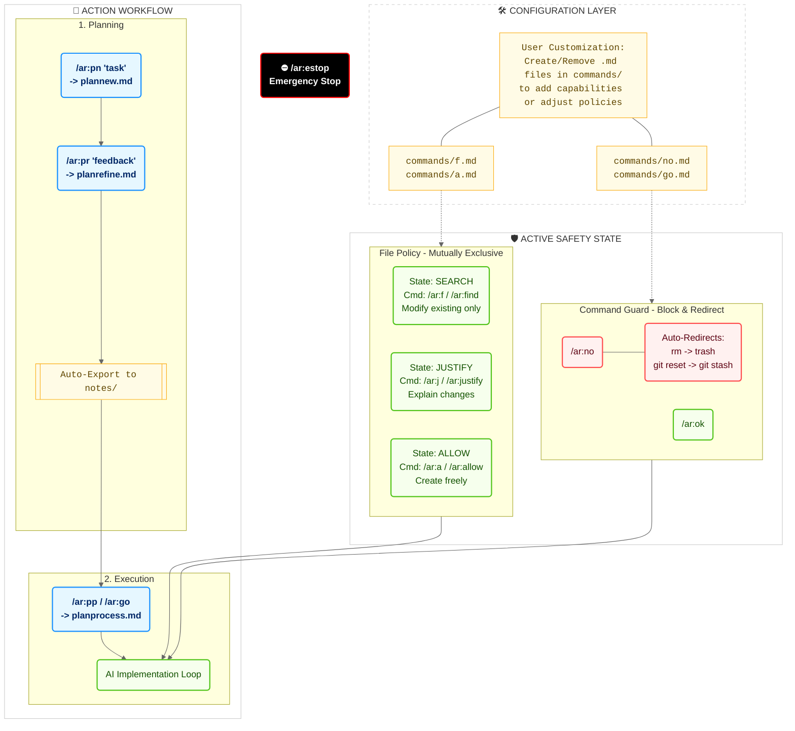

# Autorun Architecture & Workflow

This diagram illustrates the technical architecture of autorun, showing how user-configurable Markdown files drive the safety policies and command execution.

## 🛠️ Layer 1: Configuration (The Customizable Core)
Autorun is driven by Markdown files located in the `commands/` directory.
- **You are in control**: You can add, remove, or modify these `.md` files to change how the agent behaves.
- **Example**: `commands/no.md` defines the logic for the `/ar:no` command. Removing this file would remove that capability.

## 🛡️ Layer 2: Active Safety State
This layer enforces constraints on every action the AI takes.

### File Policy (Mutually Exclusive)
Controls *if* and *how* the AI can create or modify files.
- **SEARCH (`/ar:f`)**: **Strictest.** The AI can only modify *existing* files found via search tools. No new files allowed.
- **JUSTIFY (`/ar:j`)**: The AI must provide a reasoning (justification) before creating any new file.
- **ALLOW (`/ar:a`)**: **Permissive.** The AI can create files freely. Best for new projects.

### Command Guard (Block & Redirect)
The system actively monitors for dangerous commands.
- **Auto-Redirection**: Dangerous commands are automatically redirected to safe alternatives.
    - `rm` -> **`trash`** (Move to trash instead of delete)
    - `git reset` -> **`git stash`** (Save work instead of losing it)
- **`/ar:no <pattern> [desc]`**: Manually block specific patterns.
- **`/ar:ok <pattern>`**: Override a specific block or redirection for this session.

## 🚀 Layer 3: Action Workflow
Once safety is configured, the AI operates in two main phases:

### 1. Planning
- **`/ar:pn` (Plan New)**: Reads `plannew.md` to guide the AI in creating a structured plan.
- **`/ar:pr` (Plan Refine)**: Reads `planrefine.md` to help you iteratively improve the plan.
- **Auto-Export**: The approved plan is automatically saved to the `notes/` directory.

### 2. Execution
- **`/ar:pp` (Plan Process)**: Reads `planprocess.md` to execute the saved plan step-by-step.
- **`/ar:go`**: A faster, direct execution command for simpler tasks.
- **AI Implementation Loop**: The agent writes code, runs tests, and fixes errors, all while being checked against the **Active Safety State** from Layer 2.

## ⛔ Emergency Stop
- **`/ar:estop`**: Immediately halts the entire process at any time.
